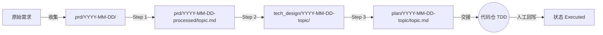

# SSD-Template 使用指南

## 核心理念

### Why-First

在写任何代码前,回答四个问题:

1. **为什么有这个流程?** — 它解决什么问题?
2. **具体解决什么问题?** — 问题是什么?
3. **代码为什么这样设计?** — 决策依据是什么?
4. **这应该放在哪里?** — 哪个组件负责?

### Given/When/Then

用自然语言描述行为:

- **Given** — 前置条件
- **When** — 触发动作
- **Then** — 预期结果

### 复审机制

每个 PRD 定期复审,防止 feature rot:

- **仍然重要?** — Yes / No / 重新定义
- **应当保留?** — Yes / No
- **可以删除?** — Yes / No

### Harness 原则

工作流是固定的 harness,不是灵活的建议:

- 5 步必须走完,不简化
- 每步有明确的"检查清单"
- 违反则失败,不跳过

## 如何使用本指南

### 谁来读

本指南面向 AI agent 和开发者,用于规范从需求到代码的完整流程。

### 从哪里开始

当有新的需求时:

1. **收集原始需求** — 将原始描述或文件引用放入 `prd/{YYYY-MM-DD}/`(多文件)
2. **Step 1: 加工为 PRD** — 读 `prd/{YYYY-MM-DD}/`,产出 PRD 到 `prd/{YYYY-MM-DD}-processed/{topic}.md`(Active)
3. **Step 2: PRD → Tech Design** — 产出多文件 Tech Design 到 `tech_design/{date}-{topic}/`(Ready,见 [tech_design/README.md](tech_design/README.md))
4. **Step 3: Tech Design → Plan** — 产出 Plan 到 `plan/{date}-{topic}/{topic}.md`(Ready → Executed)
5. **执行 TDD** — 按 Plan 的验证用例进入 Red → Green → Refactor

### 遇到问题时

- **不确定填什么?** → 查看对应 schema 模板 [schema/prd.md](schema/prd.md)
- **不知道覆盖哪些场景?** → 参考下方完成检查清单
- **不确定一个需求走多深?** → 默认走完 5 步,不简化

### 状态流转

```
prd/{date}/ (素材) → prd/{date}-processed/ (Active) → tech_design/ (Ready) → plan/ (Ready) → code → prd (Implemented)
```

## 目录组织(4 个文件夹)

```text
{project-root}/
├── prd/              # 素材区 + Layer 1: PRD(素材区非独立 Layer)
├── tech_design/      # Layer 2: 技术设计(按功能组织,7 个子文件)
├── plan/             # Layer 3: 实施计划(按功能组织)
└── schema/           # 模板定义
```

**prd/ 命名** (素材区 + Layer 1,见 [prd/README.md](prd/README.md)):

```text
prd/
├── {YYYY-MM-DD}/              ← 素材区(只读,非 Layer)
│   ├── {source-1}.md
│   └── {source-2}.md
└── {YYYY-MM-DD}-processed/    ← Layer 1: PRD
    └── {topic}.md
```

**plan/ 命名** (单文件):

```text
plan/
└── {YYYY-MM-DD}-{topic}/
    └── {topic}.md             ← 内容文件,简化为功能名
```

**tech_design/ 命名** (7 个子文件,见 [tech_design/README.md](tech_design/README.md)):

```text
tech_design/
└── {YYYY-MM-DD}-{topic}/
    ├── README.md              ← 入口/索引(必填)
    ├── decisions.md           ← 关键决策(必填)
    ├── data-model.md          ← 数据模型(必填)
    ├── api-contracts.md       ← API 契约(必填)
    ├── scenario-mapping.md    ← 场景映射(必填)
    ├── interactions.md        ← 时序图(视情况)
    └── quality.md             ← 指标 + 降级 + 错误(必填)
```

## 三步工作流



### Step 1: 原始素材 → Layer 1 PRD

将原始素材(用户抱怨、会议纪要、需求文档)放入 `prd/{YYYY-MM-DD}/`(多文件,只读),然后经过分析和讨论收敛,产出 PRD 到 `prd/{YYYY-MM-DD}-processed/{topic}.md`,状态从 **Draft → Active**。

> `prd/{date}/` 是 Layer 1 的**素材区**,**不是**独立 Layer。架构层只有 3 层(Layer 1/2/3),详见 [prd/README.md](prd/README.md)。

**转换关系**:
- **1:1**: 一份原始文档对应一个 PRD
- **1:N**: 一份原始文档(如 `history-apis.md`)拆成多个 PRD
- **N:1**: 多份原始文档合成一个 PRD
- **N:N**: 更复杂的 1→N→M 组合

**PRD 必填**:

- **为什么**: 一句话说明问题和目的
- **目标**: 可验证的成功标准
- **场景**: Given/When/Then,覆盖正常路径 + 至少一个异常
- **不在范围**: 明确不做的内容
- **复审**: still_matters / should_keep / can_delete(防止 feature rot)

### Step 2: 设计 + 计划 (PRD → Tech Design → Plan)

基于 Active 状态的 PRD,产出:

- `tech_design/{date}-{topic}/` (**Ready**): 7 个子文件——关键决策 + 数据模型 + API 契约 + 场景映射 + 时序图(可选) + 质量保证
- `plan/{date}-{topic}/{topic}.md` (**Ready**): 变更清单 + 验证用例 + 业务约束 + 开发约束

**Tech Design 必填**:

- **关键决策 (KD)**: Context / Decision / Alternatives / Rationale / Enforced by
- **场景映射**: PRD 场景 → 组件/动作/数据模型
- **指标**: 具体数字(不是模糊描述)
- **降级策略**: 异常情况下的行为

**Plan 必填**:

- **变更清单**: 每个文件的"变更描述"(新增/修改/删除什么) + "策略约束"(怎么做、不做什么)
- **验证用例 (V)**: Given/When/Then,TDD 阶段执行
- **业务约束**: 前置/不变量/后置/副作用
- **完成检查**: 7 项勾选

> ⚠️ **设计原则**: Plan 是"实施指南",不是"替代实现"。
> 变更描述用文字说明策略和约束,指导参与的 agent 写出代码。
> 完整代码在 TDD 阶段产出,不是提前写在 Plan 里。

### Step 3: 执行 (Plan → TDD → src/)

按 Plan 进入 TDD 循环:

1. **Red** — 写一个失败的测试(V 用例)
2. **Green** — 写最少代码让测试通过
3. **Refactor** — 优化代码,保持测试通过

完成所有 V 用例后,prd 状态变为 **Implemented**。

## 何时升级

> 简化原则: 默认所有内容用 3 个 schema。只在以下情况考虑升级。

| 触发条件 | 升级方案 | 状态 |
|---------|---------|------|
| 决策影响 ≥3 个 PRD 或长期架构 | 独立 ARD | v2 引入 |
| 多需求聚合管理 | batch-overview | v2 引入 |
| 需要可执行 BDD 框架 | 已在 PRD/Plan 内联 Given/When/Then,无需独立 | — |

## 完成检查清单

### 每个 PRD

- [ ] **为什么** 用具体问题陈述回答
- [ ] **目标** 有可验证的成功标准
- [ ] **场景** 覆盖正常 + 至少一个异常
- [ ] **不在范围** 明确说明
- [ ] **复审** 已填写

### 每个 Tech Design

- [ ] **7 个子文件** 全部按 [schema/tech_design/](schema/tech_design/) 检查清单通过
- [ ] **`interactions.md` 必填门** 已检查(满足条件则创建,否则显式跳过并注明)
- [ ] **跨文件引用** (KD, V, FR, SC, SYS, MOD) 已对账
- [ ] **场景映射** 覆盖 PRD 所有 Given/When/Then
- [ ] **指标** 有具体数字,**每个外部依赖** 有降级策略

### 每个 Plan

- [ ] **变更清单** 完整(每个 Change 有 KD 引用 + 验证引用)
- [ ] **验证用例** 覆盖正常 + 异常 + 边界
- [ ] **完成检查** 全部勾选

## 相关文件

| 文件 | 用途 |
|------|------|
| [schema/prd.md](schema/prd.md) | PRD 模板 |
| [schema/tech_design/](schema/tech_design/) | Tech Design 模板(7 个子模板) |
| [schema/plan.md](schema/plan.md) | Plan 模板 |
| [new-factors.md](new-factors.md) | 深度概念参考 |
| [legacy/](legacy/) | 历史参考(旧 7-schema 设计) |
