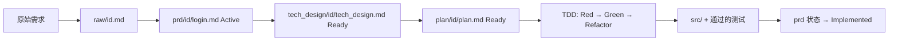

# SSD-Template 使用指南

## 核心理念:Why-First

在写任何代码前回答四个问题:

1. **为什么有这个流程?** — 它解决什么问题?
2. **具体解决什么问题?** — 问题是什么?
3. **代码为什么这样设计?** — 决策依据是什么?
4. **这应该放在哪里?** — 哪个组件负责?

> 详细概念见 [new-factors.md](new-factors.md)

## 目录组织(5 个文件夹)

```text
{project-root}/
├── raw/              # Layer 0: 原始需求(扁平,按日期命名)
├── prd/              # Layer 1: 产品需求(按功能组织)
├── tech_design/      # Layer 2: 技术设计(按功能组织)
├── plan/             # Layer 3: 实施计划(按功能组织)
└── schema/           # 模板定义
```

**raw 命名**: `{YYYY-MM-DD}-{简短主题}.md` (扁平结构)

**prd/tech_design/plan 命名**:

```text
{folder}/
└── {YYYY-MM-DD}-{topic}/      ← 子文件夹
    └── {topic}.md             ← 内容文件,简化为功能名
```

## 三步工作流



### Step 1: 发现 + 收敛 (Raw → PRD)

将原始需求(用户抱怨、会议纪要、需求文档)放入 `raw/`,然后经过分析和讨论收敛,产出 PRD,状态从 **Draft → Active**。

**PRD 必填**:

- **为什么**: 一句话说明问题和目的
- **目标**: 可验证的成功标准
- **场景**: Given/When/Then,覆盖正常路径 + 至少一个异常
- **不在范围**: 明确不做的内容
- **复审**: still_matters / should_keep / can_delete(防止 feature rot)

### Step 2: 设计 + 计划 (PRD → Tech Design → Plan)

基于 Active 状态的 PRD,产出:

- `tech_design/{date}-{topic}/{topic}.md` (**Ready**): 关键决策 + 数据模型 + API 契约 + 场景映射
- `plan/{date}-{topic}/{topic}.md` (**Ready**): 变更清单 + 验证用例 + 业务约束 + 开发约束

**Tech Design 必填**:

- **关键决策 (KD)**: Context / Decision / Alternatives / Rationale / Enforced by
- **场景映射**: PRD 场景 → 组件/动作/数据模型
- **指标**: 具体数字(不是模糊描述)
- **降级策略**: 异常情况下的行为

**Plan 必填**:

- **变更清单**: 每个文件的"变更描述"(新增/修改/删除什么) + "策略约束"(怎么做、不做什么)
- **验证用例 (V)**: Given/When/Then,TDD 阶段执行
- **业务约束**: 前置/不变量/后置/副作用
- **完成检查**: 7 项勾选

> ⚠️ **设计原则**: Plan 是"实施指南",不是"替代实现"。
> 变更描述用文字说明策略和约束,指导参与的 agent 写出代码。
> 完整代码在 TDD 阶段产出,不是提前写在 Plan 里。

### Step 3: 执行 (Plan → TDD → src/)

按 Plan 进入 TDD 循环:

1. **Red** — 写一个失败的测试(V 用例)
2. **Green** — 写最少代码让测试通过
3. **Refactor** — 优化代码,保持测试通过

完成所有 V 用例后,prd 状态变为 **Implemented**。

## 何时升级

> 简化原则: 默认所有内容用 3 个 schema。只在以下情况考虑升级。

| 触发条件 | 升级方案 | 状态 |
|---------|---------|------|
| 决策影响 ≥3 个 PRD 或长期架构 | 独立 ARD | v2 引入 |
| 多需求聚合管理 | batch-overview | v2 引入 |
| 需要可执行 BDD 框架 | 已在 PRD/Plan 内联 Given/When/Then,无需独立 | — |

## 完成检查清单

### 每个 PRD

- [ ] **为什么** 用具体问题陈述回答
- [ ] **目标** 有可验证的成功标准
- [ ] **场景** 覆盖正常 + 至少一个异常
- [ ] **不在范围** 明确说明
- [ ] **复审** 已填写

### 每个 Tech Design

- [ ] **关键决策** 已定义(每个有 Context/Decision/Alternatives/Rationale/Enforced by)
- [ ] **场景映射** 覆盖所有 PRD 场景
- [ ] **指标** 有具体数字
- [ ] **降级策略** 已定义

### 每个 Plan

- [ ] **变更清单** 完整(每个 Change 有 KD 引用 + 验证引用)
- [ ] **验证用例** 覆盖正常 + 异常 + 边界
- [ ] **完成检查** 全部勾选

## 相关文件

| 文件 | 用途 |
|------|------|
| [schema/prd.md](schema/prd.md) | PRD 模板 |
| [schema/tech_design.md](schema/tech_design.md) | Tech Design 模板 |
| [schema/plan.md](schema/plan.md) | Plan 模板 |
| [new-factors.md](new-factors.md) | 概念参考(Why-First、四问、BDD/ADR) |
| [legacy/](legacy/) | 历史参考(旧 7-schema 设计) |
