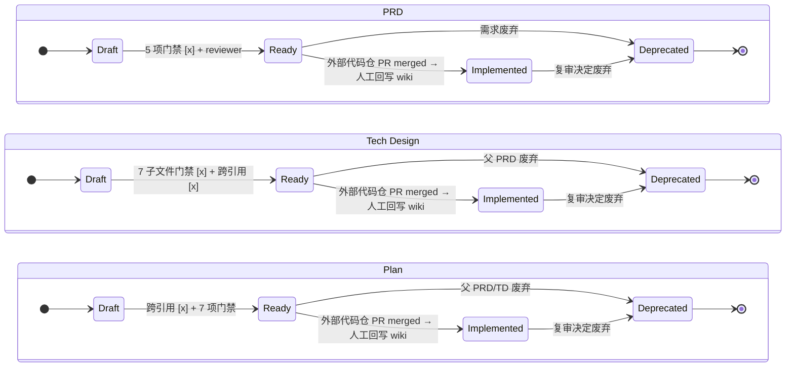
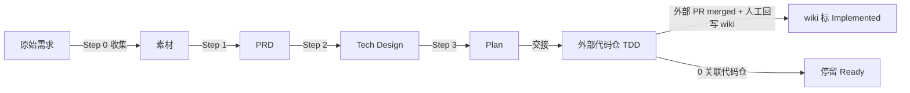
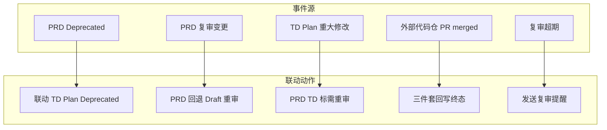

# SSD-Template 使用指南

## 核心理念

### Why-First

在写任何代码前,回答四个问题:

1. **为什么有这个流程?** — 它解决什么问题?
2. **具体解决什么问题?** — 问题是什么?
3. **代码为什么这样设计?** — 决策依据是什么?
4. **这应该放在哪里?** — 哪个组件负责?

### Given/When/Then

用自然语言描述行为:

- **Given** — 前置条件
- **When** — 触发动作
- **Then** — 预期结果

### 复审机制

每个 PRD 定期复审,防止 feature rot:

- **仍然重要?** — Yes / No / 重新定义
- **应当保留?** — Yes / No
- **可以删除?** — Yes / No

### Harness 原则

工作流是固定的 harness,不是灵活的建议:

- 5 步必须走完,不简化
- 每步有明确的"门禁清单"
- 违反则失败,不跳过

## 如何使用本指南

### 谁来读

本指南面向 AI agent 和开发者,用于规范从需求到代码的完整流程。

### 从哪里开始

当有新的需求时:

1. **收集原始需求** — 将原始描述或文件引用放入 `prd/{YYYY-MM-DD}/`(多文件)
2. **Step 1: 加工为 PRD** — 读 `prd/{YYYY-MM-DD}/`,产出 PRD 到 `prd/{YYYY-MM-DD}-processed/{topic}.md`(Ready)
3. **Step 2: PRD → Tech Design** — 产出多文件 Tech Design 到 `tech_design/{date}-{topic}/`(Ready,见 [tech_design/README.md](tech_design/README.md))
4. **Step 3: Tech Design → Plan** — 产出 Plan 到 `plan/{date}-{topic}/{topic}.md`(Ready → Implemented)
5. **执行 TDD** — 按 Plan 的验证用例进入 Red → Green → Refactor

### 遇到问题时

- **不确定填什么?** → 查看对应 schema 模板 [schema/prd.md](schema/prd.md)
- **不知道覆盖哪些场景?** → 参考下方门禁清单
- **不确定一个需求走多深?** → 默认走完 5 步,不简化

### 状态流转

3 层各自维护独立的状态机(详见 [状态机详解](#状态机详解-state-machine)):



> **0 关联代码仓库**:规格停留在 Ready,标记 "Awaiting TDD in external code repo"(本仓库为纯 wiki)
> **≥1 关联外部代码仓库**:外部代码仓(位于本仓库**之外**)PR merged 后,人工回写 wiki 状态进入 Implemented
> **Deprecated**:3 层均支持,v3 起统一加入(旧 schema 仅 PRD 支持)

## 目录组织(4 个文件夹)

```text
{project-root}/
├── prd/              # 素材区 + Layer 1: PRD(素材区非独立 Layer)
├── tech_design/      # Layer 2: 技术设计(按功能组织,7 个子文件)
├── plan/             # Layer 3: 实施计划(按功能组织)
└── schema/           # 模板定义
```

**prd/ 命名** (素材区 + Layer 1,见 [prd/README.md](prd/README.md)):

```text
prd/
├── {YYYY-MM-DD}/              ← 素材区(只读,非 Layer)
│   ├── {source-1}.md
│   └── {source-2}.md
└── {YYYY-MM-DD}-processed/    ← Layer 1: PRD
    └── {topic}.md
```

**plan/ 命名** (单文件):

```text
plan/
└── {YYYY-MM-DD}-{topic}/
    └── {topic}.md             ← 内容文件,简化为功能名
```

**tech_design/ 命名** (7 个子文件,见 [tech_design/README.md](tech_design/README.md)):

```text
tech_design/
└── {YYYY-MM-DD}-{topic}/
    ├── README.md              ← 入口/索引(必填)
    ├── decisions.md           ← 关键决策(必填)
    ├── data-model.md          ← 数据模型(必填)
    ├── api-contracts.md       ← API 契约(必填)
    ├── scenario-mapping.md    ← 场景映射(必填)
    ├── interactions.md        ← 时序图(视情况)
    └── quality.md             ← 指标 + 降级 + 错误(必填)
```

## 三步工作流



### Step 1: 原始素材 → Layer 1 PRD

将原始素材(用户抱怨、会议纪要、需求文档)放入 `prd/{YYYY-MM-DD}/`(多文件,只读),然后经过分析和讨论收敛,产出 PRD 到 `prd/{YYYY-MM-DD}-processed/{topic}.md`,状态从 **Draft → Ready**。

> `prd/{date}/` 是 Layer 1 的**素材区**,**不是**独立 Layer。架构层只有 3 层(Layer 1/2/3),详见 [prd/README.md](prd/README.md)。

**转换关系**:
- **1:1**: 一份原始文档对应一个 PRD
- **1:N**: 一份原始文档(如 `history-apis.md`)拆成多个 PRD
- **N:1**: 多份原始文档合成一个 PRD
- **N:N**: 更复杂的 1→N→M 组合

**PRD 必填**:

- **为什么**: 一句话说明问题和目的
- **目标**: 可验证的成功标准
- **场景**: Given/When/Then,覆盖正常路径 + 至少一个异常
- **不在范围**: 明确不做的内容
- **复审**: still_matters / should_keep / can_delete(防止 feature rot)

### Step 2: 设计 + 计划 (PRD → Tech Design → Plan)

基于 Ready 状态的 PRD,产出:

- `tech_design/{date}-{topic}/` (**Ready**): 7 个子文件——关键决策 + 数据模型 + API 契约 + 场景映射 + 时序图(可选) + 质量保证
- `plan/{date}-{topic}/{topic}.md` (**Ready**): 变更清单 + 验证用例 + 业务约束 + 开发约束

**Tech Design 必填**:

- **关键决策 (KD)**: Context / Decision / Alternatives / Rationale / Enforced by
- **场景映射**: PRD 场景 → 组件/动作/数据模型
- **指标**: 具体数字(不是模糊描述)
- **降级策略**: 异常情况下的行为

**Plan 必填**:

- **变更清单**: 每个文件的"变更描述"(新增/修改/删除什么) + "策略约束"(怎么做、不做什么)
- **验证用例 (V)**: Given/When/Then,TDD 阶段执行
- **业务约束**: 前置/不变量/后置/副作用
- **完成检查**: 7 项勾选

> ⚠️ **设计原则**: Plan 是"实施指南",不是"替代实现"。
> 变更描述用文字说明策略和约束,指导参与的 agent 写出代码。
> 完整代码在 TDD 阶段产出,不是提前写在 Plan 里。

### Step 3: 执行 (Plan → TDD → src/)

按 Plan 进入 TDD 循环:

1. **Red** — 写一个失败的测试(V 用例)
2. **Green** — 写最少代码让测试通过
3. **Refactor** — 优化代码,保持测试通过

完成所有 V 用例后,wiki 状态按**外部关联代码仓情况**分两条路:

- **≥1 关联外部代码仓**(代码仓位于本仓库**之外**,独立 Git 仓库 / monorepo 子目录):
  - 外部 TDD 全过 + 外部 PR merged 后
  - 由人类**人工回写**本 wiki 三件套状态:PRD → **Implemented**,Tech Design → **Implemented**,Plan → **Implemented**
- **0 关联代码仓**(纯文档项目,如 SSD-Template 自身):停留在 **Ready**,标记 "Awaiting TDD in external code repo"

详见 [状态机详解](#状态机详解-state-machine)。

## 状态机详解 (State Machine)

> 每层独立维护自己的状态(per-layer independent lifecycle)。上方"状态流转"段的 3 个 stateDiagram-v2 已包含完整图,本节补充状态值枚举、转换触发、跨层协调规则。

### 状态值枚举

| 层 | Draft | Ready | 终态 | Deprecated |
|----|-------|----------------|------|------------|
| PRD | Draft | Ready | Implemented | Deprecated |
| Tech Design | Draft | Ready | Implemented | Deprecated |
| Plan | Draft | Ready | Implemented | Deprecated |

> **术语分层**:
> - **三件套 = Implemented** — 3 层状态机统一终态;Plan 侧重"已被消费/执行完毕",PRD / Tech Design 侧重"对应代码已落地到生产(已实施)"
> - **Deprecated** — v1 仅 PRD 支持,v3 起 3 层统一加入

### 转换触发条件

| 当前 → 下一 | 触发条件 | 责任方 |
|------------|---------|--------|
| Draft → Ready | PRD 5 项门禁清单全 [x] + reviewer 签字 | author + reviewer |
| Draft → Ready | Tech Design 7 子文件门禁全 [x] + 跨引用对账全 [x] | author + reviewer |
| Draft → Ready | Plan 跨引用对账全 [x] + 7 项门禁 | author + reviewer |
| Ready → Implemented | **≥1 外部代码仓**:外部 TDD 全过 + 外部 PR merged | 外部 reviewer + wiki 人工回写 |
| Ready → Implemented | **≥1 外部代码仓**:与 PRD 同步进入 Implemented | 外部 reviewer + wiki 人工回写 |
| Ready → Implemented | **≥1 外部代码仓**:外部 TDD 全过 + 外部 PR merged | 外部 reviewer + wiki 人工回写 |
| * → Deprecated | 需求废弃 / 复审决定废弃 | reviewer |
| Ready (停留) | **0 关联代码仓**:无外部回写源 | (无动作) |

> **"完成门禁清单"定义**:对应 schema/tech_design/README.md 与 schema/plan.md 的所有 [ ] 复选框全部勾选 [x]。当前为人工 markdown 勾选,未来可通过 scripts/check-completion-gate.sh 自动化(未实现,见审计报告 critical-3)。

### 跨层协调规则



### 0 关联代码仓库的特殊语义

> ⚠️ **核心原则**:本仓库**永远是 wiki**(spec 仓库),**永远不会**变成代码仓。
> 即使项目有关联的代码仓,代码仓也**位于本仓库之外**(独立 Git 仓库 / monorepo 子目录 / 其他物理位置)。
> 本仓库**不包含** `src/`、`cmd/`、`pkg/`、`internal/` 等代码目录——这些只存在于**外部**代码仓。

#### 术语澄清

| 表述 | 准确语义 |
|------|---------|
| **本仓库 / 本 wiki** | 始终是规格文档仓库,**永远不会**变成代码仓 |
| **0 关联代码仓库** | 本 wiki 未关联任何外部代码仓库(纯文档项目) |
| **≥1 关联代码仓库** | 本 wiki 关联了 N 个**外部**代码仓库(代码仓位于本仓库**之外**) |
| **外部代码仓** | 独立 Git 仓库 / monorepo 子目录,通过 `{仓库前缀}/path` 跨仓引用(详见 AGENTS.md §1.2) |
| **wiki 的 Implemented** | 外部代码仓 PR merged 后,**人工回写**到本 wiki 的镜像状态 |

#### SSD-Template 自身(0 关联代码仓库)

- Step 1 产出:`prd/{date}-processed/{topic}.md` 状态 **Ready**
- Step 2 产出:`tech_design/{date}-{topic}/*` 状态 **Ready**
- Step 3 产出:`plan/{date}-{topic}/{topic}.md` 状态 **Ready**
- 不进入 Implemented(无外部代码仓作为回写源)

#### Fork 后接入外部关联代码仓库

> 外部代码仓**独立**于本仓库,本仓库保持纯 wiki 状态:

- 按 `AGENTS.md §A 定制指南` 在 §1.1 登记外部代码仓清单(仓库地址 / 主要语言 / 角色)
- 跨仓引用统一使用 `{仓库前缀}/path` 写法(如 `vanpipy/awp/cmd/foo.go`)
- Step 5 (TDD) 在**外部代码仓**内执行,**不**在本仓库
- 外部 PR merged 后,由人类**人工回写**本 wiki 三件套状态为 Implemented
- 维护"外部代码仓 → 本 wiki"的状态同步规则

## 何时升级

> 简化原则: 默认所有内容用 3 个 schema。只在以下情况考虑升级。

| 触发条件 | 升级方案 | 状态 |
|---------|---------|------|
| 决策影响 ≥3 个 PRD 或长期架构 | 独立 ARD | v2 引入 |
| 多需求聚合管理 | batch-overview | v2 引入 |
| 需要可执行 BDD 框架 | 已在 PRD/Plan 内联 Given/When/Then,无需独立 | — |

## 门禁清单

### 每个 PRD

- [ ] **为什么** 用具体问题陈述回答
- [ ] **目标** 有可验证的成功标准
- [ ] **场景** 覆盖正常 + 至少一个异常
- [ ] **不在范围** 明确说明
- [ ] **复审** 已填写

### 每个 Tech Design

- [ ] **7 个子文件** 全部按 [schema/tech_design/](schema/tech_design/) 门禁清单通过
- [ ] **`interactions.md` 必填门** 已检查(满足条件则创建,否则显式跳过并注明)
- [ ] **跨文件引用** (KD, V, FR, SC, SYS, MOD) 已对账
- [ ] **场景映射** 覆盖 PRD 所有 Given/When/Then
- [ ] **指标** 有具体数字,**每个外部依赖** 有降级策略

### 每个 Plan

- [ ] **变更清单** 完整(每个 Change 有 KD 引用 + 验证引用)
- [ ] **验证用例** 覆盖正常 + 异常 + 边界
- [ ] **完成检查** 全部勾选

## 相关文件

| 文件 | 用途 |
|------|------|
| [schema/prd.md](schema/prd.md) | PRD 模板 |
| [schema/tech_design/](schema/tech_design/) | Tech Design 模板(7 个子模板) |
| [schema/plan.md](schema/plan.md) | Plan 模板 |
| [new-factors.md](new-factors.md) | 深度概念参考 |
| [legacy/](legacy/) | 历史参考(旧 7-schema 设计) |
