# 移动收银APP — 会员模块 PRD

## 📑 目录

```
1.  模块概述（5W1H + KANO 分级）
2.  流程1 · 会员登录（手机号 + 被扫会员码 + 会员解绑）
    2.1 业务规则 | 2.2 流程图 | 2.3 交互说明
3.  流程2 · 新会员注册
    3.1 业务规则 | 3.2 流程图 | 3.3 交互说明
4.  流程3 · 支付即会员
    4.1 业务规则 | 4.2 流程图 | 4.3 交互说明
5.  三流程联动总图
    5.1 完整业务流程图（可复用 SVG，含四流程）
6.  页面状态矩阵
7.  接口汇总
```

---

## 1. 模块概述

### 1.1 5W1H 分析

| 维度 | 内容 |
|------|------|
| **Who** | 门店店员（收银员），操作 PDA 帮助顾客完成会员绑定 |
| **Where** | 零售门店收银区 / 排队区，PDA 手持终端 |
| **When** | ①结算前：店员主动帮顾客绑定会员；②结算时：支付即会员自动检测 |
| **What** | 会员身份识别、快速注册、会话绑定、支付时自动识别 |
| **Why** | 让顾客享受会员价格和积分权益；无会员则不免会员优惠，但不应阻塞结算 |
| **How** | 手机号查询 / PDA 扫会员码 / 付款码反查支付身份三种路径 |

### 1.2 KANO 需求分级

| 类型 | 需求 |
|------|------|
| **基础型（Must）** | 手机号查询会员、会员绑定、结算无需会员也可完成 |
| **期望型（Should）** | 被扫会员码快速识别、会员不存在引导注册、手机号快速注册 |
| **兴奋型（Could）** | 支付即会员（付款码反查自动绑定）、短信验证码注册 |

### 1.3 三个流程的关系

```
结算前
  ├─ 顾客已是会员 ──→ 流程1：会员登录（手机号 / 被扫会员码 → 绑定）
  ├─ 顾客非会员 ──→ 流程2：会员注册（手机号 → 注册 → 绑定）
  └─ 结算时无会员 ──→ 流程3：支付即会员（付款码反查 openid/alipayuid → 会员中心查询 → 绑定或跳过）
```

| 项目 | 内容 |
|------|------|
| **前置条件** | 店员已登录、门店已绑定、设备网络正常 |
| **会话规则** | 每个收银会话仅可绑定一个会员；结算完成后清除会员信息，下次收银需重新绑定 |

---

## 2. 流程1 · 会员登录（含解绑）

> 支付前帮助已注册会员完成身份识别与绑定。支持手机号查询和被扫会员码两种方式。

### 2.1 业务规则

| 编号 | 规则 |
|------|------|
| 1 | 支持两种方式：① 手机号查询 ② 被扫会员码（调起 PDA 扫码器扫描顾客会员码） |
| 2 | 每次收银会话仅可绑定一个会员 |
| 3 | 会员绑定仅在当前收银会话生效，结算完成后自动清除 |
| 4 | 会员不存在时，弹窗引导进入注册流程 |
| 5 | 已绑定会员的情况下再次登录，弹窗确认「是否解绑并更换」 |
| 6 | 会员登录不是结算的强制步骤——不绑定会员也可以正常结算 |

### 2.2 业务流程图（ProcessOn 风格）

```svg
<svg viewBox="0 0 680 920" width="100%" role="img">
  <defs>
    <marker id="arr" viewBox="0 0 10 10" refX="8" refY="5" markerWidth="6" markerHeight="6" orient="auto-start-reverse">
      <path d="M2 1L8 5L2 9" fill="none" stroke="context-stroke" stroke-width="1.5" stroke-linecap="round" stroke-linejoin="round"/>
    </marker>
  </defs>
  <title>会员登录流程</title>
  <desc>会员登录：手机号查询 / 被扫会员码 → 绑定 → 首页</desc>

  <!-- ===== Connectors ===== -->
  <line x1="340" y1="94" x2="340" y2="116" stroke="#5F5E5A" stroke-width="0.5" marker-end="url(#arr)"/>
  <line x1="340" y1="160" x2="340" y2="192" stroke="#5F5E5A" stroke-width="0.5" marker-end="url(#arr)"/>

  <line x1="340" y1="256" x2="340" y2="278" stroke="#5F5E5A" stroke-width="0.5" marker-end="url(#arr)"/>

  <text x="355" y="314" font-size="12" fill="#0F6E56" font-family="system-ui, sans-serif">手机号</text>
  <text x="222" y="314" font-size="12" fill="#A32D2D" font-family="system-ui, sans-serif">扫码</text>
  <polyline points="265,310 470,310 470,352" fill="none" stroke="#5F5E5A" stroke-width="0.5" marker-end="url(#arr)"/>
  <polyline points="415,310 210,310 210,352" fill="none" stroke="#5F5E5A" stroke-width="0.5" marker-end="url(#arr)"/>

  <line x1="470" y1="396" x2="470" y2="428" stroke="#5F5E5A" stroke-width="0.5" marker-end="url(#arr)"/>
  <line x1="210" y1="396" x2="210" y2="428" stroke="#5F5E5A" stroke-width="0.5" marker-end="url(#arr)"/>

  <line x1="340" y1="472" x2="340" y2="504" stroke="#5F5E5A" stroke-width="0.5" marker-end="url(#arr)"/>

  <polyline points="265,540 210,540 210,576" fill="none" stroke="#5F5E5A" stroke-width="0.5" marker-end="url(#arr)"/>
  <text x="242" y="533" font-size="12" fill="#A32D2D" font-family="system-ui, sans-serif">取消</text>
  <polyline points="415,540 470,540 470,576" fill="none" stroke="#5F5E5A" stroke-width="0.5" marker-end="url(#arr)"/>
  <text x="444" y="533" font-size="12" fill="#0F6E56" font-family="system-ui, sans-serif">确认</text>

  <line x1="470" y1="620" x2="470" y2="652" stroke="#5F5E5A" stroke-width="0.5" marker-end="url(#arr)"/>
  <line x1="210" y1="620" x2="210" y2="652" stroke="#5F5E5A" stroke-width="0.5" marker-end="url(#arr)"/>

  <line x1="340" y1="544" x2="340" y2="576" stroke="#5F5E5A" stroke-width="0.5" marker-end="url(#arr)"/>
  <text x="358" y="562" font-size="11" fill="#0F6E56" font-family="system-ui, sans-serif">不存在</text>

  <polyline points="470,696 470,720 340,720 340,752" fill="none" stroke="#5F5E5A" stroke-width="0.5" marker-end="url(#arr)"/>
  <polyline points="210,696 210,720 340,720" fill="none" stroke="#5F5E5A" stroke-width="0.5"/>

  <polyline points="340,576 510,576 510,652" fill="none" stroke="#5F5E5A" stroke-width="0.5" marker-end="url(#arr)"/>
  <text x="445" y="618" font-size="11" fill="#0F6E56" font-family="system-ui, sans-serif">存在</text>

  <line x1="510" y1="696" x2="510" y2="720" stroke="#5F5E5A" stroke-width="0.5"/>

  <line x1="340" y1="816" x2="340" y2="852" stroke="#5F5E5A" stroke-width="0.5" marker-end="url(#arr)"/>
  <text x="358" y="837" font-size="11" fill="#0F6E56" font-family="system-ui, sans-serif">成功</text>

  <!-- ===== Nodes ===== -->
  <g><rect x="295" y="50" width="90" height="44" rx="22" fill="#EAF3DE" stroke="#639922" stroke-width="0.5"/><text x="340" y="76" text-anchor="middle" dominant-baseline="central" font-size="14" font-weight="500" fill="#27500A" font-family="system-ui, sans-serif">开始</text></g>

  <g><rect x="265" y="116" width="150" height="44" rx="8" fill="#E6F1FB" stroke="#378ADD" stroke-width="0.5"/><text x="340" y="142" text-anchor="middle" dominant-baseline="central" font-size="13" font-weight="400" fill="#0C447C" font-family="system-ui, sans-serif">首页·会员登录页</text></g>

  <g><polygon points="340,192 415,228 340,264 265,228" fill="#FAECE7" stroke="#D85A30" stroke-width="0.5"/><text x="340" y="232" text-anchor="middle" dominant-baseline="central" font-size="13" font-weight="500" fill="#712B13" font-family="system-ui, sans-serif">识别方式?</text></g>

  <g><rect x="430" y="352" width="80" height="44" rx="8" fill="#E6F1FB" stroke="#378ADD" stroke-width="0.5"/><text x="470" y="378" text-anchor="middle" dominant-baseline="central" font-size="12" font-weight="400" fill="#0C447C" font-family="system-ui, sans-serif">手机号查询</text></g>
  <g><rect x="170" y="352" width="80" height="44" rx="8" fill="#E6F1FB" stroke="#378ADD" stroke-width="0.5"/><text x="210" y="378" text-anchor="middle" dominant-baseline="central" font-size="12" font-weight="400" fill="#0C447C" font-family="system-ui, sans-serif">扫会员码</text></g>

  <g><rect x="430" y="428" width="80" height="44" rx="8" fill="#E6F1FB" stroke="#378ADD" stroke-width="0.5"/><text x="470" y="450" text-anchor="middle" dominant-baseline="central" font-size="11" font-weight="400" fill="#0C447C" font-family="system-ui, sans-serif">输入手机号</text></g>
  <g><rect x="170" y="428" width="80" height="44" rx="8" fill="#E6F1FB" stroke="#378ADD" stroke-width="0.5"/><text x="210" y="450" text-anchor="middle" dominant-baseline="central" font-size="11" font-weight="400" fill="#0C447C" font-family="system-ui, sans-serif">PDA扫码</text></g>

  <g><polygon points="340,504 415,540 340,576 265,540" fill="#FAECE7" stroke="#D85A30" stroke-width="0.5"/><text x="340" y="544" text-anchor="middle" dominant-baseline="central" font-size="13" font-weight="500" fill="#712B13" font-family="system-ui, sans-serif">已绑会员?</text></g>

  <g><rect x="170" y="576" width="80" height="44" rx="8" fill="#FCEBEB" stroke="#E24B4A" stroke-width="0.5"/><text x="210" y="602" text-anchor="middle" dominant-baseline="central" font-size="11" font-weight="400" fill="#791F1F" font-family="system-ui, sans-serif">弹出确认</text></g>
  <g><rect x="430" y="576" width="80" height="44" rx="8" fill="#E6F1FB" stroke="#378ADD" stroke-width="0.5"/><text x="470" y="602" text-anchor="middle" dominant-baseline="central" font-size="11" font-weight="400" fill="#0C447C" font-family="system-ui, sans-serif">调用接口</text></g>

  <g><rect x="430" y="652" width="80" height="44" rx="8" fill="#E6F1FB" stroke="#378ADD" stroke-width="0.5"/><text x="470" y="678" text-anchor="middle" dominant-baseline="central" font-size="11" font-weight="400" fill="#0C447C" font-family="system-ui, sans-serif">存储会员</text></g>

  <g><rect x="170" y="652" width="80" height="44" rx="8" fill="#FCEBEB" stroke="#E24B4A" stroke-width="0.5"/><text x="210" y="678" text-anchor="middle" dominant-baseline="central" font-size="11" font-weight="400" fill="#791F1F" font-family="system-ui, sans-serif">取消请求</text></g>

  <g><rect x="430" y="652" width="80" height="44" rx="8" fill="#E6F1FB" stroke="#378ADD" stroke-width="0.5"/><text x="470" y="678" text-anchor="middle" dominant-baseline="central" font-size="11" font-weight="400" fill="#0C447C" font-family="system-ui, sans-serif">存储会员</text></g>

  <g><polygon points="510,710 555,745 510,780 465,745" fill="#FAECE7" stroke="#D85A30" stroke-width="0.5"/><text x="510" y="749" text-anchor="middle" dominant-baseline="central" font-size="11" font-weight="500" fill="#712B13" font-family="system-ui, sans-serif">存在?</text></g>

  <g><rect x="445" y="652" width="130" height="44" rx="8" fill="#E6F1FB" stroke="#378ADD" stroke-width="0.5"/><text x="510" y="678" text-anchor="middle" dominant-baseline="central" font-size="12" font-weight="400" fill="#0C447C" font-family="system-ui, sans-serif">POST /api/member/login</text></g>

  <polyline points="510,780 510,810 340,810 340,852" fill="none" stroke="#5F5E5A" stroke-width="0.5" marker-end="url(#arr)"/>
  <text x="444" y="800" font-size="11" fill="#0F6E56" font-family="system-ui, sans-serif">是</text>

  <polyline points="545,745 580,745 580,576 470,576" fill="none" stroke="#5F5E5A" stroke-width="0.5" stroke-dasharray="4,3" marker-end="url(#arr)"/>
  <text x="570" y="660" font-size="11" fill="#A32D2D" font-family="system-ui, sans-serif">否→注册</text>

  <g><rect x="295" y="852" width="90" height="44" rx="22" fill="#EAF3DE" stroke="#639922" stroke-width="0.5"/><text x="340" y="878" text-anchor="middle" dominant-baseline="central" font-size="14" font-weight="500" fill="#27500A" font-family="system-ui, sans-serif">首页已登录</text></g>

  <rect x="20" y="8" width="640" height="28" rx="4" fill="none" stroke="#D3D1C7" stroke-width="0.5" stroke-dasharray="2,2"/>
  <text x="340" y="27" text-anchor="middle" font-size="12" fill="#888780" font-family="system-ui, sans-serif">流程1：会员登录（识别方式→已绑定检查→接口查询→存储/引导注册）</text>
</svg>
```

### 2.3 交互说明

#### 方式一：手机号查询

```
店员操作                          系统行为
───────                          ──────
首页点击「去登录」
  │                              跳转会员登录页
  ▼
输入会员手机号
  │
  ▼
点击「登录」
  │                              ① 校验手机号是否为空
  │                              ② 校验当前会话是否已绑定会员
  │                                 → 已绑定：弹窗"已绑定会员，是否解绑并更换？"
  │                                   [确认] → 清除旧会员 → 继续③
  │                                   [取消] → 终止
  │                              ③ POST /api/member/login
  ▼
  ├─ 查询成功(code=0)             ① 存储会员至当前会话
  │                              ② Toast "会员已登录"
  │                              ③ 返回首页，会员栏更新：
  │                                 "鸣鸣会员  13456786677  切换会员 >"
  │
  └─ 会员不存在(code=4001)         ① 弹窗"会员不存在，是否立即注册？"
                                   [确认] → 跳注册页(携带手机号)
                                   [取消] → 关弹窗，保留输入
```

#### 方式二：被扫会员码

```
首页→「扫码识别会员」
  │                              ① 调起 PDA 摄像头
  │                              ② 扫码超时5s → Toast"扫码超时"
  ▼                              ③ 格式无效 → Toast"请尝试手动输入"
                                 ④ 已绑检查 → 弹窗"是否解绑？"
                                 ⑤ POST /api/member/scan-login
  ├─ 识别成功 → 存储 → 回首页
  ├─ 码无效(4003) → Toast"会员码无效" → 停留
  └─ 超时 → Toast"网络异常" → 停留
```

#### 会员解绑（首页「切换会员」）

```
首页点击「切换会员」
  │                              弹窗"确定解除当前会员的绑定？"
  │                              [确定]  [取消]
  ├─ 确定 → 清除会员 → 跳转会员登录页
  └─ 取消 → 回首页
```

---

## 3. 流程2 · 新会员注册

> 店员帮助非会员顾客通过手机号快速注册，成功后自动绑定至当前收银会话。

### 3.1 业务规则

| 编号 | 规则 |
|------|------|
| 1 | 仅需手机号即可注册，系统自动生成昵称 |
| 2 | 注册成功后自动绑定至当前收银会话——无需再登录 |
| 3 | 手机号已被注册时提示"该手机号已注册，请直接登录" |
| 4 | 两个入口：① 登录页底部"去注册会员"（空输入框）<br>② 会员不存在弹窗"确认注册"（预填手机号） |
| 5 | 不需要短信验证码（门店店员当面确认），后续版本可加 |
| 6 | 注册前先校验当前会话是否已绑定会员，已绑定则弹窗确认解绑 |

### 3.2 业务流程图

```svg
<svg viewBox="0 0 680 720" width="100%" role="img">
  <defs>
    <marker id="arr2" viewBox="0 0 10 10" refX="8" refY="5" markerWidth="6" markerHeight="6" orient="auto-start-reverse">
      <path d="M2 1L8 5L2 9" fill="none" stroke="context-stroke" stroke-width="1.5" stroke-linecap="round" stroke-linejoin="round"/>
    </marker>
  </defs>
  <title>会员注册流程</title>
  <desc>双入口→校验→注册→绑定</desc>

  <line x1="340" y1="60" x2="340" y2="96" stroke="#5F5E5A" stroke-width="0.5" marker-end="url(#arr2)"/>
  <line x1="170" y1="60" x2="170" y2="96" stroke="#5F5E5A" stroke-width="0.5" marker-end="url(#arr2)"/>

  <line x1="340" y1="140" x2="340" y2="172" stroke="#5F5E5A" stroke-width="0.5" marker-end="url(#arr2)"/>
  <line x1="170" y1="140" x2="170" y2="172" stroke="#5F5E5A" stroke-width="0.5" marker-end="url(#arr2)"/>

  <line x1="340" y1="256" x2="340" y2="288" stroke="#5F5E5A" stroke-width="0.5" marker-end="url(#arr2)"/>
  <line x1="170" y1="256" x2="170" y2="330" stroke="#5F5E5A" stroke-width="0.5"/>

  <text x="358" y="296" font-size="11" fill="#0F6E56" font-family="system-ui, sans-serif">已绑?</text>
  <text x="185" y="296" font-size="11" fill="#0F6E56" font-family="system-ui, sans-serif">空?</text>

  <polyline points="265,318 210,318 210,330" fill="none" stroke="#5F5E5A" stroke-width="0.5" marker-end="url(#arr2)"/>
  <polyline points="415,318 470,318 470,330" fill="none" stroke="#5F5E5A" stroke-width="0.5" marker-end="url(#arr2)"/>

  <line x1="210" y1="374" x2="210" y2="416" stroke="#5F5E5A" stroke-width="0.5" marker-end="url(#arr2)"/>
  <line x1="470" y1="374" x2="470" y2="416" stroke="#5F5E5A" stroke-width="0.5" marker-end="url(#arr2)"/>

  <line x1="340" y1="328" x2="340" y2="370" stroke="#5F5E5A" stroke-width="0.5" marker-end="url(#arr2)"/>

  <line x1="340" y1="414" x2="340" y2="456" stroke="#5F5E5A" stroke-width="0.5" marker-end="url(#arr2)"/>

  <polyline points="265,506 170,506 170,456" fill="none" stroke="#5F5E5A" stroke-width="0.5" marker-end="url(#arr2)"/>
  <text x="222" y="499" font-size="12" fill="#A32D2D" font-family="system-ui, sans-serif">禁止</text>
  <polyline points="415,506 530,506 530,456" fill="none" stroke="#5F5E5A" stroke-width="0.5" marker-end="url(#arr2)"/>
  <text x="480" y="499" font-size="12" fill="#0F6E56" font-family="system-ui, sans-serif">确认</text>

  <line x1="530" y1="500" x2="530" y2="552" stroke="#5F5E5A" stroke-width="0.5" marker-end="url(#arr2)"/>
  <line x1="340" y1="500" x2="340" y2="552" stroke="#5F5E5A" stroke-width="0.5" marker-end="url(#arr2)"/>

  <polyline points="265,614 170,614 170,552" fill="none" stroke="#5F5E5A" stroke-width="0.5" marker-end="url(#arr2)"/>
  <text x="222" y="607" font-size="11" fill="#A32D2D" font-family="system-ui, sans-serif">4002</text>
  <polyline points="415,614 530,614 530,552" fill="none" stroke="#5F5E5A" stroke-width="0.5" marker-end="url(#arr2)"/>
  <text x="480" y="607" font-size="11" fill="#0F6E56" font-family="system-ui, sans-serif">0</text>

  <line x1="530" y1="596" x2="530" y2="640" stroke="#5F5E5A" stroke-width="0.5" marker-end="url(#arr2)"/>

  <text x="358" y="640" font-size="11" fill="#0F6E56" font-family="system-ui, sans-serif">0</text>

  <line x1="530" y1="596" x2="530" y2="640" stroke="#5F5E5A" stroke-width="0.5" marker-end="url(#arr2)"/>
  <line x1="340" y1="640" x2="340" y2="676" stroke="#5F5E5A" stroke-width="0.5" marker-end="url(#arr2)"/>

  <!-- Nodes -->
  <g><rect x="295" y="16" width="90" height="44" rx="22" fill="#EAF3DE" stroke="#639922" stroke-width="0.5"/><text x="340" y="42" text-anchor="middle" font-size="14" font-weight="500" fill="#27500A" font-family="system-ui, sans-serif">入口A</text></g>
  <text x="340" y="74" text-anchor="middle" font-size="11" fill="#888780" font-family="system-ui, sans-serif">登录页→去注册</text>
  <g><rect x="125" y="16" width="90" height="44" rx="22" fill="#EAF3DE" stroke="#639922" stroke-width="0.5"/><text x="170" y="42" text-anchor="middle" font-size="14" font-weight="500" fill="#27500A" font-family="system-ui, sans-serif">入口B</text></g>
  <text x="170" y="74" text-anchor="middle" font-size="11" fill="#888780" font-family="system-ui, sans-serif">会员不存在弹窗</text>

  <g><rect x="300" y="96" width="80" height="44" rx="8" fill="#E6F1FB" stroke="#378ADD" stroke-width="0.5"/><text x="340" y="122" text-anchor="middle" font-size="12" font-weight="400" fill="#0C447C" font-family="system-ui, sans-serif">输入框为空</text></g>
  <g><rect x="130" y="96" width="80" height="44" rx="8" fill="#E6F1FB" stroke="#378ADD" stroke-width="0.5"/><text x="170" y="122" text-anchor="middle" font-size="12" font-weight="400" fill="#0C447C" font-family="system-ui, sans-serif">输入框预填</text></g>

  <g><rect x="265" y="172" width="150" height="44" rx="8" fill="#E6F1FB" stroke="#378ADD" stroke-width="0.5"/><text x="340" y="198" text-anchor="middle" dominant-baseline="central" font-size="13" font-weight="400" fill="#0C447C" font-family="system-ui, sans-serif">会员注册页</text></g>

  <g><polygon points="340,288 415,324 340,360 265,324" fill="#FAECE7" stroke="#D85A30" stroke-width="0.5"/><text x="340" y="328" text-anchor="middle" dominant-baseline="central" font-size="11" font-weight="500" fill="#712B13" font-family="system-ui, sans-serif">校验：空？</text></g>
  <g><polygon points="170,330 230,360 170,390 110,360" fill="#FAECE7" stroke="#D85A30" stroke-width="0.5"/><text x="170" y="364" text-anchor="middle" dominant-baseline="central" font-size="11" font-weight="500" fill="#712B13" font-family="system-ui, sans-serif">空？</text></g>

  <g><rect x="170" y="330" width="80" height="44" rx="8" fill="#FCEBEB" stroke="#E24B4A" stroke-width="0.5"/><text x="210" y="356" text-anchor="middle" dominant-baseline="central" font-size="11" font-weight="400" fill="#791F1F" font-family="system-ui, sans-serif">Toast"请输入"</text></g>

  <g><rect x="430" y="330" width="80" height="44" rx="8" fill="#E6F1FB" stroke="#378ADD" stroke-width="0.5"/><text x="470" y="356" text-anchor="middle" dominant-baseline="central" font-size="11" font-weight="400" fill="#0C447C" font-family="system-ui, sans-serif">OK</text></g>

  <g><rect x="265" y="370" width="150" height="44" rx="8" fill="#E6F1FB" stroke="#378ADD" stroke-width="0.5"/><text x="340" y="396" text-anchor="middle" dominant-baseline="central" font-size="13" font-weight="400" fill="#0C447C" font-family="system-ui, sans-serif">点击「注册」</text></g>

  <g><polygon points="340,456 410,490 340,524 270,490" fill="#FAECE7" stroke="#D85A30" stroke-width="0.5"/><text x="340" y="494" text-anchor="middle" dominant-baseline="central" font-size="12" font-weight="500" fill="#712B13" font-family="system-ui, sans-serif">POST register</text></g>

  <g><rect x="265" y="552" width="150" height="44" rx="8" fill="#E6F1FB" stroke="#378ADD" stroke-width="0.5"/><text x="340" y="578" text-anchor="middle" dominant-baseline="central" font-size="13" font-weight="400" fill="#0C447C" font-family="system-ui, sans-serif">注册结果</text></g>

  <g><rect x="495" y="596" width="70" height="44" rx="8" fill="#E6F1FB" stroke="#378ADD" stroke-width="0.5"/><text x="530" y="622" text-anchor="middle" dominant-baseline="central" font-size="11" font-weight="400" fill="#0C447C" font-family="system-ui, sans-serif">存储绑定</text></g>

  <g><rect x="130" y="596" width="80" height="44" rx="8" fill="#FCEBEB" stroke="#E24B4A" stroke-width="0.5"/><text x="170" y="622" text-anchor="middle" dominant-baseline="central" font-size="11" font-weight="400" fill="#791F1F" font-family="system-ui, sans-serif">Toast提示</text></g>

  <g><rect x="295" y="640" width="90" height="44" rx="22" fill="#EAF3DE" stroke="#639922" stroke-width="0.5"/><text x="340" y="666" text-anchor="middle" dominant-baseline="central" font-size="14" font-weight="500" fill="#27500A" font-family="system-ui, sans-serif">注册成功</text></g>
  <text x="340" y="702" text-anchor="middle" font-size="11" fill="#5F5E5A" font-family="system-ui, sans-serif">Toast "注册成功，会员已登录" → 返回首页</text>

  <rect x="20" y="8" width="640" height="28" rx="4" fill="none" stroke="#D3D1C7" stroke-width="0.5" stroke-dasharray="2,2"/>
  <text x="340" y="27" text-anchor="middle" font-size="12" fill="#888780" font-family="system-ui, sans-serif">流程2：会员注册（双入口→校验→注册→绑定）</text>
</svg>
```

### 3.3 交互说明

```
入口A：登录页底部「去注册会员」
  │                              跳转注册页（输入框为空）
  ▼
入口B：会员不存在弹窗「确认注册」
  │                              跳转注册页（输入框已预填手机号）
  ▼
会员注册页 → 点击「注册」
  │                              ① 校验为空 → Toast"请输入手机号"
  │                              ② 校验已绑 → 弹窗"是否解绑并更换？"
  │                              ③ POST /api/member/register
  ▼
  ├─ 成功(code=0)                 ① 存储至会话 → Toast"注册成功，会员已登录"
  │                              ② 返回首页（会员栏已登录）
  └─ 失败(code≠0)                 ① Toast 展示原因
      ├─ 4002"已注册"              提示"该手机号已注册，请直接登录"
      ├─ 超时                      提示"网络异常，请重试"
      └─ 系统错误                  提示"系统繁忙，请稍后重试"
```

---

## 4. 流程3 · 支付即会员

> 结算时，通过顾客的微信/支付宝付款码反查支付平台身份（openid/alipayuid），再向会员中心查询是否为会员。是会员则绑定后重新计算促销再发起支付，非会员直接付。

### 4.1 业务规则

| 编号 | 规则 |
|------|------|
| 1 | 仅在结算时当前订单**未绑定会员**时触发 |
| 2 | 使用付款码→支付中心→银行渠道→支付宝/微信 → 获取 alipayuid/openid |
| 3 | 获取到的身份标识调用会员中心查询是否关联会员 |
| 4 | 是会员→绑定至订单→重新促销计算→店员确认新金额→发起支付扣款 |
| 5 | 非会员→不绑定、不注册，直接发起支付扣款 |
| 6 | 查询过程对店员和顾客透明，无额外弹窗 |
| 7 | 任何查询环节失败（超时/异常）均不阻塞支付，直接发起扣款 |

### 4.2 业务流程图

```svg
<svg viewBox="0 0 680 640" width="100%" role="img">
  <defs>
    <marker id="arr3" viewBox="0 0 10 10" refX="8" refY="5" markerWidth="6" markerHeight="6" orient="auto-start-reverse">
      <path d="M2 1L8 5L2 9" fill="none" stroke="context-stroke" stroke-width="1.5" stroke-linecap="round" stroke-linejoin="round"/>
    </marker>
  </defs>
  <title>支付即会员流程</title>
  <desc>付款码→支付中心→渠道→alipayuid/openid→会员中心→绑定或跳过</desc>

  <line x1="340" y1="94" x2="340" y2="126" stroke="#5F5E5A" stroke-width="0.5" marker-end="url(#arr3)"/>
  <line x1="340" y1="170" x2="340" y2="202" stroke="#5F5E5A" stroke-width="0.5" marker-end="url(#arr3)"/>
  <text x="358" y="188" font-size="11" fill="#0F6E56" font-family="system-ui, sans-serif">已绑定</text>

  <polyline points="265,202 170,202 170,232" fill="none" stroke="#5F5E5A" stroke-width="0.5" marker-end="url(#arr3)"/>
  <text x="222" y="195" font-size="11" fill="#A32D2D" font-family="system-ui, sans-serif">无会员</text>

  <line x1="170" y1="276" x2="170" y2="308" stroke="#5F5E5A" stroke-width="0.5" marker-end="url(#arr3)"/>

  <line x1="340" y1="202" x2="340" y2="232" stroke="#5F5E5A" stroke-width="0.5" marker-end="url(#arr3)"/>

  <line x1="340" y1="276" x2="340" y2="308" stroke="#5F5E5A" stroke-width="0.5" marker-end="url(#arr3)"/>
  <line x1="170" y1="384" x2="170" y2="416" stroke="#5F5E5A" stroke-width="0.5" marker-end="url(#arr3)"/>

  <polyline points="170,498 100,498 100,596" fill="none" stroke="#5F5E5A" stroke-width="0.5" marker-end="url(#arr3)"/>
  <polyline points="170,498 240,498 240,596" fill="none" stroke="#5F5E5A" stroke-width="0.5" marker-end="url(#arr3)"/>

  <line x1="340" y1="384" x2="340" y2="416" stroke="#5F5E5A" stroke-width="0.5" marker-end="url(#arr3)"/>

  <polyline points="340,498 340,596" fill="none" stroke="#5F5E5A" stroke-width="0.5" marker-end="url(#arr3)"/>

  <!-- Nodes -->
  <g><rect x="295" y="50" width="90" height="44" rx="22" fill="#EAF3DE" stroke="#639922" stroke-width="0.5"/><text x="340" y="76" text-anchor="middle" dominant-baseline="central" font-size="14" font-weight="500" fill="#27500A" font-family="system-ui, sans-serif">开始</text></g>

  <g><rect x="265" y="126" width="150" height="44" rx="8" fill="#E6F1FB" stroke="#378ADD" stroke-width="0.5"/><text x="340" y="152" text-anchor="middle" dominant-baseline="central" font-size="13" font-weight="400" fill="#0C447C" font-family="system-ui, sans-serif">购物车·点收款</text></g>

  <g><polygon points="340,202 415,238 340,274 265,238" fill="#FAECE7" stroke="#D85A30" stroke-width="0.5"/><text x="340" y="242" text-anchor="middle" font-size="12" font-weight="500" fill="#712B13" font-family="system-ui, sans-serif">已绑定会员?</text></g>

  <g><rect x="130" y="232" width="80" height="44" rx="8" fill="#E6F1FB" stroke="#378ADD" stroke-width="0.5"/><text x="170" y="258" text-anchor="middle" footer="central" font-size="12" font-weight="400" fill="#0C447C" font-family="system-ui, sans-serif">扫付款码</text></g>
  <g><rect x="295" y="232" width="90" height="44" rx="8" fill="#E6F1FB" stroke="#378ADD" stroke-width="0.5"/><text x="340" y="258" text-anchor="middle" dominant-baseline="central" font-size="12" font-weight="400" fill="#0C447C" font-family="system-ui, sans-serif">直接支付</text></g>

  <g><rect x="130" y="308" width="80" height="44" rx="8" fill="#E6F1FB" stroke="#378ADD" stroke-width="0.5"/><text x="170" y="330" text-anchor="middle" dominant-baseline="central" font-size="11" font-weight="400" fill="#0C447C" font-family="system-ui, sans-serif">支付中心</text></g>
  <text x="170" y="370" text-anchor="middle" font-size="10" fill="#5F5E5A" font-family="system-ui, sans-serif">解析渠道→请求微信/支付宝</text>

  <g><rect x="130" y="416" width="80" height="44" rx="8" fill="#E6F1FB" stroke="#378ADD" stroke-width="0.5"/><text x="170" y="442" text-anchor="middle" dominant-baseline="central" font-size="11" font-weight="400" fill="#0C447C" font-family="system-ui, sans-serif">获取身份标识</text></g>
  <text x="170" y="478" text-anchor="middle" font-size="10" fill="#5F5E5A" font-family="system-ui, sans-serif">alipayuid / openid</text>

  <g><rect x="265" y="308" width="150" height="44" rx="8" fill="#E6F1FB" stroke="#378ADD" stroke-width="0.5"/><text x="340" y="334" text-anchor="middle" dominant-baseline="central" font-size="13" font-weight="400" fill="#0C447C" font-family="system-ui, sans-serif">促销计算</text></g>
  <g><rect x="265" y="416" width="150" height="44" rx="8" fill="#E6F1FB" stroke="#378ADD" stroke-width="0.5"/><text x="340" y="442" text-anchor="middle" dominant-baseline="central" font-size="13" font-weight="400" fill="#0C447C" font-family="system-ui, sans-serif">发起支付扣款</text></g>

  <g><polygon points="170,514 220,550 170,586 120,550" fill="#FAECE7" stroke="#D85A30" stroke-width="0.5"/><text x="170" y="554" text-anchor="middle" dominant-baseline="central" font-size="11" font-weight="500" fill="#712B13" font-family="system-ui, sans-serif">找到?</text></g>

  <g><rect x="65" y="596" width="70" height="44" rx="8" fill="#E6F1FB" stroke="#378ADD" stroke-width="0.5"/><text x="100" y="622" text-anchor="middle" dominant-baseline="central" font-size="11" font-weight="400" fill="#0C447C" font-family="system-ui, sans-serif">是会员</text></g>
  <g><rect x="205" y="596" width="70" height="44" rx="8" fill="#E6F1FB" stroke="#378ADD" stroke-width="0.5"/><text x="240" y="622" text-anchor="middle" dominant-baseline="central" font-size="11" font-weight="400" fill="#0C447C" font-family="system-ui, sans-serif">非会员</text></g>

  <text x="100" y="654" text-anchor="middle" font-size="10" fill="#5F5E5A" font-family="system-ui, sans-serif">绑定会员</text>
  <text x="100" y="668" text-anchor="middle" font-size="10" fill="#5F5E5A" font-family="system-ui, sans-serif">重算促销</text>
  <text x="240" y="654" text-anchor="middle" font-size="10" fill="#5F5E5A" font-family="system-ui, sans-serif">不绑定</text>
  <text x="240" y="668" text-anchor="middle" font-size="10" fill="#5F5E5A" font-family="system-ui, sans-serif">不注册</text>

  <rect x="20" y="8" width="640" height="28" rx="4" stroke="#D3D1C7" stroke-width="0.5" stroke-dasharray="2,2" fill="none"/>
  <text x="340" y="27" text-anchor="middle" font-size="12" fill="#888780" font-family="system-ui, sans-serif">流程3：支付即会员（付款码→支付中心→渠道→会员中心→绑定或跳过→发起支付）</text>
</svg>
```

### 4.3 交互说明

```
结算页 → 扫取顾客付款码
  │                              ① 当前订单已绑定会员？
  │                                 → 已绑定：跳过本流程，直接发起支付
  │                                 → 未绑定：进入支付即会员
  ▼
付款码 → 支付中心
  │                              ① 解析付款码→识别渠道（微信/支付宝）
  │                              ② 通过银行侧请求支付宝/微信
  │                              ③ 获取 alipayuid / openid
  ▼
  ├─ 获取成功
  │     │                        ① POST /api/member/query-by-payment
  │     ├─ 是会员(code=0)         ① 绑会员至订单→重算促销→店员确认金额→支付
  │     └─ 非会员(code=4005)      ① 不绑不注册→直接发起支付
  │
  └─ 获取失败（超时/异常）
        不阻塞 → 直接发起支付

关键时序：查询在支付扣款之前，是会员时先绑后付，非会员时直接付。
```

---

## 5. 三流程联动总图

```svg
<svg viewBox="0 0 680 700" width="100%" role="img">
  <defs>
    <marker id="arr4" viewBox="0 0 10 10" refX="8" refY="5" markerWidth="6" markerHeight="6" orient="auto-start-reverse">
      <path d="M2 1L8 5L2 9" fill="none" stroke="context-stroke" stroke-width="1.5" stroke-linecap="round" stroke-linejoin="round"/>
    </marker>
  </defs>
  <title>会员模块三流程联动</title>
  <desc>收银会话→绑定会员→扫码加车→结算→支付即会员→完成</desc>

  <!-- Top flow: 收银会话开始 -->
  <line x1="340" y1="94" x2="340" y2="126" stroke="#5F5E5A" stroke-width="0.5" marker-end="url(#arr4)"/>
  <line x1="340" y1="170" x2="340" y2="202" stroke="#5F5E5A" stroke-width="0.5" marker-end="url(#arr4)"/>
  <text x="358" y="188" font-size="11" fill="#0F6E56" font-family="system-ui, sans-serif">是</text>

  <polyline points="265,170 140,170 140,238" fill="none" stroke="#5F5E5A" stroke-width="0.5" marker-end="url(#arr4)"/>
  <text x="200" y="163" font-size="11" fill="#A32D2D" font-family="system-ui, sans-serif">否</text>

  <line x1="140" y1="308" x2="140" y2="350" stroke="#5F5E5A" stroke-width="0.5" marker-end="url(#arr4)"/>

  <line x1="340" y1="246" x2="340" y2="288" stroke="#5F5E5A" stroke-width="0.5" marker-end="url(#arr4)"/>

  <polyline points="140,394 140,430 340,430 340,460" fill="none" stroke="#5F5E5A" stroke-width="0.5" marker-end="url(#arr4)"/>

  <line x1="340" y1="332" x2="340" y2="374" stroke="#5F5E5A" stroke-width="0.5" marker-end="url(#arr4)"/>
  <line x1="340" y1="384" x2="340" y2="418" stroke="#5F5E5A" stroke-width="0.5" marker-end="url(#arr4)"/>

  <line x1="340" y1="504" x2="340" y2="536" stroke="#5F5E5A" stroke-width="0.5" marker-end="url(#arr4)"/>

  <polyline points="265,568 170,568 170,598" fill="none" stroke="#5F5E5A" stroke-width="0.5" marker-end="url(#arr4)"/>
  <text x="222" y="561" font-size="11" fill="#A32D2D" font-family="system-ui, sans-serif">无会员</text>
  <line x1="340" y1="568" x2="340" y2="598" stroke="#5F5E5A" stroke-width="0.5" marker-end="url(#arr4)"/>
  <text x="358" y="585" font-size="11" fill="#0F6E56" font-family="system-ui, sans-serif">已有</text>

  <line x1="170" y1="642" x2="170" y2="674" stroke="#5F5E5A" stroke-width="0.5" marker-end="url(#arr4)"/>

  <line x1="340" y1="642" x2="340" y2="674" stroke="#5F5E5A" stroke-width="0.5" marker-end="url(#arr4)"/>

  <!-- Nodes -->
  <g><rect x="295" y="50" width="90" height="44" rx="22" fill="#EAF3DE" stroke="#639922" stroke-width="0.5"/><text x="340" y="76" text-anchor="middle" dominant-baseline="central" font-size="14" font-weight="500" fill="#27500A" font-family="system-ui, sans-serif">收银会话开始</text></g>

  <g><polygon points="340,126 415,162 340,198 265,162" fill="#FAECE7" stroke="#D85A30" stroke-width="0.5"/><text x="340" y="166" text-anchor="middle" dominant-baseline="central" font-size="12" font-weight="500" fill="#712B13" font-family="system-ui, sans-serif">店员绑定会员?</text></g>

  <g><rect x="100" y="238" width="80" height="70" rx="8" fill="#E6F1FB" stroke="#378ADD" stroke-width="0.5"/><text x="140" y="265" text-anchor="middle" dominant-baseline="central" font-size="12" font-weight="400" fill="#0C447C" font-family="system-ui, sans-serif">流程1</text><text x="140" y="285" text-anchor="middle" dominant-baseline="central" font-size="11" fill="#0C447C" font-family="system-ui, sans-serif">会员登录</text></g>

  <g><rect x="265" y="202" width="150" height="44" rx="8" fill="#E6F1FB" stroke="#378ADD" stroke-width="0.5"/><text x="340" y="228" text-anchor="middle" dominant-baseline="central" font-size="13" font-weight="400" fill="#0C447C" font-family="system-ui, sans-serif">商品扫码加车</text></g>

  <g><rect x="100" y="350" width="80" height="44" rx="8" fill="#EAF3DE" stroke="#639922" stroke-width="0.5"/><text x="140" y="376" text-anchor="middle" dominant-baseline="central" font-size="11" font-weight="400" fill="#27500A" font-family="system-ui, sans-serif">会员绑定完成</text></g>

  <g><rect x="265" y="460" width="150" height="44" rx="8" fill="#E6F1FB" stroke="#378ADD" stroke-width="0.5"/><text x="340" y="486" text-anchor="middle" dominant-baseline="central" font-size="13" font-weight="400" fill="#0C447C" font-family="system-ui, sans-serif">购物车·结算收款</text></g>

  <g><polygon points="340,536 415,572 340,608 265,572" fill="#FAECE7" stroke="#D85A30" stroke-width="0.5"/><text x="340" y="576" text-anchor="middle" dominant-baseline="central" font-size="12" font-weight="500" fill="#712B13" font-family="system-ui, sans-serif">有会员?</text></g>

  <g><rect x="130" y="598" width="80" height="44" rx="8" fill="#E6F1FB" stroke="#378ADD" stroke-width="0.5"/><text x="170" y="624" text-anchor="middle" dominant-baseline="central" font-size="12" font-weight="400" fill="#0C447C" font-family="system-ui, sans-serif">流程3</text></g>

  <g><rect x="300" y="598" width="80" height="44" rx="8" fill="#E6F1FB" stroke="#378ADD" stroke-width="0.5"/><text x="340" y="624" text-anchor="middle" dominant-baseline="central" font-size="12" font-weight="400" fill="#0C447C" font-family="system-ui, sans-serif">直接支付</text></g>

  <g><rect x="295" y="674" width="90" height="44" rx="22" fill="#EAF3DE" stroke="#639922" stroke-width="0.5"/><text x="340" y="700" text-anchor="middle" dominant-baseline="central" font-size="14" font-weight="500" fill="#27500A" font-family="system-ui, sans-serif">支付完成</text></g>

  <rect x="20" y="8" width="640" height="28" rx="4" fill="none" stroke="#D3D1C7" stroke-width="0.5" stroke-dasharray="2,2"/>
  <text x="340" y="27" text-anchor="middle" font-size="12" fill="#888780" font-family="system-ui, sans-serif">会员模块·三流程联动总图（流程1/2 → 扫码加车 → 流程3 → 支付完成）</text>
</svg>
```

**注册触发路径（流程2）**：
- 路径①：首页→去登录→登录页→去注册会员（主动注册，手机号为空）
- 路径②：首页→去登录→输入手机号→会员不存在弹窗→确认注册（引导注册，手机号预填）

### 5.1 完整业务流程图（Mermaid · 可复制源码）

> 下图包含会员登录（手机号+被扫会员码）、新会员注册、会员解绑、支付即会员 —— 四流程整合于一幅图。
> 源码见独立文件：`pos-member-flow-mermaid.md`

```mermaid
flowchart TD
    Start(["收银会话开始"]) --> HomeMember{"首页会员栏<br>是否已登录?"}

    %% ── 路径A：会员未登录 → 去登录 ──
    HomeMember -->|"未登录·去登录"| LoginPage["会员登录页"]
    LoginPage --> LoginMethod{"识别方式?"}
    LoginMethod -->|"手机号"| InputPhone["输入会员手机号"]
    LoginMethod -->|"被扫会员码"| ScanCode["PDA扫码识别"]
    InputPhone --> ClickLogin["点击「登录」"]
    ScanCode --> ScanDone{"扫码完成?"}
    ScanDone -->|"超时/无效"| ScanFail["Toast·停留登录页"]
    ScanFail --> LoginMethod
    ScanDone -->|"解析成功"| CheckBind2{"已绑定会员?"}
    ClickLogin --> CheckBind{"已绑定会员?"}

    %% ── 已绑定 → 解绑弹窗 ──
    CheckBind -->|"已绑定"| UnbindPop["弹窗：「已绑定会员<br>是否解绑并更换？」"]
    CheckBind2 -->|"已绑定"| UnbindPop
    UnbindPop --> UnbindConfirm{"确认解绑?"}
    UnbindConfirm -->|"取消"| HomeLogged
    UnbindConfirm -->|"确认"| ClearOld["清除旧会员"]

    %% ── 未绑定 → 查询接口 ──
    CheckBind -->|"未绑定"| CallLogin["POST /api/member/login"]
    CheckBind2 -->|"未绑定"| CallScan["POST /api/member/scan-login"]
    ClearOld --> CallLogin

    CallLogin --> LoginResult{"查询结果?"}
    CallScan --> ScanResult{"查询结果?"}
    LoginResult -->|"code=0·存在"| StoreMember["存储会员至当前会话"]
    ScanResult -->|"code=0·成功"| StoreMember
    StoreMember --> ToastOK["Toast「会员已登录」"]
    ToastOK --> HomeLogged["首页·会员栏已登录"]

    LoginResult -->|"code=4001·不存在"| PopReg["弹窗：「会员不存在<br>是否立即注册？」"]
    ScanResult -->|"code=4003·无效"| ScanToast["Toast·停留登录页"]
    ScanToast --> LoginMethod
    PopReg --> RegChoice{"选择?"}
    RegChoice -->|"确认注册"| RegPage["会员注册页<br>（预填手机号）"]

    %% ── 主动注册 ──
    LoginPage -->|"底部·去注册会员"| RegPageEmpty["会员注册页<br>（输入框为空）"]
    RegPageEmpty --> ClickReg["点击「注册」"]
    RegPage --> ClickReg

    ClickReg --> ChkBind3{"已绑定会员?"}
    ChkBind3 -->|"已绑定"| UnbindPop
    ChkBind3 -->|"未绑定"| CallReg["POST /api/member/register"]
    CallReg --> RegResult{"注册结果?"}
    RegResult -->|"code=0·成功"| StoreMember
    RegResult -->|"code=4002·已注册"| RegFail["Toast「该手机号已注册<br>请直接登录」"]
    RegFail --> LoginPage
    RegChoice -->|"取消"| LoginPage

    %% ── 已登录 → 进入收银 ──
    HomeMember -->|"已登录·进入收银"| AddItems["商品扫码加车"]
    HomeLogged --> AddItems
    AddItems --> Checkout["购物车·结算收款"]

    %% ── 切换会员 ──
    HomeLogged -->|"点击切换会员"| UnbindPop

    %% ── 支付即会员 ──
    Checkout --> CheckMember{"订单已绑定会员?"}
    CheckMember -->|"已绑定"| PayNow["直接发起支付扣款"]
    CheckMember -->|"无会员"| ScanPayCode["扫取顾客付款码"]
    ScanPayCode --> PayCenter["支付中心<br>解析付款码·识别渠道"]
    PayCenter --> Channel["银行渠道<br>请求支付宝/微信侧"]
    Channel --> GetId{"获取身份标识?"}
    GetId -->|"成功·alipayuid / openid"| QueryMember["POST /api/member/query-by-payment<br>会员中心查询"]
    QueryMember --> QueryResult{"查询结果?"}
    QueryResult -->|"是会员·code=0"| BindPromo["绑定会员至订单<br>重新促销计算"]
    BindPromo --> ConfirmAmt["店员确认新金额"]
    ConfirmAmt --> PayNow
    QueryResult -->|"非会员·code=4005"| PayNow
    GetId -->|"超时/异常"| PayNow
    PayNow --> PayDone(["支付完成"])

    %% ── 样式 ──
    classDef startEnd fill:#e8f5e9,stroke:#2e7d32,stroke-width:1.5px,color:#1b5e20
    classDef process fill:#e3f2fd,stroke:#1565c0,stroke-width:1px,color:#0d47a1
    classDef decision fill:#fff3e0,stroke:#e65100,stroke-width:1.5px,color:#bf360c
    classDef error fill:#ffebee,stroke:#c62828,stroke-width:1px,color:#b71c1c
    classDef payment fill:#f3e5f5,stroke:#7b1fa2,stroke-width:1.5px,color:#4a148c

    class Start,PayDone startEnd
    class HomeLogged,LoginPage,InputPhone,ScanCode,ClickLogin,ScanDone,StoreMember,ToastOK,ClearOld,CallLogin,CallScan,PopReg,RegPage,RegPageEmpty,ClickReg,CallReg,RegFail,ScanFail,ScanToast,AddItems,Checkout,PayNow,ScanPayCode,PayCenter,Channel,QueryMember,BindPromo,ConfirmAmt process
    class HomeMember,LoginMethod,CheckBind,CheckBind2,UnbindConfirm,LoginResult,ScanResult,RegChoice,ChkBind3,RegResult,CheckMember,GetId,QueryResult decision
    class UnbindPop error
    class ScanPayCode,PayCenter,Channel,QueryMember,BindPromo,ConfirmAmt payment
```



**颜色图例**：

| 颜色 | 含义 | 类型 |
|------|------|------|
| 🟢 绿色 | 开始/结束 | 胶囊形 |
| 🔵 蓝色 | 操作/处理 | 圆角矩形 |
| 🟠 橙色 | 判断/分支 | 菱形 |
| 🔴 红色 | 弹窗/错误 | 圆角矩形 |
| 🟣 紫色 | 支付即会员 | 圆角矩形 |

**四条核心路径**：

| 路径 | 走向 |
|------|------|
| **A. 手机号登录** | 首页→去登录→手机号→已绑检查→POST/login→存储→首页已登录 |
| **B. 被扫会员码** | 首页→去登录→PDA扫码→已绑检查→POST/scan-login→存储→首页已登录 |
| **C. 会员不存在→注册** | 手机号→会员不存在→弹窗→注册页→成功→首页已登录 |
| **D. 支付即会员** | 结算→无会员→扫付款码→支付中心→渠道→会员中心→绑定/跳过→支付 |
| **E. 会员解绑** | 首页已登录→切换会员→解绑弹窗→确认→清除→重新登录 |

---

## 6. 页面状态矩阵

| 页面 | 状态 | 展示 | 操作 | 跳转 |
|------|------|------|------|------|
| **首页·会员栏** | 无会员 | "会员未登录" + "去登录"按钮 | 去登录 | → 会员登录页 |
| **首页·会员栏** | 有会员 | 昵称+手机号+"切换会员" | 切换会员→弹窗解绑 | → 会员登录页 |
| **购物车·会员栏** | 无会员 | "当前会员：未登录" + [登录][注册]按钮 | 登录/注册 | → 会员登录/注册页 |
| **会员登录页** | 默认 | 手机号输入框 + "登录" + "扫码识别" + 去注册链接 | 手机号 / 扫码 | → 绑定成功 → 首页 |
| **会员不存在弹窗** | 4001 | "会员不存在，是否立即注册？" [确认][取消] | 确认/取消 | → 注册页 / 回登录 |
| **解绑确认弹窗** | 已绑定 + 再次登录 | "已绑定会员，是否解绑并更换？" [确认][取消] | 确认/取消 | → 重新绑定 / 回首页 |
| **会员注册页** | 默认 | 手机号输入框(可能预填) + "注册" | 输入手机号注册 | → 注册成功 → 首页 |
| **结算页** | 支付即会员 | 店员无感知，后端自动查询 | — | → 是会员重新促销 / 非会员直接付 |

---

## 7. 接口汇总

| 接口 | 方式 | 说明 |
|------|------|------|
| `/api/member/login` | POST | 手机号查询会员 |
| `/api/member/scan-login` | POST | 被扫会员码查询 |
| `/api/member/register` | POST | 手机号注册会员 |
| `/api/member/query-by-payment` | POST | 支付身份反查会员（支付中心→会员中心） |

### 7.1 会员查询（手机号）

**`POST /api/member/login`**

| 参数 | 类型 | 必填 | 说明 |
|------|------|------|------|
| `phone` | string | 是 | 11位手机号 |
| `storeName` | string | 是 | 门店名称 |

| code | 说明 |
|------|------|
| 0 | 成功，返回 memberId/memberName/memberPhone/memberLevel |
| 4001 | 会员不存在 |

### 7.2 会员查询（被扫）

**`POST /api/member/scan-login`**

| 参数 | 类型 | 必填 | 说明 |
|------|------|------|------|
| `memberCode` | string | 是 | PDA 扫码器识别的会员码 |
| `storeName` | string | 是 | 门店名称 |

| code | 说明 |
|------|------|
| 0 | 成功 |
| 4003 | 会员码无效/已过期 |
| 4004 | 格式无法识别 |

### 7.3 会员注册

**`POST /api/member/register`**

| 参数 | 类型 | 必填 | 说明 |
|------|------|------|------|
| `phone` | string | 是 | 11位手机号 |
| `storeName` | string | 是 | 门店名称 |

| code | 说明 |
|------|------|
| 0 | 成功，返回 memberId/memberName/memberPhone |
| 4002 | 手机号已注册 |

### 7.4 支付即会员身份查询

**`POST /api/member/query-by-payment`**

| 参数 | 类型 | 必填 | 说明 |
|------|------|------|------|
| `paymentIdentity` | string | 是 | alipayuid 或 openid |
| `channel` | string | 是 | `alipay` / `wechat` |
| `storeName` | string | 是 | 门店名称 |

| code | 说明 |
|------|------|
| 0 | 是会员，返回 memberId/memberName/memberLevel |
| 4005 | 未关联会员 |

**调用链路**：

```
PDA扫付款码 → 支付中心 → 银行渠道 → 支付宝/微信(返回 alipayuid/openid) → 会员中心 ← POST /api/member/query-by-payment
                                                                              ├─ 是会员 → 绑订单 → 重算促销 → 店员确认 → 扣款
                                                                              └─ 非会员 → 直接扣款
```
