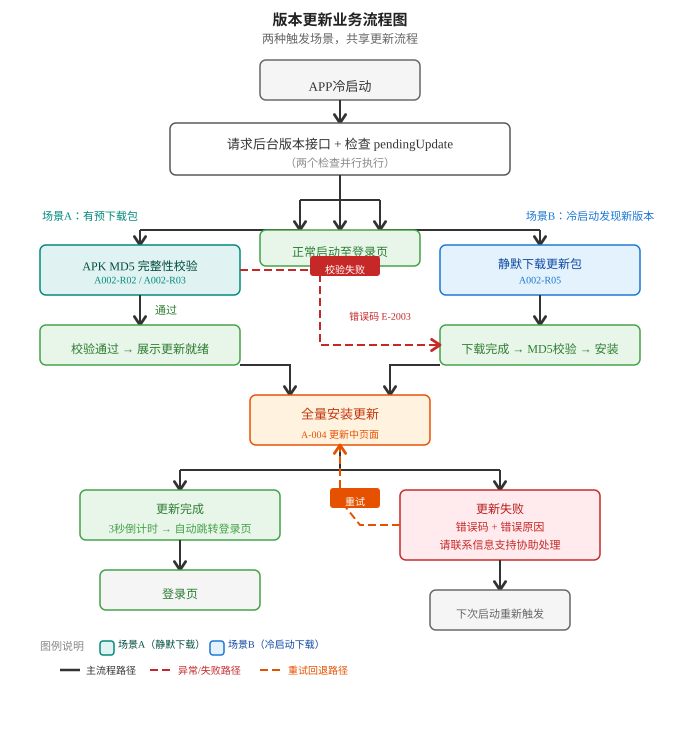

# 移动收银APP — 产品需求文档（PRD）

## 📑 目录

```
1.  文档概述
    1.1 文档目的
    1.2 产品定位
    1.3 需求背景
2.  整体功能架构
    2.1 功能模块总览
    2.2 业务主流程（启动顺序：门店注册→版本更新→用户登录→销售主流程）
3.  业务流程清单（含15个流程完成状态）
4.  流程1 · 版本更新 ✅
    4.1 业务规则 | 4.2 功能需求分述 | 4.3 页面状态对照 | 4.4 异常场景 | 4.5 业务流程图
5.  流程2 · 用户登录 ✅
    5.1 功能简述 | 5.2 页面元素 | 5.3 功能需求分述(含6个子功能) | 5.4 页面状态对照 | 5.5 接口需求 | 5.6 异常场景
6.  流程3 · 门店注册 ✅（启动第一步校验）
    6.1 功能简述 | 6.2 业务规则 | 6.3 功能需求分述(含5个子功能) | 6.4 页面状态对照 | 6.5 异常场景 | 6.6 流程图(2幅SVG)
7.  流程4 · 销售主流程 ✅
    7.1 功能简述 | 7.2 业务主流程图 | 7.3 首页(D-100) | 7.4 分类列表(D-101) | 7.5 扫码页(D-102) | 7.6 底部导航(D-103) | 7.7 SVG流程图 | 7.8 页面状态对照 | 7.9 待补充
8.  流程5 · 挂单/取单 📋
9.  流程6 · 会员登录 ✅
    9.1 功能简述 | 9.2 页面元素 | 9.3 功能需求分述(含3个子功能) | 9.4 页面状态对照 | 9.5 异常场景
10. 流程7 · 会员注册 ✅
    10.1 功能简述 | 10.2 页面元素 | 10.3 功能需求分述 | 10.4 页面状态对照 | 10.5 异常场景 | 10.6 与会员登录联动
11. 流程8 · 商品录入流程 📋
12. 流程9 · 促销计算流程 📋
13. 流程10 · 收款流程 📋
14. 流程11 · 有源退货 📋
15. 流程12 · 对账/换班 📋
16. 流程13 · 订单申诉 📋
17. 流程14 · 订单查询 📋
18. 流程15 · 系统设置 📋
19. 非功能性需求
20. 数据埋点
21. 附录（原型文件清单 / 关联文档）
```

> ✅ = 已详细展开 &nbsp;&nbsp; 📋 = 框架阶段

---

## 📋 修订记录

| 版本 | 日期 | 修订内容 |
|------|------|---------|
| V1.0 | 2026-05-23 | 初稿：完整PRD框架，含全部15个流程；流程1「版本更新」已详细展开 |
| V1.1 | 2026-05-23 | 流程2「用户登录」详细展开；流程3「门店注册」详细展开；一体化原型含更新+登录 |
| V1.2 | 2026-05-25 | 原型优化：门店注册引导页文案调整、注册码输入改为不限位数单行输入框 |
| V1.3 | 2026-05-28 | 主流程顺序调整：门店注册提前至登录之前（启动即校验）；流程3门店注册重写触发逻辑和流程图（含全链路+子流程两幅SVG）；流程2标注已完成；流程4/6/7详细展开；首页/分类列表/扫码页原型已完成；底部导航确认（首页/分类/购物车/我的） |

---

## 1. 文档概述

### 1.1 文档目的

本文档为移动扫码购收银APP的产品需求文档，用于明确产品功能范围、业务流程、交互规则及验收标准，指导后续设计、开发与测试工作。

### 1.2 产品定位

**产品名称**：移动扫码购收银APP
**运行平台**：安卓系统 PDA 手持终端
**目标用户**：零售门店店员（收银员）、店长
**核心价值**：在门店高峰期分流定量商品收银压力，提供移动化、灵活性的收银能力补充

### 1.3 需求背景

门店当前存在以下典型场景与痛点：

**1. 小量标品速购场景，缺乏快速通道**
顾客仅购买少量标品（如两根烤肠、一支冰淇淋、饮料等），却需要与其他大宗称重顾客一同排队等待收银，体验差、效率低，且容易导致顾客流失。

**2. 高峰期收单压力分流**
根据现有数据分析，门店约 43% 的订单为纯定量商品订单（无需称重售卖），具备分流处理的可行性，从而将有限的人工收银台资源释放给需要称重服务的顾客。

**3. 移动收银能力补充**
考虑引入手持移动 POS 收银能力，在高峰时段由店员在排队区或店内流动收银，灵活分担门店收单压力，减少顾客排队时长，提升门店承单能力。

**4. 潜在延伸场景**
- 新店开业期间的人流疏导与快速收银
- 店外促销场景的临时收单
- 其他高峰期的弹性收银补充

---

## 2. 整体功能架构

### 2.1 功能模块总览

| 编号 | 功能模块 | 核心能力 | 优先级 |
|------|---------|---------|--------|
| 1 | **版本更新** | 静默下载 → 强制更新 → 更新中/完成/失败处理 | P0 |
| 2 | **用户登录** | 账号密码 / 企微扫码登录、记住密码、权限校验 | P0 |
| 3 | **门店注册** | 门店注册码绑定、设备授权 | P0 |
| 4 | **销售主流程** | 会员录入 → 商品扫码加车 → 促销计算 → 结算收款 | P0 |
| 5 | **挂单/取单** | 购物车暂存、多单管理、恢复续结 | P1 |
| 6 | **会员登录** | 被扫会员码 / 手机号 / 支付即会员 | P0 |
| 7 | **会员注册** | 展示注册二维码、手机号录入注册 | P1 |
| 8 | **商品录入** | PDA扫码识别、定量/称重商品分流 | P0 |
| 9 | **促销计算** | 满减/满折/会员优惠券自动计算 | P0 |
| 10 | **收款流程** | 聚合支付（微信/支付宝/云闪付） | P0 |
| 11 | **有源退货** | 原单查询、定量商品部分/整单退款 | P1 |
| 12 | **对账/换班** | 交班汇总、交易笔数/金额统计、店员登出 | P1 |
| 13 | **订单申诉** | 支付中间态查询、支付结果终态同步 | P1 |
| 14 | **订单查询** | 历史订单筛选、订单详情查看 | P1 |
| 15 | **系统设置** | 密码有效期、基础参数配置 | P2 |

### 2.2 业务主流程

```
              ┌──────────┐
              │ APP启动   │
              └────┬─────┘
                   │
              ┌────▼─────┐
              │ 门店注册  │ ← 第一步：校验门店是否已注册，未注册则强制进入注册流程
              └────┬─────┘
                   │
              ┌────▼─────┐
              │ 版本更新  │ ← 第二步：已注册 → 校验设备是否有更新包
              └────┬─────┘
                   │
              ┌────▼─────┐
              │ 用户登录  │ ← 第三步：版本校验通过后登录
              └────┬─────┘
                   │
              ┌────▼─────┐
              │ 销售主流程 │ ← 日常核心收银
              └────┬─────┘
                   │
         ┌─────────┼─────────┐
         │         │         │
    ┌────▼───┐ ┌──▼───┐ ┌──▼───┐
    │会员登录 │ │商品录入│ │促销计算│
    └────────┘ └──────┘ └──────┘
         │         │         │
         └─────────┼─────────┘
                   │
              ┌────▼─────┐
              │ 收款流程  │ ← 聚合支付
              └──────────┘

   辅助流程：挂单/取单（可随时触发）
   售后流程：有源退货（独立的售后入口）

运营管理流程（独立入口，非每日必须操作）：
   对账/换班 → 订单申诉 / 订单查询 → 系统设置
```

---

## 3. 业务流程清单

整体 APP 共包含 15 个流程：

| 序号 | 流程名称 | 对应业务场景说明 | 写作状态 |
|------|---------|-----------------|---------|
| 1 | 版本更新 | APP启动时自动检测新版本，自动触发更新，确保使用最新功能。支持强制更新（阻断旧版使用）。 | ✅ 已详细展开 |
| 2 | 用户登录 | 店员可通过以下两种方式登录APP：①输入账号和密码登录；②选择企业微信扫码，调起企业微信授权后完成登录。系统校验身份并获取对应权限（如收银员/店长）。登录成功后，支持记住账号密码，默认有效期为7天（时间支持后台配置），有效期内打开APP自动填充账号密码，店员点击登录即可进入，无需重复输入。超过有效期需重新输入密码。 | ✅ 已详细展开 |
| 3 | 门店注册 | **APP启动后的第一步校验**。系统在版本更新检测之前，先检查设备是否已绑定门店：①未绑定 → 强制进入注册流程；②已绑定 → 继续下一步版本更新检测。注册码由后台生成分发，绑定后即时失效。 | ✅ 已详细展开 |
| 4 | 销售主流程 | 核心销售流程，串联从会员信息录入、商品扫码加车、促销计算到最终结算收款的完整环节，确保操作流畅高效。 | ✅ 已详细展开 |
| 5 | 挂单/取单 | 销售过程中，店员可将当前购物车中的商品暂存为挂单，以便临时服务其他顾客或处理中断。挂单后购物车清空，可开始新的收单。需要时从挂单列表中取出原订单，继续录入或结算。挂单支持多单暂存，每笔挂单标注时间与金额，方便识别。 | 📋 框架 |
| 6 | 会员登录 | 结算前将订单与会员绑定。店员可输入会员手机号查询，实现会员身份识别，以享受会员优惠或积分。支持会员切换和解绑。 | ✅ 已详细展开 |
| 7 | 会员注册 | 针对非会员顾客，店员录入手机号快速注册，注册成功后自动将新会员信息关联至当前订单。 | ✅ 已详细展开 |
| 8 | 商品录入流程 | 店员使用PDA扫描商品条码，系统自动识别商品。判断为定量商品则加入购物车；若为称重商品则拦截并提示"请至称重台"。 | 📋 框架 |
| 9 | 促销计算流程 | 系统根据已录入的商品、绑定会员身份及当前生效的促销活动，自动计算优惠金额，如满减、满折、会员优惠券等，并实时展示在购物车。 | 📋 框架 |
| 10 | 收款流程 | 结算支持聚合支付（微信、支付宝、云闪付）。线上支付时，调用PDA扫码器扫取顾客付款码完成扣款；本期需求不支持现金支付和其他支付方式。 | 📋 框架 |
| 11 | 有源退货 | 处理已支付订单的退货退款。店员可通过扫描原订单小票码或输入订单号找到原单，勾选需退回的定量商品，核实金额后发起整单和部分退款。 | 📋 框架 |
| 12 | 对账/换班 | 店员结束当班工作时，在APP上发起换班或交班操作。系统自动汇总当班期间交易总笔数、实收总金额（仅线上支付）、各支付方式明细。生成交班汇总页面。交班后当前店员登出，设备恢复待登录状态。 | 📋 框架 |
| 13 | 订单申诉 | 订单支付过程中，若支付渠道返回结果延迟或卡在中间态，店员可在APP订单详情中发起"订单申诉"。系统将主动向支付渠道查询该笔订单的最新支付终态（支付成功/退款成功/支付失败），并将结果同步更新至订单状态，保证收银端订单状态准确，避免重复支付或错单。 | 📋 框架 |
| 14 | 订单查询 | 店员在APP上查询历史订单记录。支持按订单号、支付时间、支付方式、金额区间等条件筛选，查看订单详情（商品明细、支付信息、会员信息）。用于核对交易、协助顾客确认消费记录等场景。仅可查询本门店绑定设备的订单。 | 📋 框架 |
| 15 | 系统设置 | 店员或店长可在APP内进行基础参数配置，包括但不限于：记住账号密码有效期（受后台配置范围限制）、以及其他非业务主流程的系统配置项。 | 📋 框架 |

---

## 4. 流程1：版本更新（详细版）

> 下文为流程「版本更新」的完整 PRD 需求。
> 其余流程（2-15）仅定义框架，后续逐个补充详版。

---

### 4.1 业务规则

| 编号 | 规则描述 |
|------|---------|
| R01 | APP 每次冷启动时必须检测版本（请求后台版本接口）并检查本地待安装标记 |
| R02 | 强制更新过程中，不允许用户跳过或推迟更新 |
| R03 | 更新完成后必须自动跳转至登录页，无需用户操作 |
| R04 | 更新失败必须展示明确错误原因和联系信息支持 |
| R05 | 更新失败必须自动上报错误信息至运维中台 |
| R06 | 取消更新后，下次启动仍会重新触发更新流程 |
| R07 | 全量更新包必须做 MD5 校验，校验失败则进入失败流程 |
| R08 | 更新包大小典型值为 60-120MB |

### 4.2 功能需求分述

#### 4.2.1 静默下载（A-001）

| 项目 | 内容 |
|------|------|
| **需求编号** | A-001 |
| **优先级** | P0 |
| **触发条件** | APP 已启动运行中，后台检测到新版本发布 |
| **前置条件** | ① APP 已启动并正常运行 ② 设备网络连接正常 ③ 存储空间充足 |

**业务规则**：

| 编号 | 规则 |
|------|------|
| A001-R01 | 检测到新版本后，不弹出任何提示或弹窗 |
| A001-R02 | 后台异步下载全量 APK 包，不阻塞 UI 线程 |
| A001-R03 | 下载完成后执行 MD5 校验，通过后标记 `pendingUpdate=true` 并记录目标版本号 |
| A001-R04 | 下载中断（网络断开/存储不足）：清除残文件，下次启动重新检测下载 |
| A001-R05 | 下载路径：`/data/data/{packageName}/update/` 应用私有目录 |
| A001-R06 | 网络：Wi-Fi 优先；4G/5G 不阻断 |

**交互说明**：全程无界面交互，无弹窗，无通知。

---

#### 4.2.2 触发自动更新（A-002）

| 项目 | 内容 |
|------|------|
| **需求编号** | A-002 |
| **优先级** | P0 |
| **触发条件** | ① APP 冷启动时检测到 `pendingUpdate=true` 且 APK 文件存在（已有静默下载包）<br>② APP 冷启动时 `pendingUpdate=false` 但后台版本检测发现新版本（无预下载包） |

**业务规则**：

| 编号 | 规则 |
|------|------|
| A002-R01 | APP 启动后，在加载任何业务界面之前，先检测版本（请求后台版本接口），同时检查本地 `pendingUpdate` 标记 |
| A002-R02 | **场景A：已有预下载包** — 标记存在 + APK 存在 + MD5 通过 → 展示更新就绪页面 |
| A002-R03 | **场景A异常** — 标记存在 + APK 存在 + MD5 失败 → 清除标记 → 展示更新失败页面 |
| A002-R04 | **场景A异常** — 标记存在 + APK 不存在 → 清除标记 → 回退至场景B逻辑 |
| A002-R05 | **场景B：无预下载包，但检测到新版本** — 标记不存在 + 后台返回新版本 → 静默下载更新包，下载完成后自动进入更新流程（展示更新中页面） |
| A002-R06 | 标记不存在 + 后台无新版本 → 正常启动至登录页 |
| A002-R07 | 本流程为强制更新，用户不可跳过，更新完成前 APP 不可使用 |

---

#### 4.2.3 发现新版本页面（无编号，属 A-002 子步骤）

| 项目 | 内容 |
|------|------|
| **所属功能** | A-002 触发自动更新（场景B） |
| **优先级** | P0 |
| **触发条件** | 冷启动时检测到新版本且无预下载包 |

**页面元素**：

- 标题："发现新版本"
- 新版本号标签（橙色底色药丸标签）
- 旧版本号（灰色小字）
- 提示文案："版本更新啦！我们优化了使用体验 建议您更新到最新版本"
- "立即更新"按钮，显示 3 秒倒计时（"立即更新（3s）"→"（2s）"→"（1s）"）

**业务规则**：

| 编号 | 规则 |
|------|------|
| A2-UI01 | 页面展示时，按钮上即开始 3 秒倒计时 |
| A2-UI02 | 用户点击按钮 → 取消倒计时 → 立即进入更新流程 |
| A2-UI03 | 3 秒倒计时结束 → 按钮文字恢复"立即更新" → 自动触发更新流程 |
| A2-UI04 | 本页面无"跳过"或"以后再说"选项（强制更新） |

---

#### 4.2.4 全量更新（A-003）

| 项目 | 内容 |
|------|------|
| **需求编号** | A-003 |
| **优先级** | P0 |
| **说明** | 每次更新下载并安装完整 APK，不做差分/增量 |

**原因**：
1. 差分补丁在 PDA 厂商定制 ROM 上兼容性差
2. 门店 Wi-Fi 环境稳定，传输成本可接受
3. 全量更新可同步完成数据库迁移、配置覆盖等操作

---

#### 4.2.5 更新中页面（A-004）

| 项目 | 内容 |
|------|------|
| **需求编号** | A-004 |
| **优先级** | P0 |

**页面元素**：

- 标题："系统更新中"
- 旧版本号 + 新版本号标签（带橙色底色）
- 更新示意图（齿轮动画图标）
- 进度条（橙色渐变、圆角 4px、高 8px）
- 已更新/总数（如 5/12）
- 随进度变化的状态文案

**状态文案序列**：

| 进度 | 文案 |
|------|------|
| 0-10% | 正在准备更新环境... |
| 10-30% | 正在获取版本中... |
| 30-50% | 正在下载更新文件... |
| 50-65% | 正在校验文件完整性... |
| 65-80% | 正在进行文件更新... |
| 80-95% | 正在加载配置文件... |
| 95-100% | 即将完成... |

**交互规则**：
- 仅展示，无用户可操作元素
- 无"取消"或"暂停"按钮
- 出错立即切换至更新失败页面
- 完成 100% 后停留 0.5s 切换至完成页

---

#### 4.2.6 更新完成 → 自动跳转登录页（A-005）

| 项目 | 内容 |
|------|------|
| **需求编号** | A-005 |
| **优先级** | P0 |
| **跳转目标** | APP 登录页面 |

**页面元素**：
- 标题："更新完成"
- 绿色圆形背景 + 白色对勾图标（64px），带缩放入场动画
- "已更新至 X.X.X 版本"
- 倒计时：3s → 2s → 1s → 0s
- "系统自动跳转登录页..."

**业务规则**：
- 展示 3 秒后自动跳转至登录页
- 无需用户操作
- 跳转后清除 `pendingUpdate` 标记
- 跳转后若令牌有效可免登录进入主页

---

#### 4.2.7 更新失败（A-006）

| 项目 | 内容 |
|------|------|
| **需求编号** | A-006 |
| **优先级** | P0 |
| **触发条件** | APK 校验失败 / 安装异常 / 存储不足 / 系统不兼容 |

**错误码定义**：

| 错误码 | 含义 | 用户可见说明 |
|--------|------|------------|
| E-2001 | APK 文件不存在 | 安装包文件丢失，请重试 |
| E-2002 | 存储空间不足 | 设备存储空间不足，请清理后重试 |
| E-2003 | MD5 校验失败 | 更新文件校验失败，安装包可能已损坏 |
| E-2004 | 安装被系统拦截 | 系统安全策略阻止安装，请联系信息支持 |
| E-2005 | 系统版本不兼容 | 当前系统版本不兼容，请升级系统后重试 |
| E-2999 | 未知错误 | 未知错误，请联系信息支持 |

**页面元素**：
- 标题："更新失败"
- 红色圆形背景 + 白色叉号图标（64px），带抖动入场动画
- 错误码标签（红底白字）
- 错误原因描述
- "请联系信息支持协助处理！"
- "取消" 按钮（灰色边框）
- "重试更新" 按钮（橙色主按钮）

**业务规则**：
- 出错瞬间自动上报错误信息至运维中台
- 点击"重试"重新进入更新流程
- 点击"取消"退出更新流程
- 取消后保留 `pendingUpdate` 标记，下次启动仍触发更新
- 用户无法永久跳过更新

**上报接口**：`POST /api/app/update/report`

| 字段 | 类型 | 示例 |
|------|------|------|
| deviceId | string | "PDA-20230521-001" |
| errorCode | string | "E-2003" |
| errorMessage | string | "APK文件MD5校验失败" |
| currentVersion | string | "1.8.5" |
| targetVersion | string | "2.0.0" |
| networkType | string | "WIFI" |
| freeStorage | number | 524288000 |
| updatePackageSize | number | 90487285 |
| timestamp | string | "2026-05-23T10:30:00+08:00" |

---

### 4.3 页面状态对照

| 状态 | 触发条件 | 展示内容 | 用户操作 | 目标跳转 |
|------|---------|---------|---------|---------|
| **发现新版本** | 冷启动检测到新版本（无预下载包） | 版本标签 + "版本更新啦"提示文案 + "立即更新"按钮（3秒倒计时） | 点击立即更新 或 3秒自动触发 | → 更新中 |
| **更新就绪** | 已有预下载包且校验通过 | 版本信息 + 更新日志 + "开始更新"按钮 | 点击开始 | → 更新中 |
| **更新中** | 用户确认开始更新或自动触发 | 更新示意图（齿轮动画）+ 进度条 + 已更新/总数 + 状态文案 | 无操作 | → 更新完成 / 更新失败 |
| **更新完成** | 安装成功 | 对勾图标 + 版本号 + 倒计时 | 自动跳转 | → 登录页 |
| **更新失败** | 安装异常 | 错误图标 + 错误码 + 原因 + 联系信息支持 + 取消/重试按钮 | 取消/重试 | → 更新中 / 初始态 |

### 4.4 异常场景

| 编号 | 场景 | 处理策略 |
|------|------|---------|
| E01 | APK 下载未完成即启动 | 清除残文件，重新检测下载 |
| E02 | MD5 校验失败 | 更新失败页，E-2003 |
| E03 | 存储空间不足 | 更新失败页，E-2002 |
| E04 | 安装被系统拦截 | 更新失败页，E-2004 |
| E05 | 系统版本不兼容 | 更新失败页，E-2005 |
| E06 | 下载阶段网络中断 | 清除残文件，下次重新下载 |
| E07 | 强制更新阶段关机 | 下次启动重新检测 → 校验 → 触发 |
| E08 | 取消后再次启动 | 保留 pendingUpdate，重新触发 |
| E09 | 跳转登录页失败 | 保留重试兜底逻辑 |
| E10 | 连续失败 > 3次 | 指数退避重试（2min → 4min → 8min） |

### 4.5 业务流程图



**流程说明**：

| 分支 | 说明 |
|------|------|
| **场景A** | APP运行时后台静默下载完成 → 下次冷启动时校验MD5 → 通过则展示"更新就绪" → 开始安装 |
| **场景A异常** | MD5校验失败 → 展示更新失败页面；APK文件不存在 → 回退至场景B逻辑 |
| **场景B** | APP冷启动时检测到新版本（无预下载包）→ 静默下载更新包 → 下载完成自动进入安装 |
| **无新版本** | 正常启动至登录页，不触发任何更新流程 |
| **更新完成** | 全量安装成功 → 展示更新完成页面 → 3秒倒计时 → 自动跳转登录页 |
| **更新失败** | 展示错误码+原因 → 用户可选：取消（下次启动重触发）或重试（回退安装） |

---

## 5. 流程2：用户登录（详细版）

### 5.1 功能简述

| 项目 | 内容 |
|------|------|
| **优先级** | P0 |
| **入口** | 版本更新流程完成后进入登录页；或店员手动登出后进入登录页 |
| **登录方式** | 本期仅支持账号密码登录 |
| **核心能力** | 账号密码校验、记住账号密码、权限校验、营业日展示、门店信息展示 |

### 5.2 页面元素

登录页自上而下包含：

#### 页面标题
- 标题文字："账号登录"，居中显示

#### 营业日信息
- 显示"当前营业日"，值为当前系统日期（如"2026年05月23日"），固定显示不可编辑

#### 账号输入框
- 输入框左侧图标：用户头像图标
- 占位符提示："请输入账号（手机号）"
- 输入内容为用户手机号

#### 密码输入框
- 输入框左侧图标：锁形图标
- 占位符提示："请输入密码"
- 输入后以圆点（•）密文显示
- 输入框右侧有一个眼睛图标用于切换密码可见/隐藏

#### 记住账号密码
- 复选框 + 文字"记住账号密码"
- **默认不勾选**
- 勾选后，有效期内打开APP自动填充账号密码，店员点击登录即可进入
- 默认有效期 **7天**（后台可配置天数 `n`）

#### 操作按钮
- **登录**按钮：橙色渐变主按钮，点击后校验账号密码
- **取消**按钮：灰色边框次按钮，点击后退出登录页

#### 底部信息
| 字段 | 数据来源 | 示例 |
|------|---------|------|
| 门店名称 | 当前绑定门店 | "长沙人民路店" |
| 款台号 | PDA设备标识 | "1" |
| 上次登录用户 | 本地存储的上次登录用户信息 | "张三" |
| 系统版本号 | APP当前版本号 | "v2.0.0" |

### 5.3 功能需求分述

#### 5.3.1 营业日展示（B-001）

| 项目 | 内容 |
|------|------|
| **需求编号** | B-001 |
| **优先级** | P0 |
| **说明** | 页面上方固定显示当前系统日期 |

**业务规则**：

| 编号 | 规则 |
|------|------|
| B001-R01 | 营业日取PDA设备当前系统日期 |
| B001-R02 | 日期格式：YYYY年MM月DD日 |
| B001-R03 | 该日期不可编辑、不可修改 |
| B001-R04 | 营业日仅用于页面展示，不与后台营业日数据同步（即仅前端展示） |

#### 5.3.2 账号输入（B-002）

| 项目 | 内容 |
|------|------|
| **需求编号** | B-002 |
| **优先级** | P0 |
| **说明** | 输入用户手机号作为登录账号 |

**业务规则**：

| 编号 | 规则 |
|------|------|
| B002-R01 | 输入内容为11位手机号 |
| B002-R02 | 输入时不做实时格式校验，仅提交时校验 |
| B002-R03 | 若勾选了"记住账号密码"，下次打开APP自动填充账号 |

#### 5.3.3 密码输入（B-003）

| 项目 | 内容 |
|------|------|
| **需求编号** | B-003 |
| **优先级** | P0 |
| **说明** | 输入密码，密文显示 |

**业务规则**：

| 编号 | 规则 |
|------|------|
| B003-R01 | 输入后立即以圆点（•）密文显示 |
| B003-R02 | 右侧眼睛图标可切换密码可见/隐藏 |
| B003-R03 | 若勾选了"记住账号密码"，下次打开APP自动填充密码 |

#### 5.3.4 记住账号密码（B-004）

| 项目 | 内容 |
|------|------|
| **需求编号** | B-004 |
| **优先级** | P1 |
| **说明** | 勾选后在有效期内自动填充账号密码 |

**业务规则**：

| 编号 | 规则 |
|------|------|
| B004-R01 | 复选框形式，「记住账号密码」文字标签 |
| B004-R02 | 页面加载时默认不勾选 |
| B004-R03 | 勾选后，登录成功后本地持久化存储账号和密码 |
| B004-R04 | 默认有效期 7 天（后台可配置，受 `maxRememberDays` 参数限制） |
| B004-R05 | 有效期内打开APP自动填充账号和密码，无需重新输入 |
| B004-R06 | 超过有效期需重新输入密码，账号保留填充 |
| B004-R07 | 安全要求：密码本地存储需加密（不可明文存储） |

#### 5.3.5 登录校验与权限获取（B-005）

| 项目 | 内容 |
|------|------|
| **需求编号** | B-005 |
| **优先级** | P0 |
| **说明** | 校验账号密码，登录成功后获取角色权限 |

**业务规则**：

| 编号 | 规则 |
|------|------|
| B005-R01 | 点击「登录」按钮，校验账号和密码是否为空 |
| B005-R02 | 账号为空时提示"请输入账号"；密码为空时提示"请输入密码" |
| B005-R03 | 调用后台登录接口校验身份 |
| B005-R04 | 登录成功后，根据账号角色获取对应权限（收银员/店长） |
| B005-R05 | 登录成功后，记录当前登录用户信息至本地，供底部"上次登录用户"显示 |
| B005-R06 | 登录失败时，展示失败原因（账号不存在/密码错误/账号已停用） |

#### 5.3.6 门店信息展示（B-006）

| 项目 | 内容 |
|------|------|
| **需求编号** | B-006 |
| **优先级** | P1 |
| **说明** | 登录页底部展示门店相关信息 |

**展示字段**：

| 字段 | 数据来源 | 示例 |
|------|---------|------|
| 门店名称 | 从门店注册流程获取，本地存储 | "长沙人民路店" |
| 款台号 | PDA设备标识（设备ID或注册时分配的编号） | "1" |
| 上次登录用户 | 本地存储的上次成功登录用户名 | "张三" |
| 系统版本号 | APP当前版本号，从 `BuildConfig.VERSION_NAME` 获取 | "v2.0.0" |

### 5.4 页面状态对照

| 状态 | 触发条件 | 展示内容 | 用户操作 | 目标跳转 |
|------|---------|---------|---------|---------|
| **默认态** | 登录页加载完成 | 营业日 + 账号/密码输入框 + 记住账号+ 登录/取消按钮 + 底部信息 | 输入账号密码 | → 登录成功/失败 |
| **记住账号填充态** | 有效期内打开APP | 账号和密码已自动填入，勾选框默认勾选 | 点击登录即可 | → 登录成功/失败 |
| **登录校验中** | 点击登录 | 按钮文字变为"登录中..."，按钮置灰 | 等待 | → 登录成功/失败 |
| **登录失败** | 账号或密码错误 | Toast提示错误原因 | 修改后重新登录 | → 重新输入 |
| **登录成功** | 账号密码验证通过 | — | — | → 跳转至主页 |

### 5.5 接口需求

#### 登录接口

**请求**：`POST /api/auth/login`

**请求参数**：

| 字段 | 类型 | 说明 |
|------|------|------|
| `account` | string | 手机号 |
| `password` | string | 密码（MD5加密后传输） |
| `storeName` | string | 门店名称 |

**响应参数**：

| 字段 | 类型 | 说明 |
|------|------|------|
| `code` | int | 状态码（0=成功，非0=失败） |
| `message` | string | 提示信息（如"登录成功"/"账号不存在"/"密码错误"） |
| `data` | object | 登录结果数据 |
| └ `token` | string | 登录令牌 |
| └ `role` | string | 用户角色（收银员/店长） |

### 5.6 异常场景

| 场景 | 处理策略 |
|------|---------|
| 账号为空点击登录 | Toast提示"请输入账号" |
| 密码为空点击登录 | Toast提示"请输入密码" |
| 账号不存在 | Toast提示"账号不存在" |
| 密码错误 | Toast提示"密码错误" |
| 账号已停用 | Toast提示"账号已停用，请联系管理员" |
| 网络异常 | Toast提示"网络异常，请检查网络连接" |
| 登录接口超时 | Toast提示"登录超时，请重试" |
| 连续登录失败5次 | 提示"登录失败次数过多，请稍后再试"，按钮锁定30秒 |

---

## 6. 流程3：门店注册（详细版）

> 门店注册是 APP 启动时的**第一步校验流程**。系统在加载版本更新检测之前，先检查门店绑定状态：未注册则强制进入注册流程，完成前不可进入版本更新和登录。

---

### 6.1 功能简述

| 项目 | 内容 |
|------|------|
| **优先级** | P0 |
| **触发时机** | APP 冷启动 → **在版本更新检测和登录页加载之前**，第一步先校验门店绑定状态 |
| **入口** | ① 首次安装启动：自动触发（无本地门店绑定信息）<br>② 切换门店：店长在后台发起解绑后，PDA 下次启动检测到解绑 → 重新触发 |
| **核心能力** | 启动时门店状态校验、注册码输入查询、门店绑定确认、设备授权 |
| **前置条件** | ① 设备网络连接正常 |
| **后置条件** | 门店信息持久化至本地 → 继续进入版本更新检测（流程1） |

**启动校验逻辑**：

```
APP 冷启动
    │
    ▼
┌─────────────┐
│ 门店绑定检测  │  ← 流程3（第一步）
└──┬───────┬──┘
   │       │
  已绑定   未绑定
   │       │
   ▼       ▼
版本更新   强制进入注册流程
检测       （引导页 → 注册码 → 确认 → 绑定）
   │       │
   ▼       ▼
 登录页   绑定成功 → 版本更新检测 → 登录页
```

### 6.2 业务规则

| 编号 | 规则描述 |
|------|---------|
| R01 | APP 每次冷启动时，**在版本更新检测之前**，必须先校验本地门店绑定状态 |
| R02 | 已绑定且未解绑 → 继续进入版本更新检测流程 |
| R03 | 未绑定 → 强制进入注册流程，**不可跳过、不可取消**，注册完成前无法进入版本更新和登录页 |
| R04 | 每台 PDA 设备仅可绑定一个门店 |
| R05 | 注册码由后台生成，为数字编码，分发至各门店管理者 |
| R06 | 注册码有效期默认 24 小时（后台可配置 `registerCodeExpireHours`） |
| R07 | 一个注册码仅允许一个设备成功绑定，绑定后该注册码立即失效 |
| R08 | 注册完成的门店信息需持久化存储至本地（门店名称、门店 ID、绑定时间） |
| R09 | 切换门店需由门店店长在后台发起「解绑」，解绑后 PDA 下次启动时重新触发注册流程 |
| R10 | 注册过程中断网：本地保留已输入的注册码及查询结果，网络恢复后继续 |

### 6.3 功能需求分述

#### 6.3.1 门店注册引导页（C-001）

| 项目 | 内容 |
|------|------|
| **需求编号** | C-001 |
| **优先级** | P0 |
| **触发条件** | APP 启动 → 版本更新完成 → 检测到本地无门店绑定信息 → 自动进入 |

**页面元素**：

- 标题："门店注册"
- 图标：门店建筑物图标（64px，蓝色/灰色调）
- 提示文案主标题："请绑定您的门店"
- 提示副标题："首次使用需绑定门店，请联系信息支持！"
- "开始注册" 按钮（橙色渐变主按钮，宽度自适应）

**业务规则**：

| 编号 | 规则 |
|------|------|
| C001-R01 | 本页面无"跳过"或"以后再说"选项（必须注册后才能使用 APP） |
| C001-R02 | 点击"开始注册" → 跳转至注册码输入页（C-002） |
| C001-R03 | 若注册未完成即退出 APP，下次启动仍从本引导页开始 |
| C001-R04 | 切换门店场景：后台解绑后，PDA 下次启动第一次也展示此引导页 |

---

#### 6.3.2 注册码输入与查询（C-002）

| 项目 | 内容 |
|------|------|
| **需求编号** | C-002 |
| **优先级** | P0 |
| **触发条件** | 引导页点击「开始注册」 或 从其他入口手动触发 |

**页面元素**：

- 标题："输入注册码"
- 注册码输入框：单行文本输入框，不限输入位数，支持数字和字母
- "查询门店" 按钮（橙色渐变主按钮）
  - 输入框非空时按钮可点击
  - 输入框为空时按钮置灰不可点击
- "返回" 按钮（灰色文字链接，返回引导页）

**业务规则**：

| 编号 | 规则 |
|------|------|
| C002-R01 | 输入框仅接受数字（0-9），禁止输入字母或特殊字符 |
| C002-R02 | 输入框非空时「查询门店」按钮可点击，为空时按钮置灰不可点击 |
| C002-R03 | 点击「查询门店」后调用后台接口，按钮变为「查询中...」并置灰 |
| C002-R04 | 注册码校验成功后跳转至门店信息确认页（C-003） |
| C002-R05 | 注册码无效/已过期/已被绑定 → 页面展示错误提示（红色文字浮动提示） |
| C002-R06 | 错误时不清除已输入的注册码，用户可修改后重新查询 |

**接口**：`POST /api/store/register/query`

**请求参数**：

| 字段 | 类型 | 说明 |
|------|------|------|
| `registerCode` | string | 门店注册码（6位数字） |

**响应参数**：

| 字段 | 类型 | 说明 |
|------|------|------|
| `code` | int | 状态码（0=成功，1001=无效注册码，1002=已过期，1003=已被绑定） |
| `message` | string | 提示信息 |
| `data` | object | 门店信息（code=0时返回） |
| └ `storeId` | string | 门店 ID |
| └ `storeName` | string | 门店名称 |
| └ `storeAddress` | string | 门店地址 |
| └ `storePhone` | string | 门店联系电话 |

---

#### 6.3.3 门店信息确认（C-003）

| 项目 | 内容 |
|------|------|
| **需求编号** | C-003 |
| **优先级** | P0 |
| **触发条件** | 注册码查询成功返回门店信息 |

**页面元素**：

- 标题："确认门店信息"
- 门店信息卡片展示（带门店图标 + 绿色对勾标志，表示查询成功）：
  | 字段 | 示例 |
  |------|------|
  | 门店名称 | "长沙万家丽路店" |
  | 门店地址 | "湖南省长沙市雨花区万家丽路 188 号" |
  | 联系电话 | "0731-8888xxxx" |
- 提示文案："请确认以上门店信息是否正确"
- "确认绑定" 按钮（橙色渐变主按钮）
- "重新输入" 按钮（灰色文字链接，返回注册码输入页）

**业务规则**：

| 编号 | 规则 |
|------|------|
| C003-R01 | 门店信息为只读展示，不可编辑 |
| C003-R02 | 点击「确认绑定」→ 调用绑定接口，按钮变为「绑定中...」并置灰 |
| C003-R03 | 绑定成功后跳转至绑定成功页（C-004） |
| C003-R04 | 绑定失败 → 展示失败页（C-005） |
| C003-R05 | 点击「重新输入」→ 返回注册码输入页，已输入的注册码清空 |

**接口**：`POST /api/store/register/bind`

**请求参数**：

| 字段 | 类型 | 说明 |
|------|------|------|
| `registerCode` | string | 门店注册码（6位数字） |
| `storeId` | string | 门店 ID（从查询结果获取） |
| `deviceId` | string | PDA 设备唯一标识 |
| `operatorAccount` | string | 当前操作店员账号（手机号） |

**响应参数**：

| 字段 | 类型 | 说明 |
|------|------|------|
| `code` | int | 状态码（0=成功，2001=注册码已失效，2002=设备已绑定其他门店，2003=门店已满绑定上限） |
| `message` | string | 提示信息 |

---

#### 6.3.4 绑定成功（C-004）

| 项目 | 内容 |
|------|------|
| **需求编号** | C-004 |
| **优先级** | P0 |
| **触发条件** | 绑定接口返回成功 |

**页面元素**：

- 标题："绑定成功"
- 绿色圆形背景 + 白色对勾图标（64px），带缩放入场动画（同版本更新完成页动画）
- 门店信息摘要：
  | 字段 | 示例 |
  |------|------|
  | 门店名称 | "长沙万家丽路店" |
  | 款台号 | "1" |
  | 绑定时间 | "2026-05-23 09:15:00" |
- "开始使用" 按钮（橙色渐变主按钮）

**业务规则**：

| 编号 | 规则 |
|------|------|
| C004-R01 | 门店名称、门店 ID 持久化存储至本地 |
| C004-R02 | 款台号由后台分配（从 1 递增，该门店下每绑定一台设备分配一个编号） |
| C004-R03 | 点击「开始使用」→ 进入版本更新检测流程（流程1），通过后进入登录页 |
| C004-R04 | 绑定成功后，注册码即刻失效 |

---

#### 6.3.5 绑定失败（C-005）

| 项目 | 内容 |
|------|------|
| **需求编号** | C-005 |
| **优先级** | P0 |
| **触发条件** | 绑定接口返回失败 / 网络异常 / 注册码已失效 |

**错误码定义**：

| 错误码 | 含义 | 用户可见说明 |
|--------|------|------------|
| E-3001 | 注册码已失效 | 注册码已过期或已被使用，请重新获取注册码 |
| E-3002 | 设备已绑定其他门店 | 该设备已绑定其他门店，请先解绑后重新注册 |
| E-3003 | 门店绑定数已达上限 | 该门店绑定设备数量已达上限，请联系店长 |
| E-3004 | 网络异常 | 网络连接异常，请检查网络后重试 |
| E-3005 | 系统错误 | 系统异常，请联系信息支持 |

**页面元素**：

- 标题："绑定失败"
- 红色圆形背景 + 白色叉号图标（64px），带抖动入场动画
- 错误码标签（红底白字）
- 错误原因描述
- "重试" 按钮（橙色主按钮）
- "返回修改" 按钮（灰色边框）

**业务规则**：

| 编号 | 规则 |
|------|------|
| C005-R01 | 出错瞬间自动上报错误信息至运维中台 |
| C005-R02 | 点击「重试」→ 重新调用绑定接口 |
| C005-R03 | 点击「返回修改」→ 返回注册码输入页（不清除已输内容） |
| C005-R04 | 连续失败 3 次 → 提示"连续失败次数过多，建议重新获取注册码" |

**上报接口**：`POST /api/store/register/report`

| 字段 | 类型 | 示例 |
|------|------|------|
| deviceId | string | "PDA-20230521-001" |
| errorCode | string | "E-3001" |
| errorMessage | string | "注册码已失效" |
| registerCode | string | "382105" |
| storeId | string | "store_20230501" |
| operatorAccount | string | "188****5678" |
| timestamp | string | "2026-05-23T09:15:00+08:00" |

---

### 6.4 页面状态对照

| 状态 | 触发条件 | 展示内容 | 用户操作 | 目标跳转 |
|------|---------|---------|---------|---------|
| **引导页** | 登录后检测到无门店绑定 | 门店图标 + "请绑定您的门店" + "开始注册"按钮 | 点击开始注册 | → 注册码输入 |
| **注册码输入** | 引导页点击开始注册 | 6位数字输入框 + 查询按钮（初始置灰） | 输入6位码后点击查询 | → 门店确认 / 错误提示 |
| **查询中** | 点击查询门店 | 按钮变为"查询中..."置灰 | 等待 | → 门店确认 / 错误提示 |
| **门店确认** | 查询成功返回门店信息 | 门店信息卡片 + "确认绑定"按钮 + "重新输入"链接 | 确认绑定 / 重新输入 | → 绑定成功 / 绑定失败 |
| **绑定中** | 点击确认绑定 | 按钮变为"绑定中..."置灰 | 等待 | → 绑定成功 / 绑定失败 |
| **绑定成功** | 绑定接口返回成功 | 对勾图标 + 门店摘要 + "开始使用"按钮 | 点击开始使用 | → 版本更新检测 |
| **绑定失败** | 绑定接口返回失败 | 叉号图标 + 错误码 + 原因 + 重试/返回修改按钮 | 重试 / 返回修改 | → 绑定 / 注册码输入 |

### 6.5 异常场景

| 编号 | 场景 | 处理策略 |
|------|------|---------|
| E01 | 注册码输入非数字字符 | 输入拦截，仅允许数字 |
| E02 | 注册码无效 | 注册码输入页展示红色错误提示，不清除已输入内容 |
| E03 | 注册码已过期 | 展示"注册码已过期，请重新获取"，不清除已输入内容 |
| E04 | 注册码已被绑定 | 展示"注册码已被使用"，不清除已输入内容 |
| E05 | 绑定阶段网络中断 | 绑定失败页，E-3004 |
| E06 | 设备已绑定其他门店 | 绑定失败页，E-3002 |
| E07 | 门店绑定数已达上限 | 绑定失败页，E-3003 |
| E08 | 连续绑定失败 3 次 | 提示"连续失败次数过多，建议重新获取注册码" |
| E09 | 查询接口超时 | Toast 提示"查询超时，请重试" |
| E10 | 绑定接口超时 | 绑定失败页，提示"绑定超时，请重试" |
| E11 | 注册过程中强行关闭APP | 下次启动进入引导页或恢复至注册码输入步骤 |

### 6.6 门店注册流程图

#### 6.6.1 启动校验入口（全链路）

```svg
<svg viewBox="0 0 680 500" width="100%" role="img">
  <defs>
    <marker id="arr" viewBox="0 0 10 10" refX="8" refY="5" markerWidth="6" markerHeight="6" orient="auto-start-reverse">
      <path d="M2 1L8 5L2 9" fill="none" stroke="context-stroke" stroke-width="1.5" stroke-linecap="round" stroke-linejoin="round"/>
    </marker>
  </defs>
  <title>APP启动校验流程</title>
  <desc>APP冷启动→门店注册检测→版本更新检测→用户登录</desc>

  <!-- Connectors -->
  <line x1="340" y1="94" x2="340" y2="116" stroke="#5F5E5A" stroke-width="0.5" marker-end="url(#arr)"/>
  <line x1="340" y1="188" x2="340" y2="210" stroke="#5F5E5A" stroke-width="0.5" marker-end="url(#arr)"/>
  <text x="355" y="202" font-size="12" fill="#0F6E56" font-family="system-ui, sans-serif">已注册</text>

  <polyline points="265,152 170,152 170,210" fill="none" stroke="#5F5E5A" stroke-width="0.5" marker-end="url(#arr)"/>
  <text x="222" y="145" font-size="12" fill="#A32D2D" font-family="system-ui, sans-serif">未注册</text>

  <line x1="170" y1="254" x2="170" y2="275" stroke="#5F5E5A" stroke-width="0.5" marker-end="url(#arr)"/>

  <line x1="340" y1="282" x2="340" y2="314" stroke="#5F5E5A" stroke-width="0.5" marker-end="url(#arr)"/>
  <line x1="340" y1="386" x2="340" y2="408" stroke="#5F5E5A" stroke-width="0.5" marker-end="url(#arr)"/>
  <text x="355" y="400" font-size="12" fill="#0F6E56" font-family="system-ui, sans-serif">无需更新</text>

  <polyline points="265,350 170,350 170,408" fill="none" stroke="#5F5E5A" stroke-width="0.5" marker-end="url(#arr)"/>
  <text x="222" y="343" font-size="12" fill="#A32D2D" font-family="system-ui, sans-serif">有新版本</text>

  <line x1="170" y1="452" x2="170" y2="475" stroke="#5F5E5A" stroke-width="0.5" marker-end="url(#arr)"/>

  <!-- Nodes -->
  <g><rect x="295" y="50" width="90" height="44" rx="22" fill="#EAF3DE" stroke="#639922" stroke-width="0.5"/><text x="340" y="76" text-anchor="middle" dominant-baseline="central" font-size="14" font-weight="500" fill="#27500A" font-family="system-ui, sans-serif">APP启动</text></g>

  <!-- Step 1: 门店注册检测 -->
  <g><polygon points="340,116 415,150 340,184 265,150" fill="#FAECE7" stroke="#D85A30" stroke-width="0.5"/><text x="340" y="154" text-anchor="middle" dominant-baseline="central" font-size="13" font-weight="500" fill="#712B13" font-family="system-ui, sans-serif">门店已注册?</text></g>

  <g><rect x="110" y="210" width="120" height="44" rx="8" fill="#FCEBEB" stroke="#E24B4A" stroke-width="0.5"/><text x="170" y="236" text-anchor="middle" dominant-baseline="central" font-size="13" font-weight="400" fill="#791F1F" font-family="system-ui, sans-serif">强制注册流程</text></g>

  <!-- Registration sub-flow -->
  <g><rect x="60" y="275" width="220" height="44" rx="8" fill="#EAF3DE" stroke="#639922" stroke-width="0.5" stroke-dasharray="3,3"/><text x="170" y="301" text-anchor="middle" dominant-baseline="central" font-size="12" fill="#27500A" font-family="system-ui, sans-serif">引导页→注册码→确认→绑定</text></g>
  <line x1="170" y1="319" x2="170" y2="341" stroke="#5F5E5A" stroke-width="0.5" marker-end="url(#arr)"/>
  <text x="185" y="335" font-size="11" fill="#0F6E56" font-family="system-ui, sans-serif">绑定成功</text>

  <!-- Return to main path after registration -->
  <g><rect x="110" y="341" width="120" height="44" rx="8" fill="#E6F1FB" stroke="#378ADD" stroke-width="0.5"/><text x="170" y="367" text-anchor="middle" dominant-baseline="central" font-size="13" font-weight="400" fill="#0C447C" font-family="system-ui, sans-serif">门店已注册</text></g>

  <!-- Step 2: 版本更新检测 (main path for "已注册") -->
  <g><rect x="265" y="210" width="150" height="44" rx="8" fill="#E6F1FB" stroke="#378ADD" stroke-width="0.5"/><text x="340" y="236" text-anchor="middle" dominant-baseline="central" font-size="13" font-weight="400" fill="#0C447C" font-family="system-ui, sans-serif">= 门店已注册</text></g>

  <g><polygon points="340,314 415,348 340,382 265,348" fill="#FAECE7" stroke="#D85A30" stroke-width="0.5"/><text x="340" y="352" text-anchor="middle" dominant-baseline="central" font-size="13" font-weight="500" fill="#712B13" font-family="system-ui, sans-serif">有待更新包?</text></g>

  <g><rect x="110" y="408" width="120" height="44" rx="8" fill="#FCEBEB" stroke="#E24B4A" stroke-width="0.5"/><text x="170" y="434" text-anchor="middle" dominant-baseline="central" font-size="13" font-weight="400" fill="#791F1F" font-family="system-ui, sans-serif">进入更新流程</text></g>
  <text x="170" y="454" text-anchor="middle" font-size="11" fill="#5F5E5A" font-family="system-ui, sans-serif">流程1</text>

  <!-- Update sub-flow -->
  <g><rect x="60" y="475" width="160" height="36" rx="6" fill="#EAF3DE" stroke="#639922" stroke-width="0.5" stroke-dasharray="3,3"/><text x="140" y="497" text-anchor="middle" dominant-baseline="central" font-size="11" fill="#27500A" font-family="system-ui, sans-serif">更新完成→回到主流程</text></g>

  <!-- Step 3: Login -->
  <g><rect x="280" y="408" width="120" height="44" rx="8" fill="#E6F1FB" stroke="#378ADD" stroke-width="0.5"/><text x="340" y="434" text-anchor="middle" dominant-baseline="central" font-size="13" font-weight="400" fill="#0C447C" font-family="system-ui, sans-serif">= 无需更新</text></g>
  <text x="340" y="468" text-anchor="middle" font-size="12" fill="#5F5E5A" font-family="system-ui, sans-serif">↓ 进入登录页</text>

  <rect x="20" y="8" width="640" height="28" rx="4" fill="none" stroke="#D3D1C7" stroke-width="0.5" stroke-dasharray="2,2"/>
  <text x="340" y="27" text-anchor="middle" font-size="12" fill="#888780" font-family="system-ui, sans-serif">APP启动校验流程 · 门店注册（第一步）→ 版本更新（第二步）→ 用户登录（第三步）</text>
</svg>
```

#### 6.6.2 注册子流程（引导页 → 绑定完成）

```svg
<svg viewBox="0 0 680 820" width="100%" role="img">
  <defs>
    <marker id="arr2" viewBox="0 0 10 10" refX="8" refY="5" markerWidth="6" markerHeight="6" orient="auto-start-reverse">
      <path d="M2 1L8 5L2 9" fill="none" stroke="context-stroke" stroke-width="1.5" stroke-linecap="round" stroke-linejoin="round"/>
    </marker>
  </defs>
  <title>门店注册子流程</title>
  <desc>引导页→输入注册码→查询门店→确认信息→绑定→完成</desc>

  <!-- Connectors -->
  <line x1="340" y1="94" x2="340" y2="120" stroke="#5F5E5A" stroke-width="0.5" marker-end="url(#arr2)"/>
  <line x1="340" y1="164" x2="340" y2="200" stroke="#5F5E5A" stroke-width="0.5" marker-end="url(#arr2)"/>
  <line x1="340" y1="277" x2="340" y2="313" stroke="#5F5E5A" stroke-width="0.5" marker-end="url(#arr2)"/>
  <text x="355" y="298" font-size="12" fill="#0F6E56" font-family="system-ui, sans-serif">查询成功</text>

  <polyline points="265,295 170,295 170,313" fill="none" stroke="#5F5E5A" stroke-width="0.5" marker-end="url(#arr2)"/>
  <text x="222" y="288" font-size="12" fill="#A32D2D" font-family="system-ui, sans-serif">查询失败</text>

  <line x1="340" y1="357" x2="340" y2="383" stroke="#5F5E5A" stroke-width="0.5" marker-end="url(#arr2)"/>
  <line x1="340" y1="427" x2="340" y2="463" stroke="#5F5E5A" stroke-width="0.5" marker-end="url(#arr2)"/>

  <polyline points="265,485 170,485 170,463" fill="none" stroke="#5F5E5A" stroke-width="0.5" marker-end="url(#arr2)"/>
  <text x="222" y="478" font-size="12" fill="#A32D2D" font-family="system-ui, sans-serif">绑定失败</text>
  <line x1="340" y1="507" x2="340" y2="553" stroke="#5F5E5A" stroke-width="0.5" marker-end="url(#arr2)"/>
  <text x="355" y="535" font-size="12" fill="#0F6E56" font-family="system-ui, sans-serif">绑定成功</text>

  <line x1="340" y1="597" x2="340" y2="638" stroke="#5F5E5A" stroke-width="0.5" marker-end="url(#arr2)"/>
  <line x1="340" y1="682" x2="340" y2="728" stroke="#5F5E5A" stroke-width="0.5" marker-end="url(#arr2)"/>

  <polyline points="170,505 170,520 40,520 40,200 258,200" fill="none" stroke="#5F5E5A" stroke-width="0.5" stroke-dasharray="4,3" marker-end="url(#arr2)"/>
  <text x="105" y="513" text-anchor="middle" font-size="12" fill="#A32D2D" font-family="system-ui, sans-serif">重试 / 返回修改</text>
  <polyline points="170,357 170,375 40,375 40,200 258,200" fill="none" stroke="#5F5E5A" stroke-width="0.5" stroke-dasharray="4,3" marker-end="url(#arr2)"/>
  <text x="105" y="370" text-anchor="middle" font-size="12" fill="#A32D2D" font-family="system-ui, sans-serif">修改注册码</text>

  <!-- Nodes -->
  <g><rect x="295" y="50" width="90" height="44" rx="22" fill="#EAF3DE" stroke="#639922" stroke-width="0.5"/><text x="340" y="76" text-anchor="middle" dominant-baseline="central" font-size="14" font-weight="500" fill="#27500A" font-family="system-ui, sans-serif">启动</text></g>

  <g><rect x="265" y="120" width="150" height="44" rx="8" fill="#E6F1FB" stroke="#378ADD" stroke-width="0.5"/><text x="340" y="146" text-anchor="middle" dominant-baseline="central" font-size="13" font-weight="400" fill="#0C447C" font-family="system-ui, sans-serif">注册引导页</text></g>
  <text x="340" y="180" text-anchor="middle" font-size="11" fill="#5F5E5A" font-family="system-ui, sans-serif">请绑定您的门店</text>

  <g><rect x="265" y="200" width="150" height="44" rx="8" fill="#E6F1FB" stroke="#378ADD" stroke-width="0.5"/><text x="340" y="226" text-anchor="middle" dominant-baseline="central" font-size="13" font-weight="400" fill="#0C447C" font-family="system-ui, sans-serif">输入注册码</text></g>
  <text x="340" y="260" text-anchor="middle" font-size="11" fill="#5F5E5A" font-family="system-ui, sans-serif">点击查询门店</text>

  <g><polygon points="340,313 415,349 340,385 265,349" fill="#FAECE7" stroke="#D85A30" stroke-width="0.5"/><text x="340" y="353" text-anchor="middle" dominant-baseline="central" font-size="13" font-weight="500" fill="#712B13" font-family="system-ui, sans-serif">查询结果?</text></g>

  <g><rect x="265" y="383" width="150" height="44" rx="8" fill="#E6F1FB" stroke="#378ADD" stroke-width="0.5"/><text x="340" y="409" text-anchor="middle" dominant-baseline="central" font-size="13" font-weight="400" fill="#0C447C" font-family="system-ui, sans-serif">确认门店信息</text></g>
  <text x="340" y="443" text-anchor="middle" font-size="11" fill="#5F5E5A" font-family="system-ui, sans-serif">门店名称·地址·电话</text>

  <g><polygon points="340,463 415,499 340,535 265,499" fill="#FAECE7" stroke="#D85A30" stroke-width="0.5"/><text x="340" y="503" text-anchor="middle" dominant-baseline="central" font-size="13" font-weight="500" fill="#712B13" font-family="system-ui, sans-serif">绑定结果?</text></g>

  <g><rect x="110" y="463" width="120" height="44" rx="8" fill="#FCEBEB" stroke="#E24B4A" stroke-width="0.5"/><text x="170" y="489" text-anchor="middle" dominant-baseline="central" font-size="12" font-weight="400" fill="#791F1F" font-family="system-ui, sans-serif">查询失败提示</text></g>
  <text x="170" y="522" text-anchor="middle" font-size="11" fill="#5F5E5A" font-family="system-ui, sans-serif">错误码+重试/修改</text>

  <g><rect x="100" y="553" width="130" height="44" rx="8" fill="#FCEBEB" stroke="#E24B4A" stroke-width="0.5"/><text x="165" y="579" text-anchor="middle" dominant-baseline="central" font-size="12" font-weight="400" fill="#791F1F" font-family="system-ui, sans-serif">绑定失败</text></g>
  <text x="165" y="600" text-anchor="middle" font-size="11" fill="#5F5E5A" font-family="system-ui, sans-serif">见下方处理</text>

  <g><rect x="275" y="638" width="130" height="44" rx="8" fill="#EAF3DE" stroke="#639922" stroke-width="0.5"/><text x="340" y="664" text-anchor="middle" dominant-baseline="central" font-size="13" font-weight="500" fill="#27500A" font-family="system-ui, sans-serif">绑定成功</text></g>
  <text x="340" y="700" text-anchor="middle" font-size="11" fill="#5F5E5A" font-family="system-ui, sans-serif">门店摘要+对勾图标</text>

  <g><rect x="295" y="728" width="90" height="44" rx="22" fill="#E6F1FB" stroke="#378ADD" stroke-width="0.5"/><text x="340" y="754" text-anchor="middle" dominant-baseline="central" font-size="13" font-weight="400" fill="#0C447C" font-family="system-ui, sans-serif">登录页</text></g>

  <rect x="20" y="8" width="640" height="28" rx="4" fill="none" stroke="#D3D1C7" stroke-width="0.5" stroke-dasharray="2,2"/>
  <text x="340" y="27" text-anchor="middle" font-size="12" fill="#888780" font-family="system-ui, sans-serif">门店注册子流程</text>
</svg>
```

**全链路启动顺序**：

| 步骤 | 说明 |
|------|------|
| ① APP 冷启动 | 应用启动入口 |
| ② 门店注册检测 | **第一步**：检查本地门店绑定状态 |
| ③ 版本更新检测 | **第二步**：已注册 → 检查是否有待更新包 |
| ④ 用户登录 | **第三步**：门店已注册 + 版本校验通过 → 进入登录页 |

**虚线回路说明**：

| 回路 | 触发条件 | 回到步骤 |
|------|---------|---------|
| 修改注册码 | 查询成功后点击"重新输入" | 返回②重新输注册码 |
| 重试/返回修改 | 绑定失败点击重试或返回 | 返回②修改后重试 |

## 7. 流程4：销售主流程（详细版）

> 销售主流程是 APP 的核心收银链路，从首页出发，串联会员绑定、商品扫码加车、促销计算、结算收款四个环节。

---

### 7.1 功能简述

| 项目 | 内容 |
|------|------|
| **优先级** | P0 |
| **入口** | 登录成功 + 门店绑定完成后进入首页 |
| **核心流程** | 会员录入(可选) → 商品扫码加车(循环) → 促销计算(自动) → 结算收款 |
| **页面结构** | 首页(主工作台) + 分类点选列表 + 扫码页 + 购物车 |

### 7.2 业务主流程图


> 详见 7.7 节「销售主流程 SVG 流程图」

### 7.3 首页（D-100）

| 项目 | 内容 |
|------|------|
| **需求编号** | D-100 |
| **优先级** | P0 |
| **说明** | 登录并完成门店绑定后的主工作台，是销售流程的起点 |

**页面元素**：

| 区域 | 元素 | 说明 |
|------|------|------|
| **顶部品牌区** | 橙色渐变背景 + 品牌 Logo 占位 + "欢迎使用移动收银" | 品牌标识区域 |
| **搜索框** | 搜索图标 + 输入框 + "搜索"按钮 | 支持搜索商品名称或条码 |
| **扫码入口** | 方形扫码按钮（大图标） | 点击进入扫码页，调起 PDA 摄像头 |
| **会员栏** | 两种状态：未登录 / 已登录 | 见流程6 |
| **门店信息** | 门店名称 + 款台号 | 底部固定展示 |
| **底部导航** | 首页 / 分类 / 购物车 / 我的 | 4 个 tab，全局固定 |

**会员栏状态对照**：

| 状态 | 展示内容 | 操作 |
|------|---------|------|
| **会员未登录** | "会员未登录" + "去登录"按钮（橙色文字按钮） | 点击跳转会员登录页 |
| **会员已登录** | 会员手机号(如"13456786677") + "切换会员"按钮 | 点击弹出解绑确认弹窗 |

**业务规则**：

| 编号 | 规则 |
|------|------|
| D100-R01 | 首页为固定布局，不随内容滚动 |
| D100-R02 | 搜索框支持商品名称和条码两种搜索方式 |
| D100-R03 | 底部 4 个 tab（首页/分类/购物车/我的），首页和分类页时固定显示 |
| D100-R04 | 底部 tab 当前高亮颜色：#F08A4B（橙色） |
| D100-R05 | 门店信息取自门店注册流程，持久化至本地 |

---

### 7.4 分类点选列表（D-101）

| 项目 | 内容 |
|------|------|
| **需求编号** | D-101 |
| **优先级** | P0 |
| **说明** | 按商品分类浏览并快速加入购物车 |

**页面结构**：

| 区域 | 说明 |
|------|------|
| **顶部** | 返回箭头 + "分类"标题 |
| **搜索框** | 圆角搜索框（border-radius: 20px），占位"搜索商品名称或条码" |
| **左侧分类导航** | 图标 + 文字垂直排列，显示 8 个商品品类 |
| **右侧商品网格** | 双列网格布局，每个卡片包含商品图(110px)、名称、规格、价格(红色¥)、橙色圆形加号按钮 |
| **底部导航** | 首页 / 分类 / 购物车 / 我的（分类 tab 高亮） |

**分类品类列表**：

| 序号 | 品类 |
|------|------|
| 1 | 水饮 |
| 2 | 饼干 |
| 3 | 面包糕点 |
| 4 | 冲泡类 |
| 5 | 果冻 |
| 6 | 唐巧 |
| 7 | 坚果炒货 |
| 8 | 蜜饯果干 |

**业务规则**：

| 编号 | 规则 |
|------|------|
| D101-R01 | 左侧分类点击切换，当前高亮显示橙色左边条 + 橙色文字 |
| D101-R02 | 右侧商品网格无滚动条（overflow: hidden），内容自适应 |
| D101-R03 | 点击商品加号按钮 → 商品加入购物车 → Toast 提示"已加入购物车" |
| D101-R04 | 商品图片区域高 110px，使用品牌色渐变占位图 + SVG 图标 |
| D101-R05 | 商品价格以红色(#FF3B30)粗体显示，¥ 符号 + 金额 |
| D101-R06 | 加号按钮为橙色(#FF6B00)圆形，白色+号，直径 24px |

---

### 7.5 扫码页（D-102）

| 项目 | 内容 |
|------|------|
| **需求编号** | D-102 |
| **优先级** | P0 |
| **说明** | 调起 PDA 摄像头扫描商品条码 |

**页面元素**：

| 区域 | 说明 |
|------|------|
| **扫描区域** | 黑色背景全屏 + 橙色四角框线 + 中间动画扫描线 |
| **提示文字** | "商品条形码可识别"，居中显示 |
| **返回** | 左上角返回箭头，返回首页 |

**交互规则**：
- 扫描线动画：上下往复（`scanMove` CSS 动画，周期约 2s）
- 扫描成功：震动反馈 + 商品加入购物车 + 自动返回商品页面
- 扫描识别不到条码：扫描线继续动画，无额外提示

---

### 7.6 底部全局导航（D-103）

| 项目 | 内容 |
|------|------|
| **需求编号** | D-103 |
| **优先级** | P0 |
| **说明** | 首页和分类页面底部固定的全局导航栏 |

| Tab | 图标 | 说明 |
|-----|------|------|
| **首页** | 房子图标 | 返回首页 |
| **分类** | 列表图标 | 进入分类点选列表 |
| **购物车** | 购物车图标（带红色数字角标） | 查看当前购物车 |
| **我的** | 人形图标 | 个人中心/换班/设置 |

**业务规则**：

| 编号 | 规则 |
|------|------|
| D103-R01 | 首页和分类页面时固定显示在 device-screen 底部 |
| D103-R02 | 其他页面（扫码/登录/注册等）隐藏底部导航 |
| D103-R03 | 当前选中 tab 文字颜色为橙色(#F08A4B) |
| D103-R04 | 购物车角标红色(#FF4D4F)，数字为当前购物车商品种类数 |
| D103-R05 | 点击购物车/我的 → 暂展示 Toast 提示（后续版本实现） |

---

### 7.7 销售主流程 SVG 流程图

```svg
<svg viewBox="0 0 680 830" width="100%" role="img">
  <defs>
    <marker id="arr" viewBox="0 0 10 10" refX="8" refY="5" markerWidth="6" markerHeight="6" orient="auto-start-reverse">
      <path d="M2 1L8 5L2 9" fill="none" stroke="context-stroke" stroke-width="1.5" stroke-linecap="round" stroke-linejoin="round"/>
    </marker>
  </defs>
  <title>销售主流程</title>
  <desc>移动收银APP销售主流程</desc>

  <!-- Connectors -->
  <line x1="340" y1="94" x2="340" y2="114" stroke="#5F5E5A" stroke-width="0.5" marker-end="url(#arr)"/>
  <polyline points="265,150 170,150 170,210" fill="none" stroke="#5F5E5A" stroke-width="0.5" marker-end="url(#arr)"/>
  <text x="222" y="143" text-anchor="middle" font-size="12" fill="#A32D2D" font-family="system-ui, sans-serif">否</text>
  <line x1="340" y1="186" x2="340" y2="252" stroke="#5F5E5A" stroke-width="0.5" marker-end="url(#arr)"/>
  <text x="355" y="220" font-size="12" fill="#0F6E56" font-family="system-ui, sans-serif">是</text>
  <polyline points="240,232 265,232 265,274" fill="none" stroke="#5F5E5A" stroke-width="0.5" marker-end="url(#arr)"/>
  <line x1="340" y1="316" x2="340" y2="334" stroke="#5F5E5A" stroke-width="0.5" marker-end="url(#arr)"/>
  <polyline points="265,370 170,370 170,430" fill="none" stroke="#5F5E5A" stroke-width="0.5" marker-end="url(#arr)"/>
  <text x="222" y="363" text-anchor="middle" font-size="12" fill="#A32D2D" font-family="system-ui, sans-serif">否</text>
  <polyline points="415,370 480,370 480,430" fill="none" stroke="#5F5E5A" stroke-width="0.5" marker-end="url(#arr)"/>
  <text x="450" y="363" text-anchor="middle" font-size="12" fill="#0F6E56" font-family="system-ui, sans-serif">是</text>
  <polyline points="170,498 340,498 340,514" fill="none" stroke="#5F5E5A" stroke-width="0.5" marker-end="url(#arr)"/>
  <polyline points="480,474 480,498 340,498" fill="none" stroke="#5F5E5A" stroke-width="0.5"/>
  <polyline points="265,550 40,550 40,274 265,274" fill="none" stroke="#5F5E5A" stroke-width="0.5" stroke-dasharray="4,3" marker-end="url(#arr)"/>
  <text x="148" y="543" text-anchor="middle" font-size="12" fill="#A32D2D" font-family="system-ui, sans-serif">是 · 继续扫码</text>
  <line x1="340" y1="586" x2="340" y2="598" stroke="#5F5E5A" stroke-width="0.5" marker-end="url(#arr)"/>
  <text x="355" y="595" font-size="12" fill="#0F6E56" font-family="system-ui, sans-serif">否</text>
  <line x1="340" y1="642" x2="340" y2="684" stroke="#5F5E5A" stroke-width="0.5" marker-end="url(#arr)"/>
  <line x1="340" y1="728" x2="340" y2="770" stroke="#5F5E5A" stroke-width="0.5" marker-end="url(#arr)"/>

  <!-- Nodes: Start -->
  <g><rect x="295" y="50" width="90" height="44" rx="22" fill="#EAF3DE" stroke="#639922" stroke-width="0.5"/><text x="340" y="76" text-anchor="middle" dominant-baseline="central" font-size="14" font-weight="500" fill="#27500A" font-family="system-ui, sans-serif">开始</text></g>
  <!-- Diamond: 有会员? -->
  <g><polygon points="340,114 415,150 340,186 265,150" fill="#FAECE7" stroke="#D85A30" stroke-width="0.5"/><text x="340" y="154" text-anchor="middle" dominant-baseline="central" font-size="13" font-weight="500" fill="#712B13" font-family="system-ui, sans-serif">有会员?</text></g>
  <!-- 会员登录/注册 -->
  <g><rect x="100" y="210" width="140" height="44" rx="8" fill="#E6F1FB" stroke="#378ADD" stroke-width="0.5"/><text x="170" y="236" text-anchor="middle" dominant-baseline="central" font-size="13" font-weight="400" fill="#0C447C" font-family="system-ui, sans-serif">会员登录 / 注册</text></g>
  <!-- 商品扫码录入 -->
  <g><rect x="265" y="252" width="150" height="44" rx="8" fill="#E6F1FB" stroke="#378ADD" stroke-width="0.5"/><text x="340" y="278" text-anchor="middle" dominant-baseline="central" font-size="13" font-weight="400" fill="#0C447C" font-family="system-ui, sans-serif">商品扫码录入</text></g>
  <text x="340" y="314" text-anchor="middle" font-size="11" fill="#5F5E5A" font-family="system-ui, sans-serif">PDA扫描条码</text>
  <!-- Diamond: 定量商品? -->
  <g><polygon points="340,334 415,370 340,406 265,370" fill="#FAECE7" stroke="#D85A30" stroke-width="0.5"/><text x="340" y="374" text-anchor="middle" dominant-baseline="central" font-size="13" font-weight="500" fill="#712B13" font-family="system-ui, sans-serif">定量商品?</text></g>
  <!-- 拦截提示 -->
  <g><rect x="100" y="430" width="140" height="44" rx="8" fill="#FCEBEB" stroke="#E24B4A" stroke-width="0.5"/><text x="170" y="452" text-anchor="middle" dominant-baseline="central" font-size="12" font-weight="400" fill="#791F1F" font-family="system-ui, sans-serif">拦截提示</text></g>
  <text x="170" y="496" text-anchor="middle" font-size="11" fill="#5F5E5A" font-family="system-ui, sans-serif">请至称重台</text>
  <!-- 加入购物车 -->
  <g><rect x="425" y="430" width="110" height="44" rx="8" fill="#E6F1FB" stroke="#378ADD" stroke-width="0.5"/><text x="480" y="456" text-anchor="middle" dominant-baseline="central" font-size="13" font-weight="400" fill="#0C447C" font-family="system-ui, sans-serif">加入购物车</text></g>
  <!-- Diamond: 继续扫码? -->
  <g><polygon points="340,514 415,550 340,586 265,550" fill="#FAECE7" stroke="#D85A30" stroke-width="0.5"/><text x="340" y="554" text-anchor="middle" dominant-baseline="central" font-size="13" font-weight="500" fill="#712B13" font-family="system-ui, sans-serif">继续扫码?</text></g>
  <!-- 促销计算 -->
  <g><rect x="275" y="598" width="130" height="44" rx="8" fill="#E6F1FB" stroke="#378ADD" stroke-width="0.5"/><text x="340" y="624" text-anchor="middle" dominant-baseline="central" font-size="13" font-weight="400" fill="#0C447C" font-family="system-ui, sans-serif">促销计算</text></g>
  <!-- 结算收款 -->
  <g><rect x="275" y="684" width="130" height="44" rx="8" fill="#E6F1FB" stroke="#378ADD" stroke-width="0.5"/><text x="340" y="710" text-anchor="middle" dominant-baseline="central" font-size="13" font-weight="400" fill="#0C447C" font-family="system-ui, sans-serif">结算收款</text></g>
  <!-- 完成 -->
  <g><rect x="295" y="770" width="90" height="44" rx="22" fill="#EAF3DE" stroke="#639922" stroke-width="0.5"/><text x="340" y="796" text-anchor="middle" dominant-baseline="central" font-size="14" font-weight="500" fill="#27500A" font-family="system-ui, sans-serif">完成</text></g>

  <!-- Section label -->
  <rect x="20" y="8" width="640" height="28" rx="4" fill="none" stroke="#D3D1C7" stroke-width="0.5" stroke-dasharray="2,2"/>
  <text x="340" y="27" text-anchor="middle" font-size="12" fill="#888780" font-family="system-ui, sans-serif">销售主流程 · 移动收银APP</text>
</svg>
```

**流程说明**：

| 分支 | 说明 |
|------|------|
| **有会员? 是** | 已绑定会员 → 直接进入商品扫码录入 |
| **有会员? 否** | 跳转会员登录/注册流程 → 完成后回到商品扫码录入 |
| **定量商品? 是** | PDA 扫描识别为定量商品 → 加入购物车 |
| **定量商品? 否** | 称重商品 → 拦截提示"请至称重台" → 不加入购物车 |
| **继续扫码? 是** | 虚线回路 → 回到商品扫码录入继续添加 |
| **继续扫码? 否** | 进入促销计算 → 结算收款 → 完成 |

### 7.8 页面状态对照

| 状态 | 触发条件 | 页面 | 底部导航 |
|------|---------|------|---------|
| **首页** | 登录+门店绑定完成 | 主工作台（品牌区+搜索+扫码入口+会员栏+门店信息） | 显示（首页高亮） |
| **分类列表** | 点击底部分类 tab 或首页搜索 | 左右分栏（分类导航+商品网格） | 显示（分类高亮） |
| **扫码页** | 点击首页扫码按钮 | 全屏扫描取景框 | 隐藏 |
| **会员登录** | 首页点击"去登录"或"切换会员" | 手机号输入 + 登录按钮 + 去注册链接 | 隐藏 |
| **会员注册** | 会员登录页点击"去注册"或会员不存在弹窗确认 | 手机号输入 + 注册按钮 | 隐藏 |
| **购物车** | 待后续版本实现 | — | — |
| **我的** | 待后续版本实现 | — | — |

### 7.9 待后续版本补充

- 购物车完整交互（商品列表、数量修改、删除、整单取消）
- 促销计算详细规则（满减/满折/优惠券的触发条件和计算逻辑）
- 结算收款详细流程（支付码扫描、扣款、结果展示、小票打印）
- 挂单/取单联动
- 首页销售统计区域

---

## 8. 流程5：挂单/取单（框架）

> 📋 框架阶段，后续补充详细需求

### 8.1 功能简述

| 项目 | 内容 |
|------|------|
| **优先级** | P1 |
| **核心能力** | 购物车暂存、多单管理、恢复续结 |

### 8.2 功能点

| 编号 | 功能点 |
|------|--------|
| D-001 | 挂单：当前购物车商品暂存为挂单，购物车清空 |
| D-002 | 多单管理：支持多笔挂单同时暂存 |
| D-003 | 挂单标识：每笔挂单标注时间和金额 |
| D-004 | 取单：从挂单列表中选取原订单恢复至购物车 |
| D-005 | 挂单超时清理：挂单超过指定时间后自动清除 |

---

## 9. 流程6：会员登录（详细版）

> 会员登录是销售主流程的前置环节。店员在结算前帮助顾客完成会员身份绑定，以享受会员价格和积分权益。

---

### 9.1 功能简述

| 项目 | 内容 |
|------|------|
| **优先级** | P0 |
| **入口** | ① 首页会员栏点击"去登录"<br>② 首页会员栏点击"切换会员" → 解绑后自动跳转<br>③ 结算前从购物车触发（后续版本） |
| **核心能力** | 手机号查询会员、会员身份绑定、会员切换与解绑 |
| **登录方式** | 本期仅支持手机号查询，被扫会员码/支付即会员为后续版本 |

### 9.2 页面元素

| 区域 | 元素 | 说明 |
|------|------|------|
| **标题栏** | 返回箭头 + "会员登录" | 点击返回箭头回到首页 |
| **输入区** | 手机号输入框（左侧扫码图标占位） + "登录"按钮 | 扫码图标为预留，本期不启用 |
| **底部链接** | "去注册会员" | 蓝色文字链接，跳转会员注册页 |

**页面状态**：

| 状态 | 展示 | 操作 |
|------|------|------|
| **默认态** | 手机号输入框为空，"登录"按钮可点击 | 输入手机号后点击登录 |
| **查询中** | 按钮变为"查询中..." | 等待后台响应 |
| **会员不存在** | 弹窗："会员不存在，是否立即注册？" + 确认/取消 | 确认→跳转注册页；取消→回到输入页 |
| **登录成功** | Toast"会员已登录"，返回首页 | 首页会员栏更新为已登录状态 |

### 9.3 功能需求分述

#### 9.3.1 会员手机号查询（F-001）

| 项目 | 内容 |
|------|------|
| **需求编号** | F-001 |
| **优先级** | P0 |
| **触发条件** | 店员在会员登录页输入手机号后点击"登录" |

**业务规则**：

| 编号 | 规则 |
|------|------|
| F001-R01 | 手机号为 11 位数字，仅支持中国大陆手机号 |
| F001-R02 | 点击登录后调用后台接口查询会员信息 |
| F001-R03 | 查询成功 → 绑定会员 → 返回首页，会员栏显示"鸣鸣会员 + 手机号" |
| F001-R04 | 查询失败（会员不存在）→ 弹窗引导注册会员 |
| F001-R05 | 输入框左侧扫码图标为预留入口，本期不可点击 |

**接口**：`POST /api/member/login`

| 字段 | 类型 | 必填 | 说明 |
|------|------|------|------|
| `phone` | string | 是 | 会员手机号（11位） |
| `storeName` | string | 是 | 当前门店名称 |

**响应**：

| 字段 | 类型 | 说明 |
|------|------|------|
| `code` | int | 0=成功，4001=会员不存在 |
| `data.memberId` | string | 会员ID |
| `data.memberName` | string | 会员昵称 |
| `data.memberPhone` | string | 会员手机号 |
| `data.memberLevel` | string | 会员等级 |

---

#### 9.3.2 会员不存在弹窗注册引导（F-002）

| 项目 | 内容 |
|------|------|
| **需求编号** | F-002 |
| **优先级** | P0 |
| **触发条件** | 后台返回会员不存在（code=4001） |

**弹窗元素**：
- 提示文字："会员不存在，是否立即注册？"
- "确认注册"按钮（橙色主按钮）
- "取消"按钮（灰色边框）

**业务规则**：

| 编号 | 规则 |
|------|------|
| F002-R01 | 弹窗采用自定义 DOM 弹窗，非浏览器原生 confirm |
| F002-R02 | 点击"确认注册" → 携带已输入的手机号跳转会员注册页 |
| F002-R03 | 点击"取消" → 关闭弹窗，停留在会员登录页 |
| F002-R04 | 测试手机号 00000000000 模拟会员不存在场景 |

---

#### 9.3.3 切换会员/解绑（F-003）

| 项目 | 内容 |
|------|------|
| **需求编号** | F-003 |
| **优先级** | P1 |
| **触发条件** | 首页会员栏点击"切换会员" |

**弹窗元素**：
- 提示文字："确定解除当前会员的绑定？"
- "确定"按钮（橙色主按钮）
- "取消"按钮（灰色边框）

**业务规则**：

| 编号 | 规则 |
|------|------|
| F003-R01 | 弹窗采用自定义 DOM 弹窗 |
| F003-R02 | 点击"确定" → 解除当前会员绑定 → 跳转会员登录页 |
| F003-R03 | 点击"取消" → 关闭弹窗，回到首页 |
| F003-R04 | 解绑后首页会员栏恢复为"会员未登录"状态 |

---

### 9.4 页面状态对照

| 状态 | 触发条件 | 展示内容 | 操作 | 跳转 |
|------|---------|---------|------|------|
| **会员登录页** | 首页点击"去登录" | 手机号输入框 + 登录按钮 + 去注册链接 | 输入手机号点击登录 | → 会员绑定成功 / 会员不存在弹窗 |
| **会员不存在弹窗** | 查询返回会员不存在 | "会员不存在，是否立即注册？" + 确认/取消 | 确认/取消 | → 会员注册页 / 返回登录页 |
| **会员已登录** | 查询成功 | Toast"会员已登录"，自动返回首页 | — | → 首页 |
| **切换会员弹窗** | 首页点击"切换会员" | "确定解除当前会员的绑定？" + 确定/取消 | 确定/取消 | → 解绑+跳转登录页 / 回首页 |

### 9.5 异常场景

| 场景 | 处理策略 |
|------|---------|
| 手机号为空点击登录 | 不做校验，允许空值提交（由后台返回错误） |
| 手机号格式错误 | 不做前端校验，由后台返回错误提示 |
| 查询接口超时 | Toast提示"网络异常，请重试" |
| 查询接口返回系统错误 | Toast提示"系统繁忙，请稍后重试" |

---

## 10. 流程7：会员注册（详细版）

> 当顾客非会员时，店员可通过快速注册流程帮助顾客完成会员注册，注册成功后自动绑定至当前收银会话。

---

### 10.1 功能简述

| 项目 | 内容 |
|------|------|
| **优先级** | P1 |
| **入口** | ① 会员登录页底部"去注册会员"链接<br>② 会员查询不存在弹窗 → 点击"确认注册"（携带手机号） |
| **核心能力** | 手机号快速注册、注册成功自动绑定 |
| **注册方式** | 本期仅支持手机号注册，二维码注册为后续版本 |

### 10.2 页面元素

| 区域 | 元素 | 说明 |
|------|------|------|
| **标题栏** | 返回箭头 + "会员注册" | 点击返回回到会员登录页 |
| **输入区** | 手机号输入框 + "注册"按钮 | 若从会员不存在弹窗跳转，自动填入手机号 |
| **提示文字** | 无额外提示 | 极简设计，仅手机号即可注册 |

**页面状态**：

| 状态 | 展示 | 操作 |
|------|------|------|
| **默认态** | 手机号输入框（可能已预填） + 注册按钮 | 输入/修改手机号后点击注册 |
| **注册中** | 按钮变为"注册中..." | 等待后台响应 |
| **注册成功** | Toast"注册成功，会员已登录" | 自动返回首页，会员栏更新为已登录 |
| **注册失败** | Toast 提示错误原因 | 停留在注册页，可修改后重试 |

### 10.3 功能需求分述

#### 10.3.1 手机号注册（G-001）

| 项目 | 内容 |
|------|------|
| **需求编号** | G-001 |
| **优先级** | P1 |
| **触发条件** | 会员注册页点击"注册"按钮 |

**业务规则**：

| 编号 | 规则 |
|------|------|
| G001-R01 | 入口一（去注册会员）：输入框为空，用户需手动输入手机号 |
| G001-R02 | 入口二（会员不存在弹窗）：输入框自动填入已输入的手机号，用户可修改 |
| G001-R03 | 仅需输入手机号即可注册，无需会员昵称等其他信息 |
| G001-R04 | 注册成功后自动绑定会员 → Toast"注册成功，会员已登录" → 返回首页 |
| G001-R05 | 注册失败 → Toast 显示后台返回的错误原因 |

**接口**：`POST /api/member/register`

| 字段 | 类型 | 必填 | 说明 |
|------|------|------|------|
| `phone` | string | 是 | 会员手机号（11位） |
| `storeName` | string | 是 | 当前门店名称 |

**响应**：

| 字段 | 类型 | 说明 |
|------|------|------|
| `code` | int | 0=成功 |
| `data.memberId` | string | 新注册会员ID |
| `data.memberName` | string | 系统生成会员昵称 |
| `data.memberPhone` | string | 会员手机号 |

---

### 10.4 页面状态对照

| 状态 | 触发条件 | 展示 | 操作 | 跳转 |
|------|---------|------|------|------|
| **注册页（空）** | 会员登录页点击"去注册" | 空手机号输入框 + 注册按钮 | 输入手机号点击注册 | → 注册成功/失败 |
| **注册页（预填）** | 会员不存在弹窗确认 | 手机号已填入 + 注册按钮 | 可修改后点击注册 | → 注册成功/失败 |
| **注册成功** | 接口返回成功 | Toast"注册成功，会员已登录" | — | → 自动回首页 |
| **注册失败** | 接口返回失败 | Toast 错误原因 | 修改后重试 | → 停留在注册页 |

### 10.5 异常场景

| 场景 | 处理策略 |
|------|---------|
| 手机号已被注册 | Toast提示"该手机号已注册，请直接登录" |
| 手机号格式错误 | 不做前端校验，由后台返回错误 |
| 注册接口超时 | Toast提示"网络异常，请重试" |
| 连续注册失败 | 不做次数限制，每次展示后台返回的错误原因 |

### 10.6 与会员登录的联动

```
会员登录(输入手机号) → 查询
  ├─ 会员存在 → 绑定 → 回首页(已登录)
  └─ 会员不存在 → 弹窗
       ├─ 确认注册 → 跳转注册页(预填手机号) → 注册 → 回首页(已登录)
       └─ 取消 → 回登录页
```

---

## 11. 流程8：商品录入流程（框架）

> 📋 框架阶段，后续补充详细需求

### 11.1 功能简述

| 项目 | 内容 |
|------|------|
| **优先级** | P0 |
| **核心能力** | PDA 扫码识别、定量/称重商品分流 |

### 11.2 功能点

| 编号 | 功能点 |
|------|--------|
| G-001 | 条码扫描：PDA 扫描商品条码，系统自动识别商品 |
| G-002 | 定量商品：识别为定量商品则直接加入购物车 |
| G-003 | 称重商品拦截：识别为称重商品则提示"请至称重台"，不加入购物车 |
| G-004 | 手动录入：支持手动输入商品编码添加 |
| G-005 | 扫码音效/振动反馈：扫描成功有明确反馈 |

---

## 12. 流程9：促销计算流程（框架）

> 📋 框架阶段，后续补充详细需求

### 12.1 功能简述

| 项目 | 内容 |
|------|------|
| **优先级** | P0 |
| **核心能力** | 自动计算优惠、实时展示 |

### 12.2 功能点

| 编号 | 功能点 |
|------|--------|
| H-001 | 满减计算：根据商品金额自动计算满减优惠 |
| H-002 | 满折计算：根据商品金额自动计算满折优惠 |
| H-003 | 会员优惠券：根据会员身份计算可用优惠券 |
| H-004 | 实时展示：优惠金额实时更新在购物车中 |

---

## 13. 流程10：收款流程（框架）

> 📋 框架阶段，后续补充详细需求

### 13.1 功能简述

| 项目 | 内容 |
|------|------|
| **优先级** | P0 |
| **核心能力** | 聚合支付扫码扣款 |
| **支付方式** | 微信支付、支付宝支付、云闪付 |
| **暂不支持** | 现金支付、其他支付方式 |

### 13.2 功能点

| 编号 | 功能点 |
|------|--------|
| I-001 | 聚合支付：调用 PDA 扫码器扫取顾客付款码 |
| I-002 | 扣款处理：调用支付接口完成扣款 |
| I-003 | 支付结果展示：支付成功/失败页面 |
| I-004 | 支付失败处理：引导顾客更换支付方式或重新扫码 |
| I-005 | 小票打印：支付完成后联动蓝牙打印机（可选） |

---

## 14. 流程11：有源退货（框架）

> 📋 框架阶段，后续补充详细需求

### 14.1 功能简述

| 项目 | 内容 |
|------|------|
| **优先级** | P1 |
| **核心能力** | 原单查询、定量商品退款 |

### 14.2 功能点

| 编号 | 功能点 |
|------|--------|
| J-001 | 原单查询：扫描原订单小票码或输入订单号查找原单 |
| J-002 | 商品勾选：勾选需退回的定量商品 |
| J-003 | 金额核实：展示退款金额供店员核实 |
| J-004 | 整单退款：退款全部商品 |
| J-005 | 部分退款：仅退款勾选的商品 |

---

## 15. 流程12：对账/换班（框架）

> 📋 框架阶段，后续补充详细需求

### 15.1 功能简述

| 项目 | 内容 |
|------|------|
| **优先级** | P1 |
| **核心能力** | 交班汇总、交易统计、店员登出 |

### 15.2 功能点

| 编号 | 功能点 |
|------|--------|
| K-001 | 交班发起：店员在APP上发起换班或交班操作 |
| K-002 | 交班汇总：自动汇总当班期间交易总笔数、实收总金额（仅线上支付） |
| K-003 | 支付明细：展示各支付方式（微信/支付宝/云闪付）的收款明细 |
| K-004 | 交班确认：展示交班汇总页面供店员确认 |
| K-005 | 店员登出：交班完成后当前店员登出，设备恢复待登录状态 |

### 15.3 待补充

- 交班报表模板
- 交班时间范围计算规则
- 交班异常处理（网络中断时能否交班）
- 页面交互原型

---

## 16. 流程13：订单申诉（框架）

> 📋 框架阶段，后续补充详细需求

### 16.1 功能简述

| 项目 | 内容 |
|------|------|
| **优先级** | P1 |
| **核心能力** | 支付中间态查询、支付结果终态同步 |

### 16.2 功能点

| 编号 | 功能点 |
|------|--------|
| L-001 | 申诉发起：在订单详情中发起"订单申诉" |
| L-002 | 支付查询：系统主动向支付渠道查询该笔订单的最新支付终态 |
| L-003 | 结果同步：将支付渠道返回的终态（支付成功/退款成功/支付失败）同步更新至订单状态 |
| L-004 | 重复支付检测：如果发现重复扣款，标记异常并提示处理 |
| L-005 | 申诉记录：保留每次申诉的操作记录供追溯 |

### 16.3 待补充

- 支付渠道查询超时策略
- 申诉频次限制
- 人工介入兜底流程
- 页面交互原型

---

## 17. 流程14：订单查询（框架）

> 📋 框架阶段，后续补充详细需求

### 17.1 功能简述

| 项目 | 内容 |
|------|------|
| **优先级** | P1 |
| **数据范围** | 仅可查询本门店绑定设备的订单 |
| **核心能力** | 历史订单筛选、订单详情查看 |

### 17.2 功能点

| 编号 | 功能点 |
|------|--------|
| M-001 | 订单号搜索：按订单号精确查找 |
| M-002 | 条件筛选：按支付时间、支付方式、金额区间等条件筛选 |
| M-003 | 订单列表：以列表形式展示符合条件的订单 |
| M-004 | 订单详情：查看商品明细、支付信息、会员信息 |
| M-005 | 数据导出：支持将查询结果导出为报表（可选） |

### 17.3 待补充

- 查询结果分页规则
- 数据查询时间范围限制
- 页面交互原型

---

## 18. 流程15：系统设置（框架）

> 📋 框架阶段，后续补充详细需求

### 18.1 功能简述

| 项目 | 内容 |
|------|------|
| **优先级** | P2 |
| **核心能力** | 基础参数配置、偏好设置 |

### 18.2 功能点

| 编号 | 功能点 |
|------|--------|
| N-001 | 密码有效期设置：记住账号密码有效期（受后台配置范围限制） |
| N-002 | 网络设置：查看当前网络状态、切换网络 |
| N-003 | 设备信息：查看PDA设备基本信息（型号、系统版本、存储状态） |
| N-004 | 关于APP：查看APP版本号、版本更新记录、隐私协议 |
| N-005 | 清除缓存：清理本地缓存数据 |

### 18.3 待补充

- 各配置项的后台控制范围
- 配置同步策略（本地 vs 远程）
- 页面交互原型

---

## 19. 非功能性需求

| 分类 | 需求 | 指标 |
|------|------|------|
| **性能** | 扫码识别响应时间 | ≤ 500ms |
| **性能** | 页面切换响应时间 | ≤ 300ms |
| **性能** | 支付接口超时时间 | ≤ 10s |
| **安全** | 登录 Token 加密存储 | 必做 |
| **安全** | 支付密钥不落盘 | 必做 |
| **兼容** | 支持安卓 6.0+ | 兼容 |
| **兼容** | 适配主流 PDA 品牌（东集/霍尼韦尔/优博讯） | 兼容 |
| **网络** | 支持离线/弱网模式（本地缓存+异步同步） | P2 |
| **存储** | 本地缓存订单数据上限 | 500 笔 |

---

## 20. 数据埋点（框架）

| 事件分类 | 说明 |
|---------|------|
| 版本更新类 | 下载开始/完成/失败、安装开始/完成/失败、重试/取消（已在流程1中定义） |
| 登录类 | 登录成功/失败、登录方式、记住密码触发 |
| 销售类 | 开单、加车、删除商品、挂单/取单、促销命中、支付成功/失败 |
| 退货类 | 退货发起、退货金额、退货商品数 |
| 对账换班类 | 交班发起、交班确认、交班异常 |
| 订单申诉类 | 申诉发起、支付查询、结果同步 |
| 订单查询类 | 查询条件、查看详情、导出 |
| 系统设置类 | 配置修改、缓存清除 |

详细埋点列表待各流程单独展开时定义。

---

## 21. 附录

### 21.1 原型文件

| 文件 | 说明 | 状态 |
|------|------|------|
| `pos-app-prototype.html` | 一体化交互原型，含全部已完成流程的页面 | ✅ 已完成 |
| └ 已含页面 | 版本更新 / 用户登录 / 门店注册 / 首页 / 会员登录 / 会员注册 / 扫码页 / 分类列表 | ✅ |
| └ 底部导航 | 首页 / 分类 / 购物车 / 我的（4 tab 全局底部导航） | ✅ |
| `pos-update-flow.svg` | 版本更新业务流程图 | ✅ 已完成 |
| 销售主流程 SVG | 已嵌入 PRD 第 7 节 | ✅ 已完成 |

**原型中已实现的核心交互**：

| 交互 | 说明 |
|------|------|
| 版本更新全流程 | 发现新版本 → 更新中 → 更新完成 → 更新失败（含 3s 倒计时自动触发） |
| 用户登录 | 账号密码登录 + 记住密码 + 营业日展示 + 底部门店信息 |
| 门店注册 | 引导页 → 注册码输入 → 门店确认 → 绑定成功/失败 |
| 首页会员切换 | 去登录 → 会员登录 / 切换会员 → 解绑弹窗 → 会员登录 |
| 会员不存在引导 | 输入 00000000000 → 弹窗"会员不存在" → 快速注册 |
| 分类点选 | 8 品类左侧导航 + 双列商品网格 + 加号入车 |
| 扫码页 | 黑色全屏 + 橙色角框 + 扫描线动画 |

### 21.2 关联文档

| 文档 | 说明 |
|------|------|
| 本 PRD | 当前文档，覆盖全部 15 个流程 |
| 流程1 展开版 | 本文档第 4 节（版本更新已详细展开） |
