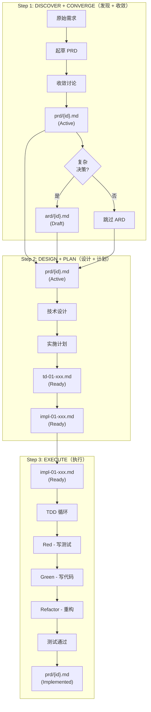

# NEW-SSD Core 使用指南

## 这个指南解决什么问题

你有一个需求，可能是用户的一句抱怨、产品的一句话、一段模糊的讨论，或者一场需求会议的完整纪要。你需要把它们变成 AI 可以直接编译成代码的实施计划。这个指南告诉你一步步怎么做。

## 核心理念：Why-First（为什么先行）

在写任何代码之前，先回答这四个问题：

1. **为什么有这个流程？** — 它解决什么问题？
2. **具体解决什么问题？** — 问题是什么？
3. **为什么代码要这样设计？** — 什么决策驱动了这个设计？
4. **这应该放在哪里？** — 哪个组件/模块负责这个？

## 目录组织

```text
{project-root}/
├── prd/                              # Layer 1: 产品需求
│   └── {date}-{topic}.md           # PRD 文件
│
├── ard/                              # Layer 2: 架构决策
│   └── {date}-{topic}.md           # 仅复杂决策需要
│
├── docs/                             # Layer 3: 技术设计 + 实施计划
│   └── {date}-{topic}/
│       ├── td-01-xxx.md            # 技术设计
│       └── impl-01-xxx.md         # 实施计划
│
├── specs/                            # Layer 4: BDD 规格（可选）
│   └── {feature-name}.md
│
└── src/                              # 实现代码
```

**命名规范**：`{YYYY-MM-DD}-{简短主题}`

---

## 工作流程：三步



---

## ARD 决策指南

```mermaid
flowchart TD
    A[需要新决策] --> B{有多少选项?}
    B -->|1-2 个选项| C{影响多个 PRD?}
    B -->|3+ 个选项| D[创建 ARD]
    C -->|是| D
    C -->|否| E{上下文复杂?}
    E -->|是| D
    E -->|否| F[内联到 Tech Design]
    
    D --> G[写入 ard/{id}.md]
    F --> H[使用 KD-1, KD-2...]
```

**创建 ARD 当：**
- 决策有 >2 个选项
- 决策影响多个 PRD 或模块
- 决策有长期架构影响
- 团队需要记住为什么选择这个

**在 Tech Design 中内联当：**
- 决策简单（≤2 个明确选项）
- 仅影响当前单个 PRD
- 理由显而易见

---

## 输入输出速查

```mermaid
flowchart LR
    subgraph Inputs
        I1[原始需求]
        I2[prd/{id}.md]
        I3[ard/{id}.md]
        I4[impl-01-xxx.md]
    end

    subgraph Step1
        I1 --> P1[prd/{id}.md<br/>+ ard/{id}.md]
    end

    subgraph Step2
        P1 --> T1[td-01-xxx.md<br/>+ impl-01-xxx.md]
    end

    subgraph Step3
        T1 --> O1[src/ + 测试]
    end
```

| 步骤 | 输入 | 输出 |
|------|------|------|
| Step 1 | 原始需求 | prd/{id}.md (Active) + ard/{id}.md (可选) |
| Step 2 | prd/{id}.md + ard/{id}.md | td-01-xxx.md + impl-01-xxx.md |
| Step 3 | impl-01-xxx.md | src/ + 通过的测试 |

---

## 相关文件

| Schema | 用途 |
|--------|------|
| [schema/prd.md](schema/prd.md) | 产品需求模板 |
| [schema/ard.md](schema/ard.md) | 架构决策模板 |
| [schema/tech-design.md](schema/tech-design.md) | 技术设计模板 |
| [schema/implementation.md](schema/implementation.md) | 实施计划模板 |
| [schema/bdd-spec.md](schema/bdd-spec.md) | BDD 规格模板（可选） |

---

## 四个问题详解

### 1. 为什么有这个流程？

这个问题识别**目的**。每个功能都应该解决一个问题。如果你无法解释一个流程为什么存在，它可能就不应该存在。

### 2. 具体解决什么问题？

这个问题识别**具体性**。模糊的需求如"支持用户管理"变成具体如"允许用户在 30 秒内重置密码"。

### 3. 为什么代码要这样设计？

这个问题识别**决策可追溯性**。答案存在于 ARD 中。没有 ARD，未来的开发者会质疑或推翻你的决策。

### 4. 这应该放在哪里？

这个问题识别**所有权**。每个功能应该在架构中有明确的归属。如果它可以放在多个地方，架构需要澄清。

---

## 验收清单

每个 PRD 必须满足：

- [ ] **Motivation** 用具体的问题陈述回答
- [ ] **Goal** 有可验证的成功标准
- [ ] **Scenarios** 覆盖正常路径和至少一个异常
- [ ] **Out of Scope** 明确说明
- [ ] **Links** 填充相关 ARD（如果有）

每个 Tech Design 必须满足：

- [ ] **Key Decisions** 已定义（内联或 ARD 引用）
- [ ] **Metrics** 有具体数字，不是模糊描述
- [ ] **Scenario Mapping** 覆盖所有 PRD 场景
- [ ] **Fallback Strategy** 已定义

每个 Implementation 必须满足：

- [ ] **ARD Compliance** — 所有变更遵循 ARD 约束
- [ ] **Verification** 案例链接到 PRD 场景
- [ ] **Completion Checklist** 全部勾选
