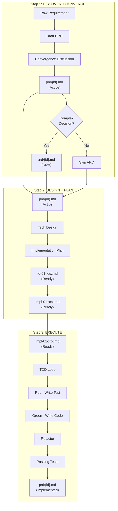

# NEW-SSD Core Usage Guide

## What This Guide Solves

You have a requirement — it could be a user's complaint, a product statement, a vague discussion, or a complete meeting minutes. You need to turn it into an actionable implementation plan that AI can directly compile into code. This guide tells you how to do it step by step.

## Core Philosophy: Why-First

Before writing any code, answer these four questions:

1. **Why do we have this flow?** — What problem does this solve?
2. **What problem is this solving?** — What is the specific issue?
3. **Why is the code shaped like this?** — What decision drove this design?
4. **Where does this belong?** — What component/module owns this?

## Directory Organization

```text
{project-root}/
├── prd/                              # Layer 1: Product Requirements
│   └── {date}-{topic}.md           # PRD files
│
├── ard/                              # Layer 2: Architecture Decisions
│   └── {date}-{topic}.md           # Only for complex decisions
│
├── docs/                             # Layer 3: Tech Design + Implementation
│   └── {date}-{topic}/
│       ├── td-01-xxx.md            # Tech Design
│       └── impl-01-xxx.md         # Implementation Plan
│
├── specs/                            # Layer 4: BDD Specs (optional)
│   └── {feature-name}.md
│
└── src/                              # Implementation code
```

**Naming convention**: `{YYYY-MM-DD}-{short-topic}`

---

## Workflow: Three Steps



---

## ARD Decision Guide

```mermaid
flowchart TD
    A[New Decision Needed] --> B{How many options?}
    B -->|1-2 options| C{Impacts multiple PRDs?}
    B -->|3+ options| D[Create ARD]
    C -->|Yes| D
    C -->|No| E{Complex context?}
    E -->|Yes| D
    E -->|No| F[Inline in Tech Design]
    
    D --> G[Document in ard/{id}.md]
    F --> H[Use KD-1, KD-2... in Tech Design]
```

**Create ARD when:**
- Decision has >2 options
- Decision impacts multiple PRDs or modules
- Decision has long-term architectural implications
- Team needs to remember why this was chosen

**Inline in Tech Design when:**
- Decision is simple (≤2 clear options)
- Only affects this single PRD
- Rationale is obvious

---

## Output Quick Reference

```mermaid
flowchart LR
    subgraph Inputs
        I1[Raw Requirement]
        I2[prd/{id}.md]
        I3[ard/{id}.md]
        I4[impl-01-xxx.md]
    end

    subgraph Step1
        I1 --> P1[prd/{id}.md<br/>+ ard/{id}.md]
    end

    subgraph Step2
        P1 --> T1[td-01-xxx.md<br/>+ impl-01-xxx.md]
    end

    subgraph Step3
        T1 --> O1[src/ + Tests]
    end
```

| Step | Input | Output |
|------|-------|--------|
| Step 1 | Raw requirement | prd/{id}.md (Active) + ard/{id}.md (optional) |
| Step 2 | prd/{id}.md + ard/{id}.md | td-01-xxx.md + impl-01-xxx.md |
| Step 3 | impl-01-xxx.md | src/ + passing tests |

---

## Related Files

| Schema | Purpose |
|--------|---------|
| [schema/prd.md](schema/prd.md) | Product Requirement template |
| [schema/ard.md](schema/ard.md) | Architecture Decision template |
| [schema/tech-design.md](schema/tech-design.md) | Tech Design template |
| [schema/implementation.md](schema/implementation.md) | Implementation template |
| [schema/bdd-spec.md](schema/bdd-spec.md) | BDD Spec template (optional) |

---

## Four Questions Deep Dive

### 1. Why do we have this flow?

This question identifies **purpose**. Every feature should solve a problem. If you can't explain why a flow exists, it probably shouldn't.

### 2. What problem is this solving?

This question identifies **specificity**. Vague requirements like "support user management" become concrete like "allow users to reset password within 30 seconds".

### 3. Why is the code shaped like this?

This question identifies **decision traceability**. The answer lives in ARDs. Without an ARD, future developers will question or undo your decisions.

### 4. Where does this belong?

This question identifies **ownership**. Each feature should have a clear home in the architecture. If it could go in multiple places, the architecture needs clarification.

---

## Completion Checklist

For every PRD:

- [ ] **Motivation** answered with concrete problem statement
- [ ] **Goal** has verifiable success criteria
- [ ] **Scenarios** cover normal path and at least one exception
- [ ] **Out of Scope** explicitly stated
- [ ] **Links** populated with related ARDs (if any)

For every Tech Design:

- [ ] **Key Decisions** defined (inline or ARD reference)
- [ ] **Metrics** have specific numbers, not vague descriptions
- [ ] **Scenario Mapping** covers all PRD scenarios
- [ ] **Fallback Strategy** defined for degradation cases

For every Implementation:

- [ ] **ARD Compliance** — all changes follow ARD constraints
- [ ] **Verification** cases link to PRD scenarios
- [ ] **Completion Checklist** all checked
