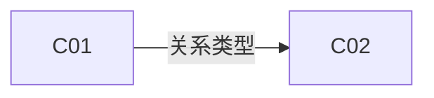

# 批次概览: [主题]

> **视角：拆分批次的 Agent（Prompt 1 / Prompt 2）**
> 批次概览是 **Agent 的工作产物**，在将输入拆分为 Collection 时产出。它服务三类读者：
> - **参与人（审阅者）**：Agent 提议拆分后读一次，确认拆分是否合理（数量、边界、关系都合适）。后续不主动维护。
> - **收敛 Agent（Prompt 3）**：读取作为全局上下文，理解跨 Collection 的耦合关系。
> - **技术设计 Agent（Prompt 4）**：读取以理解共享数据模型、共享基础设施和架构约束，再深入某个 Collection。
>
> 一个批次只有一份批次概览，由 Agent 随 Collection 变化同步更新。

> 本模板为单一必填区。Agent 在创建批次时必须填写所有字段。

---

## 必填区

### 批次元数据

- 主题: [一句话描述本批次的核心议题]
- 创建日期: [YYYY-MM-DD]
- 来源: [会议摘要路径 / 需求文档路径 / 其他来源]
- 参与人: [参与讨论的人员列表]
- 模式: [标准 | 轻量] — 如为轻量模式，在此说明理由
- 目标仓库: [Git 仓库地址或本地路径；未知则留空，在生成技术设计时确认]

### Collection 清单

> 本批次包含的所有 Collection，每条一行。状态随 Collection 更新同步。

| 编号 | 文件路径 | 主题 | 状态 | 草稿来源 | 简述 |
|------|----------|------|------|----------|------|
| C01 | [path] | [主题] | [采集中 / 已收敛 / 已完成] | [agent-prompt1 / agent-prompt2 / participant] | [一句话说明] |
| C02 | [path] | [主题] | [状态] | [来源] | [简述] |
| ...  | ...      | ...  | ...  | ...      | ...  |

### 跨 Collection 关系

> 描述 Collection 之间的调用/依赖/共享关系。优先用 Mermaid 简图，复杂情况再补文字说明。

#### 关系类型说明
- **前置依赖（prerequisite）**: 必须先完成 A 才能启动 B（顺序关系）
- **数据共享（data-sharing）**: A 和 B 读写同一份数据/模型
- **调用关系（invocation）**: A 在业务流程中直接触发 B
- **约束（constraint）**: A 的决策或规则限制了 B 的设计空间（如架构决策约束场景设计）
- **替代方案（alternative）**: A 和 B 是同一问题的互斥选项（最终只选其一）
- **运行时互斥（mutually-exclusive）**: A 和 B 不会在同一次执行中发生（与"替代方案"不同——两者可能都存在）

### 全局待收敛清单

> 汇总所有 Collection 中尚未解决的模糊点，附来源链接与优先级。参与人集中讨论时看这里，不要挨个打开 Collection。

#### 优先级说明
- **P0**: 阻塞 Tech Design 启动（如核心架构决策、基础数据模型）
- **P1**: 阻塞一条或多条已收敛规则，但不阻塞整个批次
- **P2**: 优化/边缘场景 — 可延后处理，不阻塞下游工作

| 优先级 | 来源 | 模糊点 | 阻塞 |
|--------|------|--------|------|
| [P0 / P1 / P2] | [C01#模糊点1] | [问题描述] | [阻塞了哪条规则的收敛] |
| [优先级] | [C02#模糊点3] | [问题描述] | [阻塞] |
| ... | ... | ... | ... |
