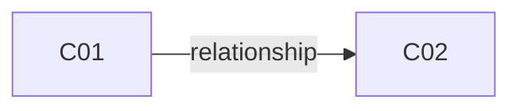

# Batch Overview: [Topic]

> **Perspective: The Agent that splits the batch (Prompt 1 / Prompt 2)**
> The batch overview is **the Agent's working artifact**, produced when splitting input into Collections. It serves three audiences:
> - **Participant (Reviewer)**: Reads the overview once after the Agent proposes a split, to confirm the split is reasonable (right number, right boundaries, right relationships). Does not maintain it ongoing.
> - **Convergence Agent (Prompt 3)**: Reads it as global context to understand cross-Collection coupling during convergence discussions.
> - **Tech Design Agent (Prompt 4)**: Reads it to understand shared data models, infrastructure, and architectural constraints before diving into a single Collection.
>
> One batch has exactly one batch overview, kept in sync by the Agent as Collections change.

> This template is a single required section. All fields should be filled by the Agent when creating the batch.

---

## Required Section

### Batch Metadata

- Topic: [One-sentence description of the core issue for this batch]
- Created Date: [YYYY-MM-DD]
- Source: [Meeting summary path / requirement document path / other source]
- Participants: [List of participants in the discussion]
- Mode: [Standard | Lightweight] — if Lightweight, state reason here
- Target Repository: [Git repository URL or local path; leave empty if unknown, confirmed during tech design generation]

### Collection Inventory

> All Collections in this batch, one row per Collection. Status is kept in sync with each Collection.

| ID | File Path | Topic | Status | Draft Origin | Summary |
|----|-----------|-------|--------|--------------|---------|
| C01 | [path] | [topic] | [Collecting / Converged / Completed] | [agent-prompt1 / agent-prompt2 / participant] | [One-sentence summary] |
| C02 | [path] | [topic] | [status] | [origin] | [summary] |
| ... | ... | ... | ... | ... | ... |

### Cross-Collection Relationships

> Describe invocation / dependency / sharing relationships between Collections. Use Mermaid diagram; add textual explanation only for complex cases.

#### Relationship Type Key
- **prerequisite**: A must be completed before B can start (ordering)
- **data-sharing**: A and B read/write the same data/model
- **invocation**: A directly triggers B in the business flow
- **constraint**: A's decision or rule restricts B's design space (e.g., architecture decision constraining a scenario)
- **alternative**: A and B are mutually exclusive options for the same problem (only one will be chosen)
- **mutually-exclusive**: A and B do not occur together at runtime (different from "alternative" — both may exist, just not in the same execution)

### Global Pending Convergence List

> Aggregated unresolved ambiguities from all Collections, with source links and priority. Participants consult this list for focused discussion instead of opening each Collection.

#### Priority Key
- **P0**: Blocks Tech Design from starting (e.g., core architecture decision, foundational data model)
- **P1**: Blocks one or more Converged Rules but does not block the whole batch
- **P2**: Polish / edge case — can be deferred without blocking downstream work

| Priority | Source | Pending Point | Blocks |
|----------|--------|---------------|--------|
| [P0 / P1 / P2] | [C01#point1] | [question description] | [which rule's convergence is blocked] |
| [priority] | [C02#point3] | [question description] | [blocks] |
| ... | ... | ... | ... |
