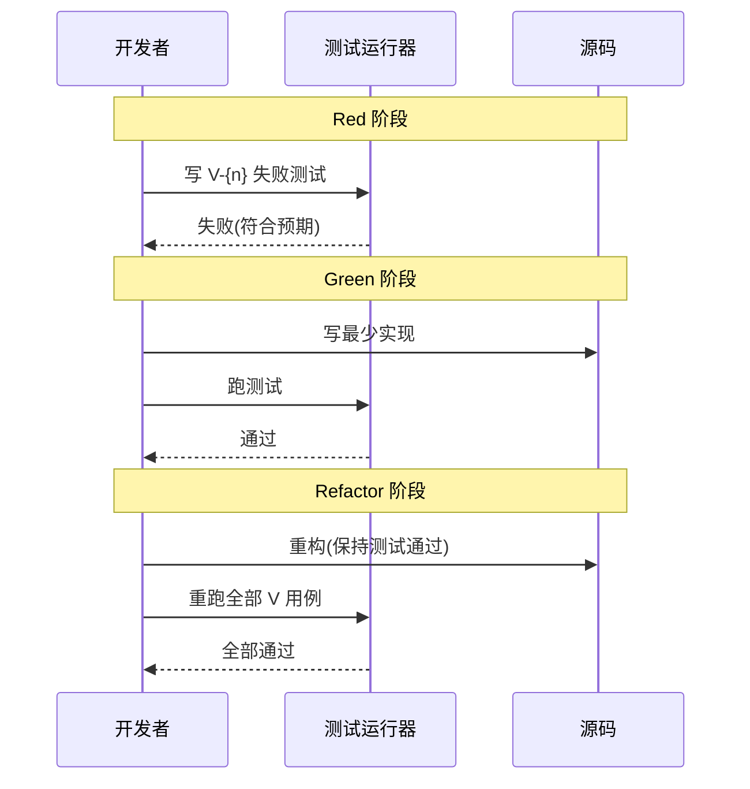

# Plan: {主题}

> **状态**: Draft | Ready | Executed
> **来源 Tech Design**: [../tech_design/{YYYY-MM-DD}-{topic}/](../tech_design/{YYYY-MM-DD}-{topic}/README.md)
> **来源 PRD**: [../../prd/{YYYY-MM-DD}-processed/{topic}.md](../../prd/{YYYY-MM-DD}-processed/{topic}.md)
> **创建日期**: {YYYY-MM-DD}
> **最后更新**: {YYYY-MM-DD}

> ⚠️ **设计原则**: Plan 是"实施指南",**不是**"替代实现"。变更描述用文字说明策略和约束,指导参与的 agent 写出代码。完整代码在 TDD 阶段产出。

---

## 变更索引 (Change Index)

> 快速扫读所有 Change,详细策略约束见下方"变更清单"各小节

| # | 文件路径 | 类型 | 遵循决策 | 验证 | 状态 |
|---|---------|------|----------|------|------|
| 1 | {file} | 新增/修改/删除 | KD-{n} | V-{n} | ⬜ 待实现 |
| 2 | ... | ... | ... | ... | ... |

---

## 变更清单 (Changes)

### Change #1: {文件路径}

**遵循决策**: KD-{n} — 此变更的设计依据

**变更描述**:
- **新增**: {功能描述}
- **修改**: {改动描述}
- **删除**: {移除描述}

**策略约束**:
- {约束 1} — {为什么}
- {约束 2} — {为什么}
- **不做**: {明确排除的行为}

**验证**: V-{n}

---

### Change #2: ...

---

## TDD 执行流程 (TDD Flow)

> 可视化本 Plan 的 TDD 循环(Red → Green → Refactor),供开发时参考

**TDD 循环规则**:
- 每个 V 用例**先写失败测试**(Red),后写实现(Green)
- 一次只让**一个** V 用例从红变绿,避免大爆炸
- Refactor 时**所有** V 用例必须保持绿
- 完成所有 V 用例 → Plan 状态 `Ready → Executed`,对应 PRD 状态 `Active → Implemented`

---

## 跨文件引用对账 (Cross-Reference Reconciliation)

> 验证本 Plan 引用的所有外部标识符**都存在且指向正确**——漏一个会导致实现走偏

| 引用类型 | 标识 | 来源 | 已对账 | 备注 |
|----------|------|------|--------|------|
| 关键决策 | KD-{n} | `../tech_design/{topic}/decisions.md` | [ ] | Change #1 |
| 时序图 | SYS-{n} | `../tech_design/{topic}/interactions.md` | [ ] | V-{n} |
| 时序图 | MOD-{n} | `../tech_design/{topic}/interactions.md` | [ ] | V-{n} |
| PRD 需求 | FR-XXX | `../../prd/{date}-processed/{topic}.md` | [ ] | V-{n} |
| 验证用例 | V-{n} | 本文件 | [ ] | Change #1 |

**对账规则**:
- 每一行都必须勾选 `[x]`
- 找不到引用 = 检查清单不通过,**禁止**进入 TDD 阶段

---

## 验证用例 (Verification)

> 用 Given/When/Then 描述,这些用例在 TDD 阶段被自动化执行。

### V-1: {正常路径场景名}

- **Given**: {前置条件}
- **When**: {动作}
- **Then**: {预期结果}

### V-2: {异常场景}

- **Given**: {错误前置}
- **When**: {动作}
- **Then**: {错误处理 / 降级行为}

### V-3: {边界场景}

- **Given**: {边界条件}
- **When**: {动作}
- **Then**: {边界结果}

---

## 业务约束 (Business Constraints)

**前置条件**:
1. 调用前必须满足的条件
2. ...

**不变量**:
- 执行过程中必须保持的条件

**后置条件**:
1. 成功后系统状态变化
2. ...

**副作用**:
1. 触发的外部操作
2. 失败时是否回滚

---

## 开发约束 (Development Constraints)

| 约束 | 值 |
|------|-----|
| 并发 | {策略} |
| 事务边界 | {边界} |
| 幂等性 | {保证方式} |
| 重试 | {策略} |
| 超时 | {设置} |

---

## 完成检查 (Completion Checklist)

### 实现层
- [ ] **代码实现** — 所有 Change 已完成
- [ ] **类型检查** — 类型检查通过
- [ ] **规范检查** — Lint 通过
- [ ] **无遗留** — 无未解决的 TODO/FIXME

### 验证层
- [ ] **测试通过** — 所有 V 用例通过(Red → Green → Refactor)
- [ ] **约束满足** — 业务约束 + 开发约束全部满足

### 引用层(对应"跨文件引用对账"表)
- [ ] **KD 引用对账** — 所有 KD-{n} 在 `tech_design/{topic}/decisions.md` 中存在
- [ ] **MOD/SYS 引用对账** — 所有时序图在 `tech_design/{topic}/interactions.md` 中存在
- [ ] **V 引用闭环** — 每个 V 用例有对应 Change,每个 Change 至少 1 个 V

### 流程层
- [ ] **PR 已创建** — 如适用

---

## 变更记录

| 日期 | 变更 |
|------|------|
| {YYYY-MM-DD} | 初始 |
