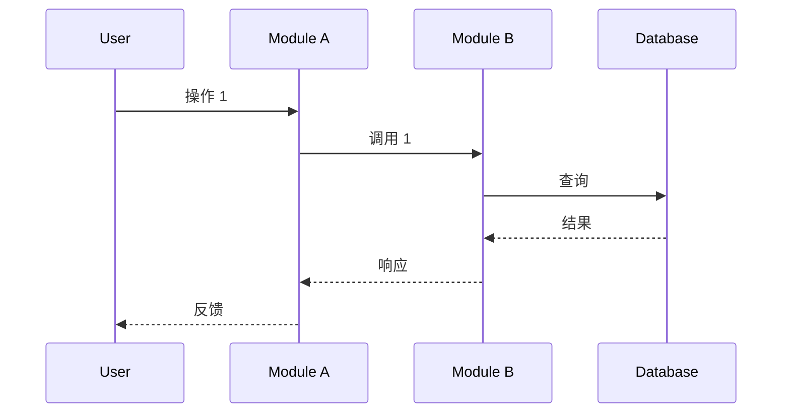
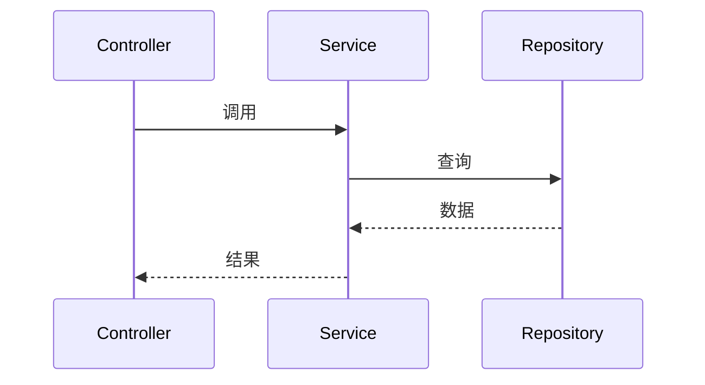

# APIs: {topic} (接口契约 + 时序交互)

> **状态**: Draft | Ready | Implemented | Deprecated
> **来源 PRD**: [../../prd/{YYYY-MM-DD}/{topic}.md](../../prd/{YYYY-MM-DD}/{topic}.md)
> **创建日期**: {YYYY-MM-DD}
> **最后更新**: {YYYY-MM-DD}

> **v4 必填子文件**: 接口契约 + 时序交互的**唯一落点**.
> 端点 / 请求 / **全响应变体** / 枚举速查 / 组装规则 / 前后置 / 副作用 + 时序图 (SYS-{n} 系统级 / MOD-{n} 模块级).

---

## 接口契约 (API Contracts)

### 接口 1: {端点名}

| 字段 | 内容 |
|------|------|
| **端点路径** | `[METHOD] /path/{id}` |
| **请求方法** | GET / POST / PUT / DELETE |
| **鉴权要求** | [Bearer Token / Cookie / 签名 / 无] |
| **调用方** | [哪个模块 / 角色] |
| **被调方** | [哪个服务 / 模块] |
| **触发时机** | [用户操作 / 定时 / 系统事件] |

**请求参数**:

| 参数 | 类型 | 必填 | 说明 | 校验规则 |
|------|------|------|------|----------|
| `{param}` | `string` | 是 | [说明] | [规则] |

**响应 (成功 200)**:

```json
{
  "code": 0,
  "data": {
    "{field}": "{value}"
  },
  "message": "success"
}
```

**响应 (失败 - 业务错误码)**:

```json
{
  "code": 40001,
  "data": null,
  "message": "[用户可读错误信息]"
}
```

**响应 (失败 - 系统错误码)**:

```json
{
  "code": 50001,
  "data": null,
  "message": "[系统错误信息, 不暴露内部细节]"
}
```

**前后置条件**:

- **前置**: [调用前必须满足的条件]
- **后置**: [调用成功后系统状态的变更]
- **副作用**: [对外部系统的写操作, 如发送通知/写日志/触发其他流程]

**关联 KD**: KD-{n} (见 [./ards.md](./ards.md))
**关联场景**: PRD 场景 {n}

---

### 接口 2: ...

---

## 枚举速查 (Enum Quick Reference)

| 枚举 | 值 | 含义 |
|------|---|------|
| **StatusEnum** | `pending` / `active` / `completed` / `archived` / `cancelled` | 通用状态机示例 |
| **[其他枚举]** | ... | ... |

---

## 时序交互 (Sequence Diagrams)

### SYS-1: {场景名}

> 系统级时序图, 跨模块/跨服务的完整流程.



**触发场景**: PRD 场景 {n}
**关联 KD**: KD-{n}

### MOD-1: {模块名}

> 模块级时序图, 单个模块内部的关键路径.



**触发场景**: PRD 场景 {n}
**关联 KD**: KD-{n}

---

## 组装规则 (Composition Rules)

> 跨接口调用时的组合方式, 如先调用 A 拿 token 再调用 B 传 token.

| 场景 | 调用顺序 | 失败处理 |
|------|----------|----------|
| [场景 1] | A → B → C | A 失败直接返回, B/C 不调用 |
| [场景 2] | A → (B 并行 C) → D | B 或 C 任一失败, 整体失败 |

---

## 门禁清单 (Completion Gate)

- [ ] 每个接口有 端点 / 方法 / 鉴权 / 调用方 / 触发时机 5 个基础字段
- [ ] 每个接口有 请求参数表 (类型/必填/校验规则)
- [ ] 每个接口有 全响应变体 (成功 + 业务错误 + 系统错误 各 1 例)
- [ ] 前后置条件 + 副作用显式声明
- [ ] 枚举速查表覆盖所有字符串/整数枚举字段
- [ ] 时序图 (SYS-{n}) 覆盖所有跨模块场景
- [ ] 模块级时序图 (MOD-{n}) 覆盖关键内部路径
- [ ] 组装规则覆盖所有多接口组合场景

---

## 变更记录 (Change Log)

| 日期 | 变更 |
|------|------|
| {YYYY-MM-DD} | 初始: apis.md (v4 结构, 合并 v3 的 api-contracts + interactions) |