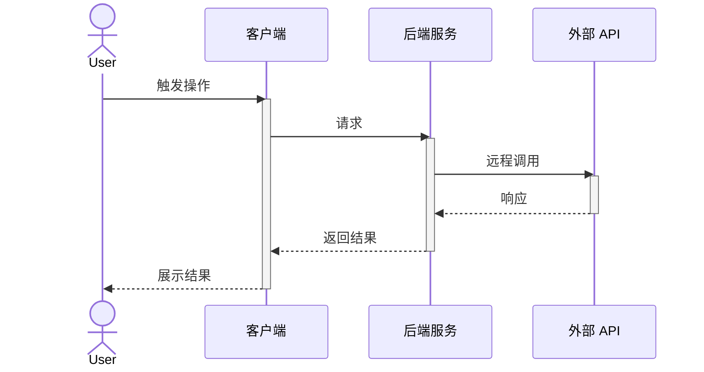
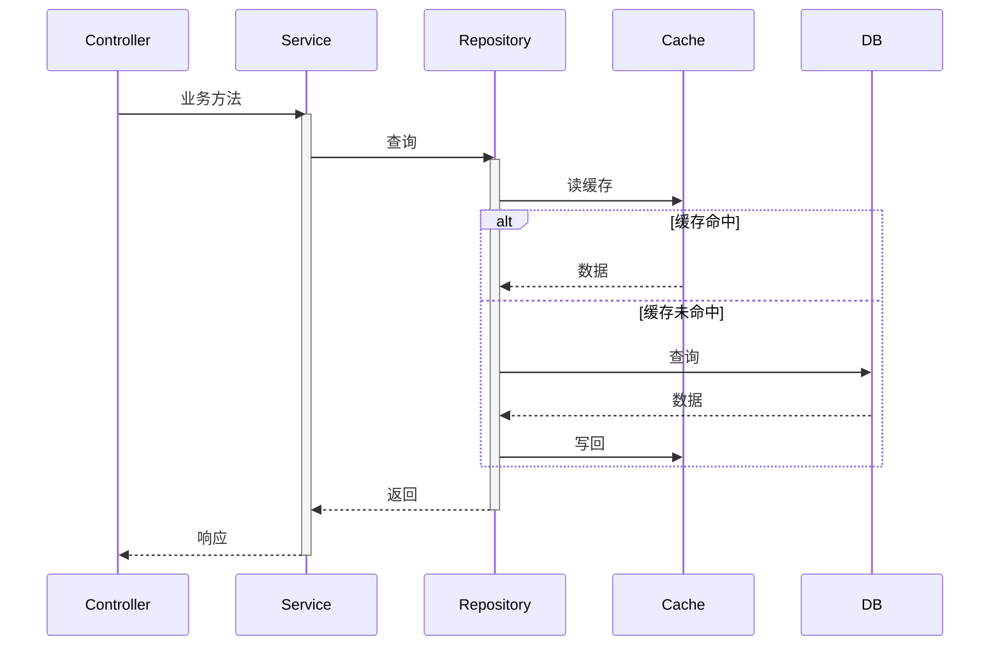

# Interactions: {topic}

> **状态**: Draft | Ready
> **来源**: [./README.md](./README.md)
> **创建日期**: {YYYY-MM-DD}
> **最后更新**: {YYYY-MM-DD}
> **格式**: Mermaid `sequenceDiagram`

---

## 系统级交互 (System-Level)

> 描述与外部系统/服务/用户的交互流程

### SYS-1: {流程名}

**Reference**: PRD 场景 {n}
**Trigger**: {触发条件}
**引用决策**: KD-{n}

**Notes**:
- 超时设置: {外部 API 调用 N 秒}
- 重试策略: {最多 N 次, 退避策略}
- 降级行为: {失败时降级为 ...}
- 幂等性: {请求是否幂等, 如何保证}

---

## 模块级交互 (Module-Level)

> 描述内部模块/组件的交互流程

### MOD-1: {流程名}

**Reference**: PRD 场景 {n}
**Trigger**: {触发条件}
**引用决策**: KD-{n}

**Notes**:
- 事务边界: {哪个组件开启 / 提交事务}
- 幂等性: {写操作如何保证幂等}
- 缓存策略: {缓存粒度, 失效时间}
- 错误处理: {异常路径}

---

## Mermaid 语法参考

| 场景 | 写法 |
|------|------|
| 同步调用 | `A->>B: msg` |
| 返回 | `B-->>A: result` |
| 异步消息 | `A-)B: msg` (无激活线) |
| 条件分支 | `alt 条件A ... else 条件B ... end` |
| 可选分支 | `opt 条件 ... end` |
| 循环 | `loop 描述 ... end` |
| 关键区 | `critical 操作 ... option 超时 ... end` |
| 注释 | `Note over A,B: 说明文字` |
| 激活 | `activate A` / `deactivate A` |
| 参与者类型 | `actor` (用户) / `participant` (组件) / `database` (DB) |

---

## 检查清单 (Completion Checklist)

- [ ] 每个时序图有 **Reference** (PRD 场景或 FR-XXX)
- [ ] 每个时序图有 **Trigger** (触发条件)
- [ ] 每个时序图有 **Notes** (超时 / 重试 / 降级 / 事务 / 幂等 中至少 2 项)
- [ ] 系统级图覆盖所有外部系统调用
- [ ] 模块级图覆盖所有内部跨组件调用
- [ ] Mermaid 语法可在 GitHub 渲染
- [ ] 编号唯一 (SYS-1, SYS-2, MOD-1, MOD-2 ...)

---

## 变更记录 (Change Log)

| 日期 | 变更 |
|------|------|
| {YYYY-MM-DD} | 初始 |
